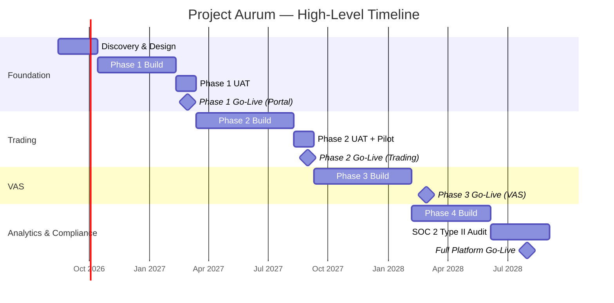

# Document 1 — Project Charter

## Ghana Gold Exchange Platform ("Project Aurum")

**Document Type:** Project Charter
**Charter Version:** 1.0
**Status:** Approved for Execution
**Classification:** Confidential — Chamber & Vendor Internal

---

## 1. Project Information

| Field | Value |
|---|---|
| **Project Name** | Ghana Gold Exchange Platform |
| **Internal Codename** | Project Aurum (platform product name: **AurumX**) |
| **Project Sponsor** | Ghana Chamber of Gold Buyers ("the Chamber") — Executive Council |
| **Executive Sponsor (Chamber)** | Mr. Kwabena Asante, President, Chamber of Gold Buyers [ASSUMPTION: name placeholder] |
| **Project Manager (Vendor)** | Ms. Adwoa Mensah, Senior TPM, Vanta Technologies Ltd. [ASSUMPTION: name placeholder] |
| **Technical Lead (Vendor)** | Mr. David Owusu, Principal Architect, Vanta Technologies Ltd. [ASSUMPTION: name placeholder] |
| **Date of Authorization** | 2026-08-15 |
| **Target Phase 1 Go-Live** | 2027-02-28 |
| **Target Full Platform (Phase 4) Go-Live** | 2028-07-31 |
| **Commercial Model** | SaaS with Revenue Sharing (70% Vendor / 30% Chamber) |

### Version History

| Version | Date | Author | Change Summary |
|---|---|---|---|
| 0.1 | 2026-07-10 | Vanta Technologies | Initial draft, circulated to Chamber Steering Committee |
| 0.5 | 2026-07-24 | Vanta Technologies + Chamber PMO | Incorporated feedback on scope, RACI, and Phase boundaries |
| 0.9 | 2026-08-05 | Joint Review Board | Compliance and risk review; escrow provider dependency finalized |
| 1.0 | 2026-08-15 | Project Sponsor | Approved and authorized for execution |

---

## 2. Executive Summary / Background

The Ghanaian gold sector loses an estimated US$2.3 billion annually to informal trading, royalty leakage, and unverified supply chains [ASSUMPTION: figure derived from Chamber internal estimates; to be validated against Minerals Commission data]. The Ghana Chamber of Gold Buyers, the recognized industry body for licensed Tier 1 and Tier 2 buyers, currently manages member licensing, dispute resolution, and export compliance through fragmented, paper-based workflows.

**Project Aurum** will deliver a controlled B2B digital exchange — *not* an open marketplace — that combines RFQ (Request for Quote), negotiated trading, and optional auction mechanics within a strict identity, licensing, and compliance perimeter. The platform will digitize the entire trade lifecycle from seller listing through escrow settlement, assay certification, vault logistics, and export documentation. Beyond trading, the platform provides the Chamber with a member-management portal, compliance audit trails, and recurring revenue lines (transaction fees, escrow fees, premium subscriptions, value-added services) that scale with adoption.

Unlike a generic marketplace, every participant must be licensed and verified before they can trade. The Chamber owns governance and member relationships; Vanta Technologies owns, operates, and continuously improves the technology under a revenue-sharing SaaS agreement that removes the Chamber's upfront capital barrier.

---

## 3. Business Case & Objectives

### 3.1 Why We Are Doing This

| Value Lever | Current State (Estimated) | Target State by Year 3 |
|---|---|---|
| Informal gold trade captured into formal channel | ~30% of national production | ≥ 55% flowing through AurumX |
| Royalty & tax recovery for the State | Significant leakage | +US$120M/year recovered [ASSUMPTION] |
| Trade settlement time (avg. deal) | 7–14 days (manual, paper-based) | ≤ 48 hours (digital escrow + e-contract) |
| Compliance audit response time | 2–4 weeks (manual file retrieval) | ≤ 48 hours (full digital audit trail) |
| Chamber recurring revenue | Membership dues only | Diversified: transaction fees + VAS + subscriptions |
| Member onboarding time | 4–6 weeks (paper-based) | ≤ 5 business days (digital + e-KYC) |

### 3.2 SMART Objectives

1. **Specific:** Launch the Phase 1 Digital Member Portal with verified onboarding for ≥ 100 Chamber members by **2027-02-28**; **Measurable:** ≥ 100 active licensed members with completed KYC; **Achievable:** Yes, given current member base of ~340; **Relevant:** Establishes the trust layer required for all subsequent trading; **Time-bound:** 6.5 months from charter authorization.

2. **Specific:** Enable end-to-end digital RFQ-to-settlement trading with escrow for ≥ US$50M in cumulative trade value processed by **2027-12-31** (10 months post-Phase-2 launch); **Measurable:** Escrow ledger totals; **Achievable:** Conservative given daily Tier 1 + Tier 2 trade flow; **Relevant:** Validates the commercial model and revenue-sharing economics; **Time-bound:** 12 months.

3. **Specific:** Achieve a Mean Time to Trade Settlement (MTTTS) of ≤ 48 hours for ≥ 90% of completed trades by **2028-03-31**; **Measurable:** Trade ledger analytics; **Achievable:** With escrow + digital contracts + assay integration; **Relevant:** Direct efficiency gain vs. current 7–14 day baseline; **Time-bound:** 19 months.

4. **Specific:** Generate ≥ US$1.2M in cumulative platform revenue in the first 12 months post Phase 2 go-live, with 30% (≥ US$360K) remitted to the Chamber under the revenue-sharing agreement; **Measurable:** Finance ledger reconciliation; **Achievable:** Conservative based on the worked example in the proposal; **Relevant:** Validates commercial sustainability; **Time-bound:** 12 months post Phase 2.

5. **Specific:** Achieve SOC 2 Type II certification and full alignment with Ghana Minerals Commission regulations and FATF AML Recommendation 22 (precious metals) by **2028-06-30**; **Measurable:** Third-party audit report; **Achievable:** With dedicated compliance engineering; **Relevant:** Required for institutional Tier 1 buyer participation; **Time-bound:** 22 months.

---

## 4. Project Scope

### 4.1 In-Scope

| Module | Phase | Description |
|---|---|---|
| Identity, Licensing & KYC/AML | P1 | Verified onboarding, license validation against Chamber registry, ongoing AML screening |
| Member Portal | P1 | Member profiles, document repository, notifications, secure messaging |
| Gold Lot Management | P2 | Lot creation with weight, purity ( Assay), serial numbers, provenance chain |
| RFQ Engine | P2 | Multi-buyer RFQ submission, response, comparison |
| Auction Engine | P2 | Timed, reverse, and sealed-bid auction variants |
| Negotiation & Smart Matching | P2 | Counter-offer workflow; AI-assisted buyer-lot matching |
| Digital Contracts & Escrow | P2 | e-Signature contracts, escrow account integration |
| Assay & Certification VAS | P3 | Assay request workflow, digital certificate issuance |
| Logistics Coordination VAS | P3 | Armored transport, vault storage, airport logistics integration |
| Export Documentation VAS | P3 | Digital export permits, customs integration |
| Vault Management | P3 | Vault inventory, audit trail, title transfer |
| Analytics & BI Dashboards | P4 | Market prices, trade volumes, regional demand, compliance reporting |
| Admin & Compliance Console | P1→P4 | Chamber staff tools for oversight, dispute resolution, audit |

### 4.2 Out-of-Scope (Explicit)

| Item | Reason | Future Path |
|---|---|---|
| Direct payment rails / mobile money wallet | Regulated PSP activity; out of vendor remit | Integrate with licensed PSPs / banks |
| Physical gold custody by the platform | Liability + insurance exposure outside vendor remit | Vault partners hold custody; platform records title |
| Consumer (B2C) gold trading | Outside Chamber's B2B mandate | N/A |
| Mining / extraction management | Upstream of buyer market | Future integration with mine management systems |
| Tax calculation & filing | Government competence | Provide export data via API to GRA / Minerals Commission |
| Trade finance origination | Banking activity | Referral commissions to partner banks only |
| White-label versions for other commodities | Future expansion | Phase 5+, post stabilization |
| Mobile native apps (iOS/Android) | PWA-first in Phases 1–4 | Native apps considered in Phase 5 |

---

## 5. High-Level Timeline & Milestones

> **Note:** This is a phase plan, not a sprint plan. Detailed sprint planning is owned by the delivery squads and tracked in the engineering backlog. See **Document 6 — Development & Operations Documentation** for sprint cadence.

| Milestone | Target Date | Exit Criteria |
|---|---|---|
| Charter signed | 2026-08-15 | This document signed by Sponsor & Vendor CEO |
| Discovery complete | 2026-10-15 | Architecture signed off; ADRs 1–5 approved |
| Phase 1 UAT entry | 2027-01-15 | All P1 features functionally complete |
| **Phase 1 Go-Live** | 2027-02-28 | ≥ 100 members onboarded; Chamber staff trained |
| Phase 2 UAT entry | 2027-07-15 | Trading engine load-tested at 10x expected volume |
| **Phase 2 Go-Live (Trading)** | 2027-08-31 | First 10 real trades settled through escrow |
| **Phase 3 Go-Live (VAS)** | 2028-02-28 | Assay + logistics + export flows live with ≥ 2 partners each |
| SOC 2 Type II report issued | 2028-06-30 | Third-party auditor sign-off |
| **Phase 4 Go-Live (Analytics)** | 2028-07-31 | BI dashboards in production; first quarterly compliance report generated |

---

## 6. Budget & Resources

### 6.1 High-Level Cost Estimate (Vendor Side, Year 1)

| Cost Category | Estimate (USD) | Notes |
|---|---|---|
| Engineering labour (12 FTE-months × 8 FTE) | $576,000 | Loaded cost; see role breakdown below |
| Design & UX | $48,000 | 1 designer × 4 months Phase 1 |
| QA & test automation | $96,000 | 2 QA × 6 months |
| DevOps & SRE setup | $72,000 | Infrastructure as Code, CI/CD, observability |
| Security & compliance engineering | $120,000 | AML/KYC integration, SOC 2 prep |
| Project management | $84,000 | 1 TPM, full allocation |
| Cloud infrastructure (AWS) | $54,000 | Estimated $4.5k/month ramp |
| Third-party services (Auth0, Twilio, Stripe Escrow, Datadog) | $36,000 | Pass-through + integration |
| External audit (SOC 2 Type II) | $60,000 | One-time Year 1 |
| Contingency (15%) | $173,400 | Standard PM reserve |
| **Total Year 1 Cost** | **$1,319,400** | Funded by Vendor under SaaS risk model |
| **Year 2 Run Cost (Annual)** | **~$680,000** | Reduced build; steady-state operations |

[ASSUMPTION: All figures are vendor-side planning estimates and exclude Chamber-side staff time, marketing, and member onboarding costs which are borne by the Chamber under the SaaS agreement.]

### 6.2 Team Composition

| Role | Headcount | Allocation | Phase Coverage |
|---|---|---|---|
| Project Manager (TPM) | 1 | 100% | P1–P4 |
| Principal Architect | 1 | 80% | P1–P4 |
| Backend Engineers (NestJS / Node) | 3 | 100% | P1–P4 |
| Frontend Engineers (Next.js / React) | 2 | 100% | P1–P4 |
| Mobile / PWA Engineer | 1 | 100% | P1–P4 (shared) |
| Data Engineer (analytics, ETL) | 1 | 100% | P3–P4 (50% P1–P2) |
| ML Engineer (matching, fraud) | 1 | 50% | P2–P4 |
| DevOps / SRE | 1 | 100% | P1–P4 |
| Security & Compliance Engineer | 1 | 100% | P1–P4 |
| QA Engineer (automation) | 2 | 100% | P1–P4 |
| UX / Product Designer | 1 | 50% | P1–P4 |
| Product Manager | 1 | 50% | P1–P4 |
| **Total core team** | **~16 FTE** | | |

---

## 7. Key Stakeholders & RACI Matrix

### 7.1 Stakeholder Register

| Stakeholder | Role | Interest | Influence |
|---|---|---|---|
| Ghana Chamber of Gold Buyers (Executive Council) | Project Sponsor | Strategic, financial, reputational | High |
| Minerals Commission of Ghana | Regulator | Compliance, royalty reporting | High (veto) |
| Bank of Ghana (Financial Stability Dept.) | Regulator | Escrow, AML oversight | High (veto) |
| Tier 1 Buyers (refiners, bullion banks) | End users | Liquidity, security, audit trail | High |
| Tier 2 Buyers (exporters, jewelers) | End users | Access to supply, fair pricing | Medium |
| Licensed Sellers (miners, aggregators) | End users | Price discovery, faster settlement | Medium |
| Partner Banks (escrow + trade finance) | Integration partner | Fee revenue, compliance | Medium |
| Vault Operators (Brink's, G4S) | Integration partner | Logistics revenue | Medium |
| Assay Laboratories (SGS, etc.) | Integration partner | Service revenue | Low |
| Vanta Technologies (Vendor) | Delivery + Operations | Revenue share, reference customer | High |
| GRA (Customs Division) | Regulator | Export duties, documentation | High |

### 7.2 RACI Matrix — Key Decisions / Deliverables

| Activity / Decision | Chamber Exec | Chamber PMO | Vendor PM | Vendor Architect | Engineering | QA | Compliance Officer (Chamber) |
|---|---|---|---|---|---|---|---|
| Charter approval | **A** | C | R | C | I | I | C |
| Architecture sign-off (ADRs) | I | C | **A** | R | C | I | C |
| Phase exit / Go-Live decision | **A** | R | R | C | C | C | C |
| Trading rules & fee schedule | **A** | R | C | I | I | I | C |
| Member onboarding criteria | **A** | R | C | I | I | I | C |
| AML / KYC thresholds | C | C | C | C | I | I | **A** |
| Security incident response | I | I | R | C | R | I | **A** |
| Vendor-side sprint planning | I | I | **A** | R | R | C | I |
| Production deployments | I | I | C | R | R | C | I |
| Compliance audit participation | C | C | R | C | C | I | **A** |
| Disaster recovery test | I | I | R | C | R | C | C |
| Change request approval | **A** | R | R | C | C | I | C |

> **R** = Responsible · **A** = Accountable · **C** = Consulted · **I** = Informed

---

## 8. Assumptions, Constraints & Dependencies

### 8.1 Assumptions

| # | Assumption | Owner | Validation Date |
|---|---|---|---|
| A1 | The Chamber's existing member registry (≈340 licensed buyers) is available in a structured exportable format by Week 3 of Phase 1 | Chamber PMO | 2026-09-05 |
| A2 | At least two Ghanaian commercial banks will execute escrow integration MOUs by end of Phase 1 | Chamber Exec | 2027-01-30 |
| A3 | The Minerals Commission will issue a digital export permit API (or formal data-sharing agreement) by Q2 2027 | Chamber Exec | 2027-06-30 |
| A4 | AWS us-east-1 + eu-west-1 remain available and sanctions-stable for the project lifetime | Vendor SRE | Ongoing |
| A5 | Tier 1 buyers will accept a third-party (Vanta) operated platform provided SOC 2 + Chamber endorsement are in place | Chamber Exec | 2027-07-31 |
| A6 | The Ghana Data Protection Act, 2012 (Act 843) classification of trade data does not require on-shore-only hosting | Vendor Compliance Eng | 2026-10-15 |

### 8.2 Constraints

| # | Constraint | Type |
|---|---|---|
| C1 | Must launch Phase 1 (Portal) **before** 2027-Q2 Chamber AGM | Time |
| C2 | Must use Auth0 for identity (enterprise agreement in place) | Technical |
| C3 | Must NOT operate as a licensed PSP or take custody of physical gold — regulated activity outside vendor remit | Legal / Regulatory |
| C4 | Must achieve SOC 2 Type II before Tier 1 institutional buyers onboard (Phase 2) | Compliance |
| C5 | All trade data subject to Ghana Data Protection Act 2012; cross-border transfer requires lawful basis | Legal |
| C6 | Maximum vendor cost overrun absorbed before revenue-share renegotiation: 10% of approved budget | Financial |
| C7 | All payments integration must route through Bank of Ghana–licensed entities | Regulatory |

### 8.3 Dependencies

| Dependency | Owner | Required By | Impact if Delayed |
|---|---|---|---|
| Chamber member registry data export | Chamber PMO | P1 Week 3 | P1 onboarding delayed by equivalent time |
| Bank escrow integration MOUs | Chamber Exec | P2 Month 1 | Phase 2 cannot go-live |
| Minerals Commission export-permit API | Chamber Exec + Vendor | P3 Month 1 | Phase 3 export VAS blocked |
| Assay lab API contracts (SGS, etc.) | Vendor BD | P3 Month 2 | Assay VAS delayed |
| SOC 2 auditor engagement | Vendor Compliance Eng | P3 Month 6 | Phase 4 sign-off at risk |
| AWS organization + Billing account setup | Vendor SRE | P1 Week 1 | All build blocked |

---

## 9. High-Level Risks

| # | Risk | Likelihood | Impact | Mitigation | Risk Owner |
|---|---|---|---|---|---|
| R1 | Key Tier 1 buyer (anchor liquidity provider) declines to participate due to platform trust concerns | Medium | High | Secure 2 anchor Tier 1 buyers under LOI before Phase 2 build; Chamber endorsement + SOC 2 prerequisite; pilot trades underwritten by Chamber for first 30 days | Chamber Exec |
| R2 | Escrow partner bank withdraws or fails to integrate on schedule | Medium | High | Dual-track two bank MOUs from Phase 1; fallback to licensed PSP escrow (e.g., Cellulant, Hubtel); contingency escrow logic abstracted behind `EscrowProvider` interface | Vendor Architect |
| R3 | Regulatory change (BoG or Minerals Commission) imposes new licensing requirement on the platform | Low | Critical | Quarterly compliance review; maintain 90-day regulatory horizon scan; legal counsel retained; modular architecture allows service carve-out | Compliance Officer |
| R4 | Cybersecurity incident (data breach or trade data exfiltration) | Medium | Critical | Defense-in-depth: WAF + IDS + KMS-encrypted stores + immutable audit log; SOC 2 controls; incident response runbook with 24h notification to BoG and Chamber; cyber insurance US$5M | Vendor Security Eng |
| R5 | Vendor key personnel departure (architect, TPM, or principal engineer) | Medium | High | Pair programming; ADRs and decision logs kept in repo; 2-week notice clause; documented runbooks; backup architect identified from Week 4 | Vendor PM |
| R6 | Trading volume underperforms forecast, jeopardizing revenue-share economics | Medium | High | Conservative base-case model (1/3 of forecast); premium subscriptions as volume-independent revenue; quarterly commercial review with rebalancing clause | Vendor PM + Chamber PMO |
| R7 | Phase 1 member onboarding slower than target (KYC friction) | Medium | Medium | Pre-load verified member data from Chamber registry; tiered KYC (Tier 1 enhanced, Tier 2 standard); in-app document upload + status tracking; Chamber onboarding concierge for top 50 members | Chamber PMO |

> **Risk-to-Mitigation Cross-Reference:** Operational mitigations for R2, R4, R5 are detailed in **Document 6 — Deployment Runbook, Monitoring & Alerting, Disaster Recovery**. Compliance mitigations for R3, R4 are detailed in **Document 7 — Security & Compliance**.

---

## 10. Success Criteria / KPIs

Measured 90 days post Phase 4 Go-Live (i.e., by **2028-10-31**):

| KPI Category | Metric | Target | Source / Dashboard |
|---|---|---|---|
| **Adoption** | Active licensed members on platform | ≥ 280 of ~340 (82%) | Chamber Admin Console |
| **Adoption** | Tier 1 buyer participation | ≥ 8 of top 10 Ghana-licensed refiners | Member registry |
| **Trading Volume** | Cumulative trade value settled through escrow | ≥ US$500M in trailing 12 months | Trading analytics |
| **Trading Volume** | Number of completed trades (RFQ + auction) | ≥ 1,200 / quarter | Trading analytics |
| **Efficiency** | Mean Time to Trade Settlement (MTTTS) | ≤ 48 hours, 90th percentile | Trade ledger |
| **Efficiency** | Member onboarding time (KYC complete) | ≤ 5 business days, median | Onboarding workflow |
| **Reliability** | Platform uptime (SLA: 99.9%) | ≥ 99.95% measured monthly | Datadog uptime |
| **Reliability** | API error rate (5xx) | < 0.1% of requests | Datadog APM |
| **Security** | Critical vulnerabilities open > 30 days | 0 | Snyk + SAST dashboards |
| **Security** | SOC 2 Type II report | Issued and unqualified | External auditor |
| **Compliance** | AML alert turnaround time | ≤ 24 hours, 95th percentile | Compliance console |
| **Financial** | Platform gross revenue (trailing 12 months) | ≥ US$2.4M | Finance ledger |
| **Financial** | Chamber revenue share remitted | ≥ US$720K (30%) | Finance ledger |
| **Customer Experience** | Member NPS | ≥ 45 | Quarterly survey |
| **Customer Experience** | Trade dispute rate | < 2% of trades | Dispute module |

> **Charter Objective → KPI Mapping:** Each SMART objective in §3.2 maps to one or more KPIs above. The vendor's revenue share is contingent on KPI achievement as defined in the Master Services Agreement (separate document).

---

## 11. Sign-offs

By signing below, the parties acknowledge that they have reviewed and approved this Project Charter and authorize the project to proceed according to the scope, timeline, budget, and governance described herein. Material changes to scope, timeline, or budget require re-authorization through the joint Change Control process defined in the Master Services Agreement.

| Role | Name | Signature | Date |
|---|---|---|---|
| Project Sponsor — President, Ghana Chamber of Gold Buyers | Mr. Kwabena Asante [ASSUMPTION] | _______________________ | __________ |
| Co-Sponsor — Vice President, Chamber | Ms. Akosua Boateng [ASSUMPTION] | _______________________ | __________ |
| Chamber PMO Lead | Mr. Yaw Mensah [ASSUMPTION] | _______________________ | __________ |
| Vendor CEO — Vanta Technologies Ltd. | Mr. Kofi Adjei [ASSUMPTION] | _______________________ | __________ |
| Vendor Project Manager | Ms. Adwoa Mensah [ASSUMPTION] | _______________________ | __________ |
| Vendor Principal Architect | Mr. David Owusu [ASSUMPTION] | _______________________ | __________ |
| Compliance Officer (Chamber) | Mrs. Efua Darko [ASSUMPTION] | _______________________ | __________ |

---

### Cross-References

- **Document 2 — User Personas:** Defines the member types referenced in §3 and §7.
- **Document 3 — User Success Journeys:** Maps §10 KPIs to end-user success outcomes.
- **Document 4 — System Architecture:** Technical foundation for §4 Scope.
- **Document 5 — User Flows & System Flows:** Operationalizes §4 Scope and §8 Dependencies.
- **Document 6 — DevOps Documentation:** Operational mitigations for §9 Risks.
- **Document 7 — Security & Compliance:** Detailed treatment of §9 Risks R3, R4 and §8 Constraints C4, C5, C7.
