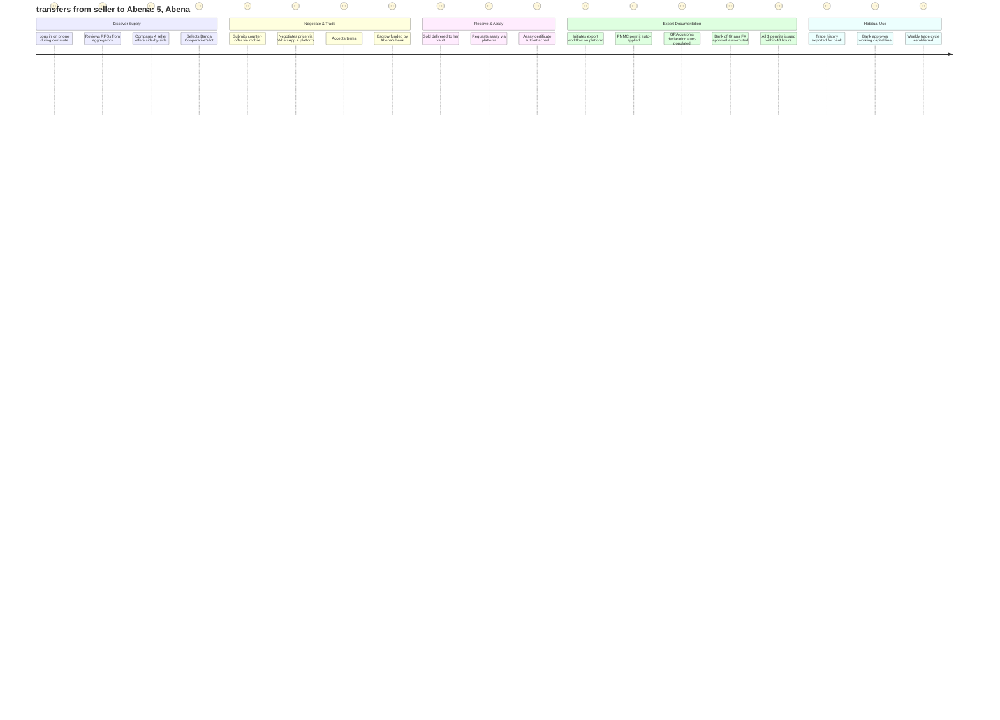
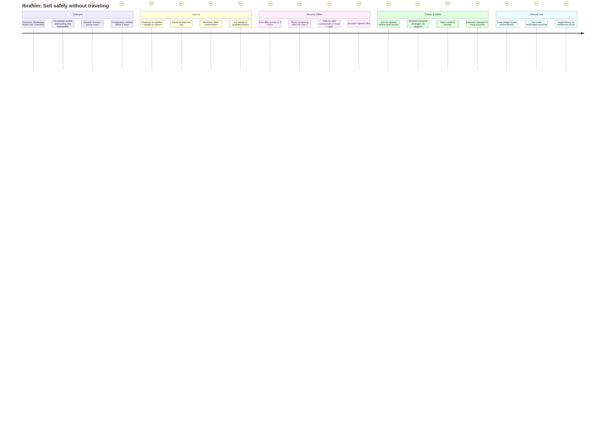
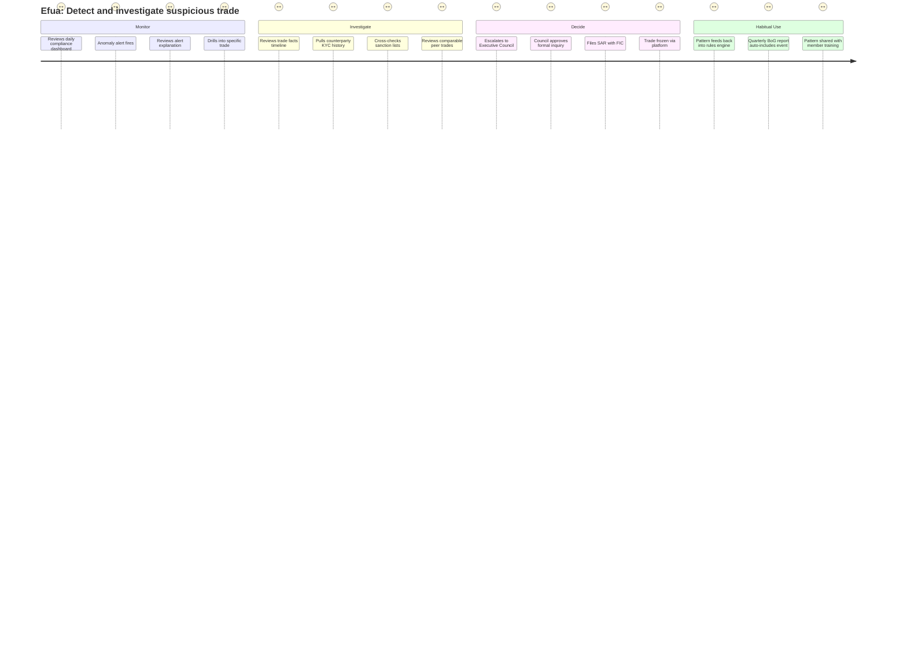

# Document 3 — User Success Journeys

## Ghana Gold Exchange Platform (AurumX)

**Document Type:** User Journey Maps
**Version:** 1.0
**Related Documents:** Charter §3.2, §10 · User Personas (Doc 2) · User Flows (Doc 5)

---

## How to Read These Journeys

A user success journey describes the end-to-end experience a persona has while pursuing their single most critical goal on the platform. Each journey is broken into **stages**, and for each stage we describe the user's **actions**, the **touchpoints** they encounter, their **emotions and pain points** along the way, and the **opportunities** the product has to remove friction or add value.

The four journeys below correspond to the four primary personas introduced in **Document 2 — User Personas**. They are written in present-tense narrative form to make the experience concrete. Each journey ends with a summary that ties the experience back to the Charter's SMART objectives and KPIs (cross-reference: Charter §3.2 and §10).

### Emotional Legend

| Marker | Meaning |
|---|---|
| 😊 | Delight / positive emotion |
| 🙂 | Satisfied / neutral-positive |
| 😐 | Neutral / uncertain |
| 😟 | Frustrated / anxious |
| 😠 | Angry / blocked |

> **Note:** Emojis are used here only as journey-map emotion markers (an industry-standard convention for journey maps). They will not appear in the production product or in the engineering documentation.

---

## Journey 1 — Kwame Asare: Vet and Onboard a New Tier 2 Counterparty

**Persona:** Kwame Asare, Head of West African Sourcing, Helvetia Refining AG (Persona 1, Tier 1 Buyer)
**Critical Goal:** Identify, vet, and on-board a new Ghanaian Tier 2 seller — from initial discovery to first completed trade with full audit defensibility — in under 21 days.

### Stages

```mermaid
journey
    title Kwame: Vet and onboard a new Tier 2 counterparty
    section Discover
      Receives RFQ alert:  Kwame, 5
      Reviews counterparty directory: 4, Kwame
      Reviews AML/risk screen: 5, Kwame
      Shortlists 3 candidates: 4, Kwame
    section Validate
      Requests enhanced due diligence pack: 3, Kwame
      Reviews license + chain-of-custody: 4, Kwame
      Validates against OECD Annex II indicators: 3, Kwame
      Approves counterparty as Tier 1-listed: 5, Kwame
    section First Trade
      Receives RFQ for 5 kg lot, 99.5% purity: 5, Kwame
      Submits counter-offer via platform: 4, Kwame
      Negotiation rounds within platform: 3, Kwame
      Accepts terms; escrow funded: 5, Kwame
    section Settle & Deliver
      Gold delivered to vault: 4, Kwame
      Assay certificate auto-attached: 5, Kwame
      Title transfers on platform: 5, Kwame
      Export documentation bundle auto-generated: 5, Kwame
    section Habitual Use
      Adds counterparty to preferred panel: 5, Kwame
      Sets up auto-alerts for similar lots: 4, Kwame
      Repeats trade weekly with declining admin time: 5, Kwame
```

### Stage-by-Stage Detail

#### Stage 1 — Discover (Days 1–3)

| Element | Detail |
|---|---|
| **Actions** | Kwame receives an in-platform alert that a new Tier 2 seller (GoldLink Exports Ltd., owned by Abena Owusu) has been verified and listed. He opens the counterparty directory, filters by region (Greater Accra), license type, and trade volume history. He reviews the basic KYC summary and the platform's AML/risk screen rating. He shortlists 3 candidates including GoldLink. |
| **Touchpoints** | AurumX web app (desktop); email notification; in-app messaging. |
| **Emotions** | 😊 Receives RFQ alert (delight at proactive notification). 😐 Reviews counterparty directory (uncertain — wants richer risk indicators). 😊 AML/risk screen rated "Low" for GoldLink (relief). |
| **Pain points** | The directory currently shows license status but not the historical trade volume benchmark or the average settlement speed. Kwame has to click through to a separate screen to compare against peers. |
| **Opportunities** | **(1)** Surface a peer-benchmark widget directly in the directory card (median trade volume, median settlement time, dispute rate for similar-sized exporters). **(2)** Show OECD Annex II red-flag indicators as a colored badge rather than a single aggregate score. **(3)** Allow Kwame to save and share shortlists with his Zurich compliance team for parallel review. |

#### Stage 2 — Validate (Days 4–10)

| Element | Detail |
|---|---|
| **Actions** | Kwame requests an enhanced due diligence (EDD) pack for GoldLink through the platform. The platform pulls the EDD pack (uploaded by Abena during onboarding + auto-pulled from Chamber registry). Kwame reviews the license scan, tax certificate, beneficial ownership declaration, and three-year trade history. He validates GoldLink against OECD Annex II indicators — region of operation, supplier source, payment patterns. He approves GoldLink as a Tier 1-listed counterparty. |
| **Touchpoints** | AurumX EDD module; integration with Chamber registry API; OECD risk reference library; in-app approval workflow. |
| **Emotions** | 😟 Requests EDD pack (frustrated if it is incomplete or missing fields). 😊 Reviews comprehensive pack (relief). 😐 Validates against OECD indicators (uncertain — wants clearer red-flag scoring). 😊 Approves counterparty (satisfaction). |
| **Pain points** | EDD packs are inconsistent across sellers — some include beneficial ownership, others omit it. OECD risk scoring is a single aggregate number rather than a structured rubric. |
| **Opportunities** | **(1)** Enforce a standardized EDD template at onboarding with required fields and validation. **(2)** Structure OECD risk as a rubric (origin, supplier, payment, transportation) with each dimension scored separately. **(3)** Allow parallel review by Zurich compliance team with comment threading and sign-off workflow. |

#### Stage 3 — First Trade (Days 11–14)

| Element | Detail |
|---|---|
| **Actions** | GoldLink lists a 5 kg, 99.5% purity lot. Kwame receives a Tier 1 priority alert (his Tier 1 status grants 4-hour exclusivity). He submits a counter-offer at US$2 below the LBMA fix. Abena responds within 90 minutes with a revised offer. They settle on a price after two rounds. Escrow is funded automatically by Kwame's bank integration. |
| **Touchpoints** | AurumX RFQ engine; negotiation module; bank escrow integration; in-app messaging; mobile push for time-sensitive notifications. |
| **Emotions** | 😊 Receives Tier 1 priority alert (delight at exclusivity). 😊 Submits counter-offer smoothly (satisfaction). 😐 Negotiation rounds (some anxiety about response time). 😊 Escrow funded automatically (relief — payment security confirmed). |
| **Pain points** | The negotiation UI requires a full page reload after each counter-offer, which feels slow for high-stakes back-and-forth. The Tier 1 exclusivity window is not visible in the negotiation header. |
| **Opportunities** | **(1)** Real-time negotiation UI via WebSocket; no full-page reload. **(2)** Prominent countdown for Tier 1 exclusivity window in negotiation header. **(3)** AI-suggested counter-offer price ranges based on LBMA fix, lot purity, and recent comparable trades. |

#### Stage 4 — Settle & Deliver (Days 15–18)

| Element | Detail |
|---|---|
| **Actions** | Gold is delivered to the partner vault (Brink's). Vault confirms receipt in the platform. Assay lab (SGS) issues a digital certificate, which is auto-attached to the trade record. Title transfers on-platform; escrow releases funds to Abena. Export documentation bundle (PMMC, GRA Customs, BoG FX approval) auto-generates as a PDF + structured JSON package. |
| **Touchpoints** | Vault operator portal; SGS assay API; escrow settlement service; export documentation VAS. |
| **Emotions** | 😊 Vault receipt confirmed (relief). 😊 Assay certificate auto-attached (delight — no manual reconciliation). 😊 Title transfers cleanly (satisfaction). 😊 Export bundle auto-generated (delight — eliminates 6–8 hours of paperwork). |
| **Pain points** | Vault confirmation occasionally delayed (1–2 hours) due to operator's manual reconciliation process. Export bundle references a GRA customs code that requires manual validation by Abena. |
| **Opportunities** | **(1)** Vault operator API with webhook for instant receipt confirmation. **(2)** GRA customs code validation integrated into the export bundle generator with pre-validation before PDF generation. |

#### Stage 5 — Habitual Use (Days 19–21+)

| Element | Detail |
|---|---|
| **Actions** | Kwame adds GoldLink to his preferred counterparty panel. He sets up an auto-alert for any 5+ kg, 99.5%+ purity lot from GoldLink. Over the next 8 weeks, he completes 6 more trades with GoldLink. His per-deal admin time drops from 6–8 hours to under 45 minutes (Charter Objective #3 target: MTTTS ≤ 48h). |
| **Touchpoints** | Saved panel management; auto-alert subscription; trade history ledger; API integration with SAP (Phase 4). |
| **Emotions** | 😊 Adds GoldLink to preferred panel (satisfaction). 😊 Sets up auto-alert (delight at automation). 😊 Per-deal admin time collapses (significant delight — direct productivity gain). |
| **Pain points** | The trade history export to SAP currently requires manual CSV upload. A real API integration would eliminate the manual step. |
| **Opportunities** | **(1)** Tier 1 REST API for direct SAP integration (Phase 4). **(2)** Per-counterparty analytics dashboard showing cumulative trade value, settlement speed trend, and dispute history. **(3)** Annual counterparty review report auto-generated for compliance file. |

### Journey 1 Summary

Kwame's journey moves from proactive discovery through structured validation, into the first trade, and finally into habitual partnership. The platform's value to Kwame is the collapse of counterparty-vetting time from weeks to days, the elimination of paperwork on every trade, and the creation of an audit-defensible trail that survives Swiss regulatory review. His per-deal admin time falls from 6–8 hours to under 1 hour, directly enabling **Charter Objective #3** (MTTTS ≤ 48 hours). His continued Tier 1 participation is the precondition for the platform's liquidity — without Kwame, Abena has no buyers; without Abena, Kwame has no supply.

---

## Journey 2 — Abena Owusu: Source, Sell, and Export Within 5 Days

**Persona:** Abena Owusu, Managing Director, GoldLink Exports Ltd. (Persona 2, Tier 2 Buyer/Exporter)
**Critical Goal:** Source gold from a new aggregator, complete the trade through escrow, and obtain a full export permit set within 5 business days, where the same workflow today takes 10–14 days.

### Stages



### Stage-by-Stage Detail

#### Stage 1 — Discover Supply (Day 1)

| Element | Detail |
|---|---|
| **Actions** | Abena logs into the AurumX mobile PWA during her morning commute. She reviews 4 incoming RFQs from aggregators, including one from the Banda Small-Scale Miners Cooperative (Ibrahim). The platform presents a side-by-side comparison of the 4 lots — weight, purity, asking price vs. LBMA fix, and seller trust score. She selects the Banda Cooperative's 3 kg lot at 99.2% purity. |
| **Touchpoints** | AurumX PWA on smartphone; comparison view; seller trust score widget. |
| **Emotions** | 😊 Mobile login works smoothly (relief — most government portals fail on mobile). 😐 Reviews RFQs (neutral — wants richer comparison). 😊 Side-by-side comparison (delight — first time she has seen this). 😊 Selects Banda lot (satisfaction at clear decision). |
| **Pain points** | The mobile UI is slightly cramped on the comparison view; she has to scroll horizontally to see all four lots. The seller trust score is a single number without explanation. |
| **Opportunities** | **(1)** Responsive comparison view optimized for phone (stacked cards, not horizontal scroll). **(2)** Explainable trust score — tap to see underlying factors (license status, trade history, dispute rate). |

#### Stage 2 — Negotiate & Trade (Day 2)

| Element | Detail |
|---|---|
| **Actions** | Abena submits a counter-offer at US$4 below the asking price, via the mobile app. Ibrahim responds within 2 hours via WhatsApp (the platform mirrors the conversation in-app). They settle on a price after one round. Escrow is funded automatically by Abena's bank (Stanbic) through the platform's bank escrow integration. |
| **Touchpoints** | Mobile counter-offer UI; WhatsApp Business API mirror; bank escrow integration. |
| **Emotions** | 😊 Submits counter-offer smoothly (satisfaction). 😊 Negotiation via WhatsApp (delight — meets her where she already works). 😊 Escrow funded automatically (major relief — first time she has not had to chase bank paperwork). |
| **Pain points** | The WhatsApp mirror has a 30-second delay; she occasionally sees duplicate messages. Bank escrow integration requires her to pre-authorize the platform once; she does not remember having done so and is briefly confused. |
| **Opportunities** | **(1)** Reduce WhatsApp mirror latency to <5 seconds. **(2)** Clear pre-authorization banner at trade start showing "Escrow will be funded by Stanbic account ending 4521" so the user knows the integration is live. |

#### Stage 3 — Receive & Assay (Day 3)

| Element | Detail |
|---|---|
| **Actions** | The cooperative delivers the gold to Abena's partner vault (Brink's Accra). Vault receipt is confirmed in the platform via vault operator API. Abena requests assay through the platform; SGS assays within 12 hours and uploads a digital certificate. Title transfers from the cooperative to Abena on-platform. Escrow releases funds to the cooperative's bank account within 30 minutes. |
| **Touchpoints** | Vault operator API; SGS assay integration; title transfer workflow; escrow release service. |
| **Emotions** | 😊 Vault receipt confirmed in-platform (relief). 😊 Assay requested and completed within hours (major delight — current process takes 2–3 days). 😊 Title transfers cleanly (satisfaction). 😊 Cooperative paid within 30 minutes (delight — relationship preserved). |
| **Pain points** | Vault receipt occasionally takes 1–2 hours to confirm in-platform because the operator's reconciliation is semi-manual. |
| **Opportunities** | **(1)** Push the vault operator to a fully API-driven confirmation flow. **(2)** Real-time escrow release notification to both parties via WhatsApp + SMS. |

#### Stage 4 — Export Documentation (Days 4–5)

| Element | Detail |
|---|---|
| **Actions** | Abena initiates the export workflow on the platform. The platform auto-applies for a PMMC export permit, pre-populates a GRA customs declaration, and routes a Bank of Ghana FX approval request. All three permits are returned within 48 hours. The platform assembles a single export bundle (PDF + structured JSON) for Abena's records and for the international buyer. |
| **Touchpoints** | Export documentation VAS; PMMC, GRA, and BoG integration APIs; export bundle generator. |
| **Emotions** | 😊 Initiates export workflow with one click (delight — vs. 7 manual forms today). 😊 All 3 permits within 48 hours (major delight — current process takes 7–10 days). 😊 Export bundle auto-assembled (delight — eliminates days of manual document management). |
| **Pain points** | The GRA customs declaration auto-population misses one field (HS code for refined gold vs. doré) that requires manual correction. The BoG FX approval requires Abena to confirm her bank account one more time in the BoG portal (cross-system authentication friction). |
| **Opportunities** | **(1)** Smart HS-code classifier based on lot purity and form. **(2)** BoG FX approval via OAuth integration to eliminate the manual confirmation step (Phase 3+). |

#### Stage 5 — Habitual Use (Weeks 2+)

| Element | Detail |
|---|---|
| **Actions** | Abena exports her trade history ledger as a structured PDF + JSON package and submits it to Stanbic's trade finance desk. Stanbic approves a US$500K working capital line against her documented trade history. Within 8 weeks, she has completed 6 trades and increased her weekly export volume by 40%. |
| **Touchpoints** | Trade history export; Stanbic trade finance integration (via exported ledger). |
| **Emotions** | 😊 Trade history export clean (delight). 😊 Bank approves working capital (major delight — first credit access in 4 years). 😊 Weekly cycle established with higher volume (satisfaction — business growing). |
| **Pain points** | Stanbic's trade finance desk still requires some manual reconciliation of the exported ledger against their internal scoring model. |
| **Opportunities** | **(1)** Standard "trade finance package" export template aligned with Ghanaian banks' credit scoring requirements. **(2)** Direct API integration with partner banks (Phase 4+) for real-time trade finance eligibility scoring. |

### Journey 2 Summary

Abena's journey is the platform's commercial core. Her ability to move from gold-in-vault to export-permit-set in 5 days instead of 14 directly enables **Charter Objective #2** (US$50M cumulative trade value processed) by collapsing the trade-cycle time. Her access to bank working capital — unlocked by the auditable trade history — multiplies her trade volume, which in turn drives the platform's transaction-fee revenue. Without Abena, the platform has no real-world Tier 2 demand; with her empowered, the revenue-share economics compound.

---

## Journey 3 — Ibrahim Toure: Sell Gold Safely Without Traveling to Accra

**Persona:** Ibrahim Toure, General Secretary, Banda Small-Scale Miners Cooperative (Persona 3, Seller)
**Critical Goal:** List the cooperative's 3 kg of weekly gold, receive three competing offers, sell to the highest bidder, and receive payment in escrow before the gold leaves his possession — all without traveling to Accra.

### Stages



### Stage-by-Stage Detail

#### Stage 1 — Onboard (Days 1–5)

| Element | Detail |
|---|---|
| **Actions** | Ibrahim receives a WhatsApp message from the Chamber inviting him to register on AurumX. He taps the link, which opens the PWA. He creates an organization account (Banda Small-Scale Miners Cooperative), adds himself as Secretary and two other executive members (Treasurer, Chairman) with different permissions. He uploads the cooperative's mining license, the member roster, and the inter-regional buyer permit. The Chamber compliance team verifies the documents within 5 business days. |
| **Touchpoints** | WhatsApp Business invite; AurumX mobile PWA; document upload; Chamber compliance review. |
| **Emotions** | 😊 Receives WhatsApp invite (delight — meets him where he already is). 😐 Mobile onboarding on 3G (some frustration with image upload speed). 😟 Uploads license + roster (uncertain about format requirements). 😊 Cooperative verified within 5 days (relief — current paper process takes 6 weeks). |
| **Pain points** | Document upload over 3G is slow; large photos time out. The required document list is in English only and Ibrahim's Treasurer (Hausa-speaking) struggles with some fields. |
| **Opportunities** | **(1)** Compress images client-side before upload (large quality reduction acceptable for document capture). **(2)** Multilingual onboarding in English + Twi + Hausa with voice prompts for non-literate members. **(3)** Progressive onboarding — start trading with minimum documents, add enhanced DD over time. |

#### Stage 2 — List Lot (Day 6)

| Element | Detail |
|---|---|
| **Actions** | Ibrahim taps "List a lot" on his phone. He captures two photos of the doré bars (front + serial number), enters the weight (3.0 kg) and purity (99.2%), and taps submit. The platform generates a lot ID, displays it back to him, and confirms via SMS. The lot is immediately visible to all qualified Tier 1 and Tier 2 buyers. |
| **Touchpoints** | Mobile lot-creation wizard; phone camera capture; SMS confirmation. |
| **Emotions** | 😊 One-tap lot creation (delight — current process requires a phone call to a middleman). 😊 SMS confirmation received (satisfaction — tangible proof of listing). 😊 Lot visible to buyers (relief — first time his gold is exposed to a real market). |
| **Pain points** | The lot-creation wizard asks for purity in a free-text field; Ibrahim is unsure whether to write "99.2" or "0.992". |
| **Opportunities** | **(1)** Numeric input with explicit unit label and validation. **(2)** Optional assay upload — if no assay is available, mark the lot as "self-declared purity, assay pending" so buyers know the status. |

#### Stage 3 — Receive Offers (Days 7–8)

| Element | Detail |
|---|---|
| **Actions** | Within 2 hours, the first offer arrives — from a Tier 2 buyer in Kumasi. By Day 2, three competing offers are visible side-by-side, with prices shown in USD primary and GHS secondary (with FX rate source disclosed). Ibrahim reviews the offers with the cooperative's executive committee over WhatsApp. They accept the highest offer (from Abena at GoldLink). |
| **Touchpoints** | Offer inbox (mobile); side-by-side comparison; currency display module. |
| **Emotions** | 😊 First offer in 2 hours (delight — usually waits days for a middleman's response). 😊 Three competing offers (major delight — first time in his life he has had competing bids). 😊 Side-by-side comparison (satisfaction — clear decision). 😊 Accepts highest offer (relief — best price secured). |
| **Pain points** | The cooperative's executive committee is on a group WhatsApp call to discuss; some members cannot see the platform side-by-side view directly because they are on basic phones. |
| **Opportunities** | **(1)** "Share comparison via WhatsApp" — generates an image summary that Ibrahim can forward to the committee. **(2)** Group decision feature — committee members receive an SMS with a one-tap approval link (no app required). |

#### Stage 4 — Deliver & Settle (Days 9–10)

| Element | Detail |
|---|---|
| **Actions** | Escrow is funded by Abena's bank before the gold leaves Ibrahim's possession — he receives an SMS confirming escrow balance. He arranges armored transport through the platform's logistics VAS (Brink's Wa-to-Accra route, US$950). The gold arrives at the Accra vault the next morning. Vault receipt is confirmed; payment is released to the cooperative's bank account within 30 minutes. |
| **Touchpoints** | Escrow confirmation SMS; logistics VAS; vault operator API; payment release notification. |
| **Emotions** | 😊 Escrow funded before gold leaves (major relief — has been burned by buyer defaults before). 😊 Armored transport arranged via platform (delight — eliminated a 2-day phone-call process). 😊 Vault confirms receipt (satisfaction). 😊 Payment released within 30 minutes (major delight — current process takes 5–10 days). |
| **Pain points** | The logistics VAS shows three transport options but does not clearly display insurance coverage limits. |
| **Opportunities** | **(1)** Display insurance coverage and liability transfer point prominently for each logistics option. **(2)** Optional: cooperative-level cargo insurance purchased through the platform at point of booking. |

#### Stage 5 — Habitual Use (Weeks 2+)

| Element | Detail |
|---|---|
| **Actions** | Over 12 weeks, the cooperative completes 11 trades through AurumX. The platform automatically builds an immutable trade-history ledger. The cooperative applies for fair-trade premium certification with the ledger as evidence. The cooperative's dependence on the single middleman aggregator drops from 100% to under 30% of weekly volume. |
| **Touchpoints** | Trade history ledger; fair-trade certification export; weekly trade cycle. |
| **Emotions** | 😊 Cooperative ledger builds automatically (delight — first auditable record in cooperative's history). 😊 Fair-trade certification becomes possible (satisfaction — opens new market). 😊 Middleman dependency drops (relief — power balance restored). |
| **Pain points** | Some cooperative members still prefer to deal with the middleman for emergency cash needs; the platform's weekly cycle does not accommodate ad-hoc urgent sales. |
| **Opportunities** | **(1)** "Express sale" option with a pre-approved Tier 1 buyer for emergency liquidity (slightly lower price, instant escrow). **(2)** Cooperative financial dashboard showing per-member contributions and payouts. |

### Journey 3 Summary

Ibrahim's journey is the platform's social-impact story. His transition from middleman-dependent to platform-empowered seller directly addresses the Charter's broader objective of capturing informal trade into the formal channel (Charter §3.1 — informal trade capture from ~30% to ≥ 55%). His immutable trade ledger enables downstream financial inclusion (fair-trade certification, future bank credit). The combination of mobile-first UX, escrow-before-delivery, and WhatsApp-native notifications is the difference between Ibrahim adopting the platform and abandoning it.

---

## Journey 4 — Efua Boateng: Detect and Investigate a Suspicious Trade Within 24 Hours

**Persona:** Efua Boateng, Director of Compliance & Member Affairs, Ghana Chamber of Gold Buyers (Persona 4, Compliance Officer)
**Critical Goal:** Detect a suspicious trade within 24 hours of occurrence, investigate it with full audit trail access, and either clear or escalate it within 48 hours.

### Stages



### Stage-by-Stage Detail

#### Stage 1 — Monitor (Hour 0–2)

| Element | Detail |
|---|---|
| **Actions** | At 8 AM, Efua opens the compliance dashboard. She sees that the platform's anomaly-detection engine has flagged an overnight trade: a Tier 2 buyer (a relatively new member, 6 weeks old) has placed an unusually high bid (12% above the next-highest offer) on a 4 kg lot, with payment routed from a newly-onboarded bank account. She reviews the alert explanation — the engine cites three signals: bid-price-outlier, counterparty-velocity-anomaly, payment-source-recently-onboarded. She drills into the specific trade. |
| **Touchpoints** | Compliance dashboard; anomaly-detection engine; alert detail view. |
| **Emotions** | 😐 Reviews dashboard (routine). 😊 Anomaly alert fires (delight — first time detection has been proactive, not reactive). 😊 Alert explanation is clear (satisfaction — actionable). 😊 Drills into specific trade smoothly (relief — current process requires manual export). |
| **Pain points** | The alert explanation is in English; some signals are technical jargon ("counterparty-velocity-anomaly"). |
| **Opportunities** | **(1)** Plain-language alert explanations with suggested next steps. **(2)** One-tap escalation to Executive Council with pre-filled context. |

#### Stage 2 — Investigate (Hour 2–8)

| Element | Detail |
|---|---|
| **Actions** | Efua opens the trade-facts timeline — a chronological view of every event in the trade lifecycle (lot listing, bids, negotiation messages, escrow funding, vault receipt). She pulls the counterparty's KYC history (3 prior trades, all clean). She cross-checks the counterparty against OFAC, EU, UN, and Ghana MoF sanction lists (no matches). She reviews 12 comparable peer trades (similar lot size, similar purity) — the flagged bid is a clear outlier. |
| **Touchpoints** | Trade-facts timeline view; KYC history; sanction list screening service; comparable-trades analytics. |
| **Emotions** | 😊 Trade-facts timeline (major delight — single source of truth). 😊 KYC history pulled in seconds (satisfaction). 😊 Sanction list check is one click (relief — current process requires manual lookups across 4 lists). 😊 Comparable trades show clear outlier (satisfaction — defensible evidence). |
| **Pain points** | The comparable-trades view requires her to manually filter by date range, lot size, and purity; she would like pre-built "peer trade" cohorts. |
| **Opportunities** | **(1)** Auto-generated peer cohort with every anomaly alert. **(2)** One-tap "export investigation pack" for the Executive Council and FIC. |

#### Stage 3 — Decide (Hour 8–24)

| Element | Detail |
|---|---|
| **Actions** | Efua escalates the case to the Executive Council with a pre-filled investigation pack. The Council reviews within 4 hours and approves a formal inquiry. Efua files a Suspicious Activity Report (SAR) with Ghana's Financial Intelligence Centre (FIC). Through the platform, she freezes the trade — escrow is held pending review, the buyer is suspended from new trades, and the seller is notified (with appropriate confidentiality). |
| **Touchpoints** | Executive Council escalation workflow; FIC filing module; trade-freeze control; member notification service. |
| **Emotions** | 😊 Escalation with pre-filled context (satisfaction — current process requires a 3-page memo). 😊 Council approves within 4 hours (delight — current process takes a week). 😊 SAR filed via platform (satisfaction — current process is a paper form). 😊 Trade frozen via platform (major delight — current process requires phone calls to multiple parties). |
| **Pain points** | The trade-freeze notification to the seller is templated; she would like to add a custom message reassuring the seller that the gold itself is not under suspicion. |
| **Opportunities** | **(1)** Custom message field on trade-freeze notifications. **(2)** Optional scheduled follow-up reminders for ongoing investigations. |

#### Stage 4 — Habitual Use (Weeks 2+)

| Element | Detail |
|---|---|
| **Actions** | The pattern (new-member + high-bid-outlier + recently-onboarded-payment-source) is added as a permanent rule in the anomaly-detection engine. The event is auto-included in the next quarterly BoG report. Efua shares the pattern (anonymized) with members in compliance training to demonstrate the platform's proactive stance. |
| **Touchpoints** | Rules engine; quarterly regulatory report generator; member training materials. |
| **Emotions** | 😊 Pattern feeds back into rules engine (delight — the system gets smarter). 😊 Quarterly BoG report auto-includes event (satisfaction — current process takes 3 weeks of manual compilation). 😊 Pattern shared with members (satisfaction — proactive deterrence). |
| **Pain points** | The rules engine requires engineering involvement to add a new rule; Efua would like a no-code rule editor. |
| **Opportunities** | **(1)** No-code rule editor for compliance team (Phase 4). **(2)** Anomaly-detection model retraining dashboard showing precision/recall over time. |

### Journey 4 Summary

Efua's journey is the platform's regulatory and reputational safeguard. Her ability to detect, investigate, and act on a suspicious trade within 24 hours — vs. weeks or months today — is the precondition for Bank of Ghana and Minerals Commission confidence, without which Tier 1 institutional buyers will not participate. The audit-defensible trail and the auto-generated regulatory reports directly enable **Charter Objective #5** (SOC 2 Type II + FATF Recommendation 22 alignment). Without Efua's empowerment, the platform cannot operate; with her empowerment, it becomes the Chamber's regulatory credibility asset.

---

## Journey-to-Charter Cross-Reference Matrix

| Charter Objective (§3.2) | Primary Journey | Success Indicator |
|---|---|---|
| Obj #1 — Phase 1 Portal, ≥ 100 members onboarded by 2027-02-28 | Journey 1 (Stage 1) + Journey 3 (Stage 1) | Kwame + Ibrahim both complete onboarding within target time |
| Obj #2 — US$50M cumulative trade value by 2027-12-31 | Journey 2 (full) + Journey 3 (full) | Abena + Ibrahim trade cycles repeat weekly |
| Obj #3 — MTTTS ≤ 48h, 90th percentile by 2028-03-31 | Journey 1 (Stage 4) + Journey 2 (Stage 4) | Kwame's settlement ≤ 48h; Abena's full cycle ≤ 5 days |
| Obj #4 — US$1.2M platform revenue, 12 months post Phase 2 | Journey 1 (Stage 5) + Journey 2 (Stage 5) | Habitual weekly trade cycles sustain transaction-fee revenue |
| Obj #5 — SOC 2 + FATF Rec 22 by 2028-06-30 | Journey 4 (full) | Efua's 24-hour detection-to-action cycle |

---

## Cross-References

- **Document 1 — Project Charter:** §3.2 SMART objectives and §10 KPIs derive from these journeys' success criteria.
- **Document 2 — User Personas:** Each journey's persona is documented in detail in Doc 2.
- **Document 5 — User Flows & System Flows:** Each stage above maps to one or more user flows (RFQ, Auction, Escrow, Onboarding, Export Documentation, Anomaly Investigation).
- **Document 6 — DevOps Documentation:** The 24-hour detection SLA in Journey 4 drives the monitoring and alerting thresholds in Doc 6 §6.
- **Document 7 — Security & Compliance:** Journey 4's audit-trail requirements drive the immutable log architecture in Doc 7 §1.4.
