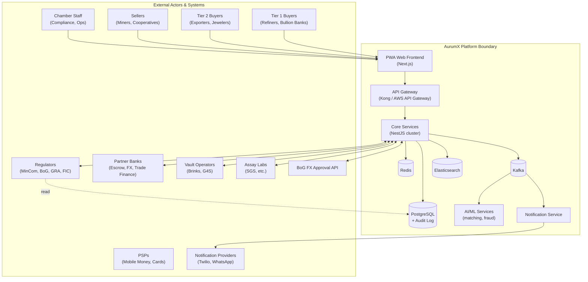
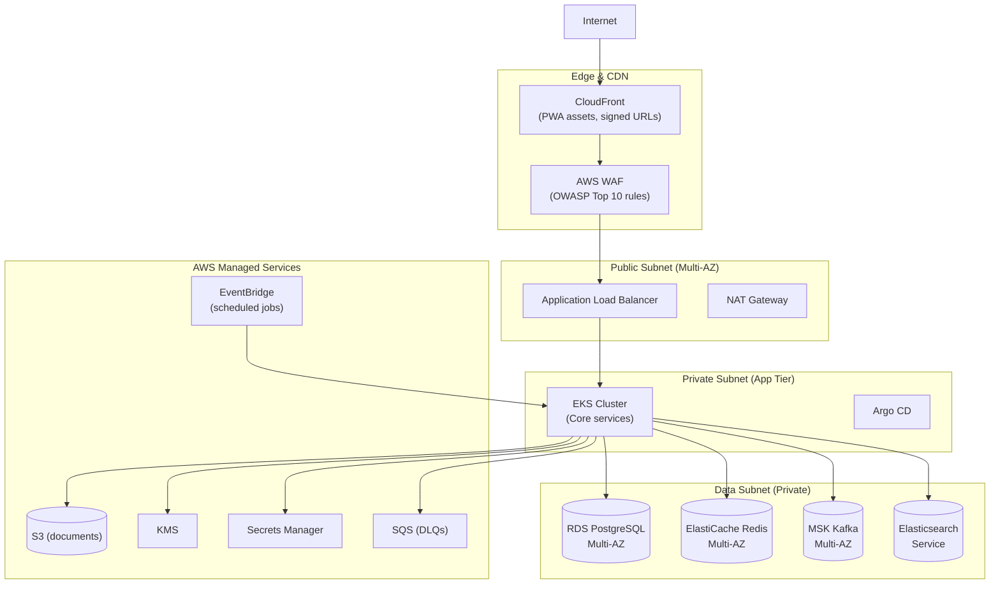
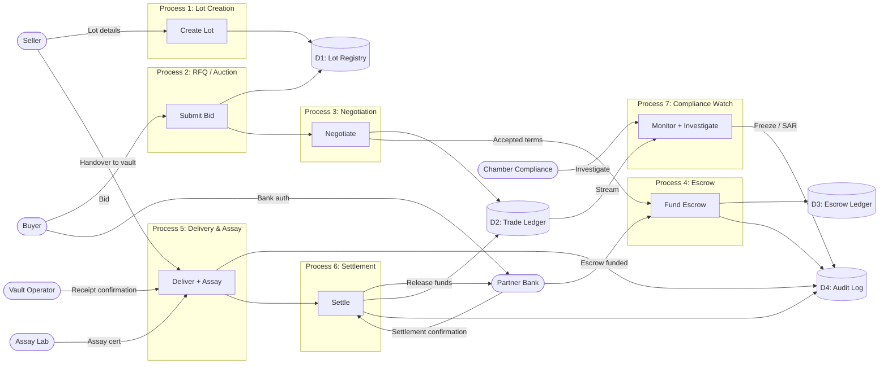
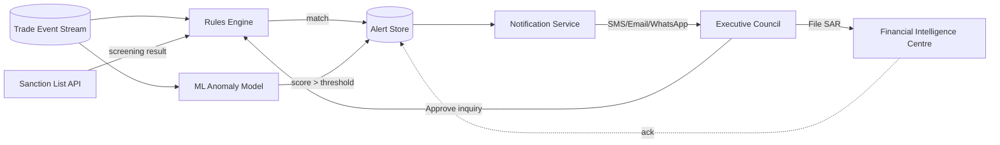
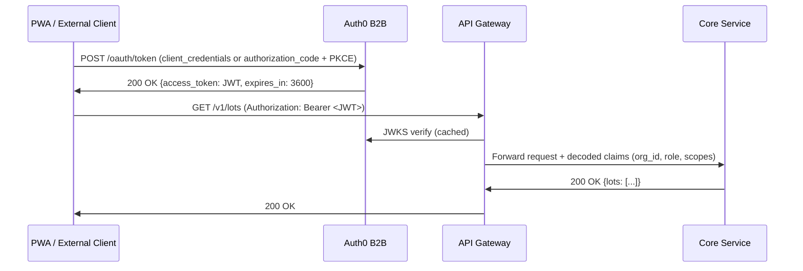

# Document 4 — System Architecture & Design

## Ghana Gold Exchange Platform (AurumX)

**Document Type:** Architecture Blueprint (HLD + LLD + ADRs)
**Version:** 1.0
**Related Documents:** Charter §4 (Scope), §8 (Constraints/Dependencies) · User Personas (Doc 2) · User Flows (Doc 5) · DevOps (Doc 6) · Security & Compliance (Doc 7)

---

## Part 1 — System Architecture Document (High-Level Design)

### 1.1 Architecture Goals & Principles

The platform is built around six architecture principles, each tied to a Charter constraint or risk:

| # | Principle | Rationale | Charter Cross-Reference |
|---|---|---|---|
| AP1 | **Member-gated, not open-marketplace.** Identity, licensing, and AML verification are preconditions for any trade. | Project context §1; Charter §3.1 | |
| AP2 | **Event-driven core.** Trade state changes emit domain events consumed by downstream services (compliance, analytics, notifications). | Enables Journey 4 (24h detection SLA) — Charter Obj #5 | |
| AP3 | **Audit-first data model.** Every state transition is persisted as an immutable, hash-anchored event before any side effect runs. | Regulatory defensibility — Charter §8 C4, C5 | |
| AP4 | **Vendor and partner agnostic.** External integrations (banks, vaults, assay labs, government APIs) abstracted behind interfaces; one provider can be swapped for another. | Charter Risk R2 (escrow partner withdrawal) | |
| AP5 | **Mobile-first delivery, desktop-required for high-value decisions.** PWA serves all personas; tiered UX confidence (Persona matrix, Doc 2). | Persona coverage — Ibrahim (mobile-only) vs. Kwame (desktop-required) | |
| AP6 | **Cost-aware scaling.** Stateless services scale horizontally; stateful stores (PostgreSQL, Redis) scale vertically first, then via read replicas and partitioning. | Vendor-side cost constraint — Charter §6.1 | |

### 1.2 System Context Diagram



### 1.3 Technology Stack with Rationale

| Layer | Technology | Rationale | Alternatives Considered |
|---|---|---|---|
| **Frontend (web/PWA)** | Next.js 16 (App Router) + React 19 + TypeScript + Tailwind CSS | Server-rendered PWA supports Ibrahim's low-bandwidth mobile use case (Persona 3); strong typing for safety-critical financial UX; ecosystem maturity. | Remix, Nuxt 3, SvelteKit — Next.js chosen for hiring pool + Vercel/AWS deployment flexibility. |
| **Frontend state / data** | TanStack Query + Zustand | Server-state cache + lightweight client state. | Redux Toolkit, Apollo (overkill given REST primary). |
| **Backend framework** | NestJS (Node.js 22 LTS, TypeScript) | Opinionated module system enforces structure; first-class DI; matches frontend language; strong OpenAPI generation. | Spring Boot (JVM ops cost), Django (slower async), Go (smaller hiring pool). |
| **API style** | REST (primary) + GraphQL (BFF for member portal) + Webhooks (outbound) + WebSocket (real-time negotiation) | REST for partner/external integrations (Kwame's SAP), GraphQL for the portal's varied UI needs, WebSocket for negotiation latency (Journey 1, Stage 3). | gRPC (overkill for external partners), pure GraphQL (partner resistance). |
| **Primary database** | PostgreSQL 16 | ACID guarantees critical for trade ledger; mature JSONB for flexible metadata; Row-Level Security for tenant isolation (Charter §7 compliance). | MySQL, CockroachDB (operational immaturity at our scale). |
| **Read replicas / scaling** | PostgreSQL read replicas + PgBouncer pooler | Vertical scale first (r6g.4xlarge), read replicas for analytics queries (Efua's dashboards). | Citus sharding (premature), Aurora Serverless v2 (cost unpredictability). |
| **Cache** | Redis 7 (cluster mode) | Session store, rate-limit counters, real-time negotiation state, hot lot metadata. | Memcached (no persistence), DynamoDB (latency variance). |
| **Search** | Elasticsearch 8 | Lot discovery (Kwame + Abena's filtering), full-text on member directory, audit-log search. | OpenSearch (fork; would re-converge), Postgres FTS (insufficient for faceted search). |
| **Message queue / event bus** | Apache Kafka (AWS MSK) | Domain events for audit log, anomaly detection, notification fan-out; replayable for compliance (Charter §8 C4). | RabbitMQ (smaller throughput), SQS (no replay semantics), EventBridge (vendor lock-in concern). |
| **Object storage** | AWS S3 + KMS encryption | Document storage (KYC packs, assay certificates, contracts); lifecycle policies to Glacier for archival. | MinIO (self-hosted ops cost), Azure Blob (AWS-first commitment). |
| **Identity** | Auth0 (B2B tenant) | Enterprise agreement in place (Charter §8 C2); supports organization-level RBAC for cooperative accounts. | Keycloak (operational burden), Cognito (B2B features weaker). |
| **Secrets management** | AWS Secrets Manager + Parameter Store | Rotation, fine-grained IAM, native RDS integration. | HashiCorp Vault (operational burden for our scale), GCP Secret Manager (AWS-first). |
| **Container orchestration** | AWS EKS (managed Kubernetes) | Multi-AZ, autoscaling, mature ecosystem. | ECS (less ecosystem breadth), Fargate only (cost premium), self-managed K8s (operational burden). |
| **CI/CD** | GitHub Actions + Argo CD (GitOps) | Branch-driven builds, Argo CD for declarative K8s deployments. | Jenkins (operational burden), GitLab CI (separate vendor). |
| **Observability** | Datadog (APM + logs + metrics) + Sentry (frontend errors) | Unified observability reduces tool sprawl; strong OpenTelemetry support. | Prometheus + Grafana + Loki (operational burden), New Relic (cost). |
| **IaC** | Terraform + Helm | Cloud-agnostic IaC; Helm for K8s release management. | CDK (AWS lock-in), Pulumi (smaller ecosystem). |
| **Cloud** | AWS (primary region: af-west-1 / Cape Town; secondary: eu-west-1) | African region for Ghanaian data residency preference (Charter §8 A6); eu-west-1 for DR. | Azure (no African region until 2026 GA), GCP (no African region). [ASSUMPTION: af-west-1 generally available by Phase 1 launch.] |

[ASSUMPTION: If AWS af-west-1 is not GA by Phase 1 launch, fall back to eu-west-1 with documented cross-border transfer lawful basis under Ghana Data Protection Act §84.]

### 1.4 Cloud Infrastructure Overview



**Multi-AZ topology:** All stateful services (RDS, ElastiCache, MSK, ES) are deployed across 3 AZs with synchronous replication for RDS, async for Elasticsearch. Stateless EKS workloads span all 3 AZs with pod anti-affinity. **Disaster recovery:** Warm standby in eu-west-1 (RPO 5 minutes, RTO 4 hours — see Doc 6 §7).

### 1.5 High-Level Component Map

```mermaid
graph LR
    subgraph Frontend["Frontend Layer"]
        Portal["Member Portal PWA"]
        Admin["Chamber Admin Console"]
        Public["Marketing Site"]
    end

    subgraph Gateway["API Layer"]
        GW["API Gateway (Kong)"]
        AuthN["Auth0 B2B"]
    end

    subgraph Core["Core Domain Services"]
        MemberSvc["Member Service"]
        LotSvc["Lot Service"]
        RFQSvc["RFQ Engine"]
        AuctSvc["Auction Engine"]
        NegotSvc["Negotiation Service"]
        TradeSvc["Trade Service"]
        EscrowSvc["Escrow Service"]
        AssaySvc["Assay Service"]
        LogisticsSvc["Logistics Service"]
        ExportSvc["Export Doc Service"]
        VaultSvc["Vault Service"]
        CompSvc["Compliance Service"]
        AnalyticsSvc["Analytics Service"]
        NotifSvc["Notification Service"]
        AuditLog["Audit Log Service"]
    end

    subgraph Integrations["Integration Layer (Adapters)"]
        BankAdapter["Bank Adapter"]
        VaultAdapter["Vault Adapter"]
        AssayAdapter["Assay Adapter"]
        GovAdapter["Government API Adapter"]
        PSPAdapter["PSP Adapter"]
        NotifAdapter["Notification Provider Adapter"]
    end

    subgraph Data["Data Layer"]
        Postgres[("PostgreSQL")]
        Redis[("Redis")]
        Kafka[("Kafka")]
        ES[("Elasticsearch")]
        S3[("S3")]
    end

    Portal --> GW
    Admin --> GW
    Public --> GW
    GW --> AuthN
    GW --> Core
    Core --> Integrations
    Integrations --> External[External Systems]
    Core --> Data
```



---

## Part 2 — Low-Level Design (LLD) / Component Design

### 2.1 Data Model — Entity-Relationship Diagram (Logical)

```mermaid
erDiagram
    ORGANIZATION ||--o{ MEMBER : has
    ORGANIZATION ||--o{ LICENSE : holds
    ORGANIZATION ||--o{ BANK_ACCOUNT : owns
    MEMBER ||--o{ USER_SESSION : has
    MEMBER {
        uuid id PK
        uuid organization_id FK
        string email UK
        string phone
        string full_name
        enum role
        timestamp created_at
        timestamp deactivated_at
    }
    ORGANIZATION {
        uuid id PK
        string name
        enum tier "TIER_1 | TIER_2 | SELLER"
        enum status "PENDING | VERIFIED | SUSPENDED | REVOKED"
        jsonb metadata
        timestamp verified_at
    }
    LICENSE {
        uuid id PK
        uuid organization_id FK
        string license_number UK
        enum type "MINING | EXPORT | BUYER_T1 | BUYER_T2"
        date issued_at
        date expires_at
        string issuer
        jsonb verification_metadata
    }
    BANK_ACCOUNT {
        uuid id PK
        uuid organization_id FK
        string bank_code
        string account_last4
        string account_holder_name
        enum status "PENDING | VERIFIED | FAILED"
        timestamp verified_at
    }

    ORGANIZATION ||--o{ GOLD_LOT : lists
    GOLD_LOT ||--o{ ASSAY_CERTIFICATE : has
    GOLD_LOT ||--o{ PROVENANCE_EVENT : records
    GOLD_LOT {
        uuid id PK
        uuid seller_org_id FK
        decimal weight_grams
        decimal purity
        string serial_number
        enum status "DRAFT | LISTED | UNDER_OFFER | IN_NEGOTIATION | IN_ESCROW | DELIVERED | SETTLED | CANCELLED | DISPUTED"
        jsonb metadata
        timestamp listed_at
    }
    ASSAY_CERTIFICATE {
        uuid id PK
        uuid lot_id FK
        uuid lab_id FK
        decimal measured_purity
        decimal measured_weight
        jsonb raw_result
        string certificate_url
        timestamp issued_at
    }
    PROVENANCE_EVENT {
        uuid id PK
        uuid lot_id FK
        enum event_type "MINED | AGGREGATED | ASSAYED | VAULTED | SHIPPED | TITLE_TRANSFER"
        jsonb event_payload
        string hash_anchor
        timestamp occurred_at
    }

    GOLD_LOT ||--o{ RFQ : receives
    GOLD_LOT ||--o{ AUCTION : listed_in
    RFQ ||--o{ BID : has
    AUCTION ||--o{ BID : has
    RFQ {
        uuid id PK
        uuid lot_id FK
        uuid buyer_org_id FK
        enum status "OPEN | RESPONDED | NEGOTIATING | ACCEPTED | REJECTED | EXPIRED"
        decimal asking_price_usd
        timestamp created_at
        timestamp expires_at
    }
    AUCTION {
        uuid id PK
        uuid lot_id FK
        enum type "TIMED | REVERSE | SEALED"
        decimal reserve_price_usd
        timestamp starts_at
        timestamp ends_at
        uuid winner_org_id
    }
    BID {
        uuid id PK
        uuid rfq_id FK
        uuid auction_id FK
        uuid bidder_org_id FK
        decimal amount_usd
        enum status "PENDING | ACCEPTED | REJECTED | OUTBID | WON | LOST"
        timestamp submitted_at
    }

    RFQ ||--|| TRADE : becomes
    AUCTION ||--o| TRADE : becomes
    TRADE ||--|| ESCROW : secured_by
    TRADE ||--o{ TRADE_EVENT : records
    TRADE ||--o{ CONTRACT : has
    TRADE {
        uuid id PK
        uuid lot_id FK
        uuid seller_org_id FK
        uuid buyer_org_id FK
        uuid rfq_id FK
        uuid auction_id FK
        decimal amount_usd
        enum status "PENDING_ESCROW | ESCROW_FUNDED | DELIVERED | ASSAYED | TITLE_TRANSFERRED | SETTLED | DISPUTED | CANCELLED"
        timestamp created_at
        timestamp settled_at
    }
    ESCROW {
        uuid id PK
        uuid trade_id FK
        uuid bank_account_id FK
        decimal amount_usd
        enum status "PENDING | FUNDED | RELEASED_TO_SELLER | REFUNDED_TO_BUYER | FROZEN"
        string bank_reference
        timestamp funded_at
        timestamp released_at
    }
    CONTRACT {
        uuid id PK
        uuid trade_id FK
        string document_url
        jsonb signatures
        timestamp signed_at
    }
    TRADE_EVENT {
        uuid id PK
        uuid trade_id FK
        enum event_type "ESCROW_FUNDED | GOLD_DELIVERED | ASSAY_ATTACHED | TITLE_TRANSFERRED | PAYMENT_RELEASED | DISPUTE_OPENED | DISPUTE_RESOLVED | COMPLIANCE_HOLD"
        jsonb event_payload
        string hash_anchor
        timestamp occurred_at
    }

    ORGANIZATION ||--o{ COMPLIANCE_ALERT : triggers
    COMPLIANCE_ALERT ||--o{ ALERT_EVENT : has
    COMPLIANCE_ALERT {
        uuid id PK
        uuid triggered_by_trade_id FK
        uuid triggered_by_org_id FK
        enum severity "LOW | MEDIUM | HIGH | CRITICAL"
        enum status "OPEN | INVESTIGATING | ESCALATED | CLEARED | FILED_SAR"
        jsonb signals
        timestamp created_at
        timestamp resolved_at
    }
    ALERT_EVENT {
        uuid id PK
        uuid alert_id FK
        enum action "DETECTED | ACKNOWLEDGED | ESCALATED | FROZE_TRADE | FILED_SAR | CLEARED"
        uuid actor_member_id FK
        jsonb action_payload
        timestamp occurred_at
    }
```



### 2.2 Data Flow Diagrams (DFDs)

#### Level-0 DFD — Trade Lifecycle



#### Level-1 DFD — Compliance Anomaly Detection



### 2.3 Design Patterns Used

| Pattern | Where Applied | Why |
|---|---|---|
| **Domain-Driven Design (DDD)** | Core domain services (`Lot`, `Trade`, `Escrow`, `Compliance`) | Complex business rules in trade lifecycle require rich domain models, not anemic CRUD. |
| **Event Sourcing** (partial) | `Trade` and `Compliance Alert` aggregates | Audit-defensible history; replayable for investigations (Journey 4). |
| **CQRS** | `Lot` read model backed by Elasticsearch; write model in PostgreSQL | Optimization for high-read lot discovery (Kwame + Abena search). |
| **Repository + Unit of Work** | All data access layers | Testability; consistency boundaries per aggregate. |
| **Strategy** | `EscrowProvider`, `PaymentProvider`, `NotificationProvider`, `AssayProvider` adapters | Vendor-agnostic per Charter Risk R2 (provider swap). |
| **Outbox Pattern** | All services publishing to Kafka | Guarantees atomic DB write + event publish (no dual-write inconsistency). |
| **Saga** (choreography) | Trade lifecycle (`LotListed → BidSubmitted → NegotiationComplete → EscrowFunded → GoldDelivered → AssayAttached → TitleTransferred → PaymentReleased`) | Long-running distributed transaction across services without 2PC. |
| **Backpressure / Bulkhead** | Notification Service, Bank Adapter | Prevents downstream slowness (e.g., bank API latency) from cascading. |
| **Materialized View** | Analytics rollups for compliance dashboard | Decouples Efua's heavy read queries from the trade-write hot path. |

### 2.4 Service Boundaries

| Service | Owns | Does NOT Own |
|---|---|---|
| `Member Service` | Organizations, members, roles, sessions | License verification (delegated to Compliance) |
| `Lot Service` | Gold lot lifecycle, provenance events | Trade / RFQ / Auction |
| `RFQ Engine` | RFQ + Bid lifecycle | Negotiation messages |
| `Auction Engine` | Auction lifecycle, bid ranking, winner determination | Trade settlement |
| `Negotiation Service` | Real-time negotiation messages, WebSocket state | Trade acceptance (delegated to Trade Service) |
| `Trade Service` | Trade aggregate, state machine, trade events | Escrow funds (delegated to Escrow Service) |
| `Escrow Service` | Escrow ledger, bank integration, release/refund | Physical gold movement |
| `Assay Service` | Assay request workflow, certificate storage | Lab operations (owned by lab) |
| `Logistics Service` | Transport booking, tracking | Vehicle operations (owned by vault/transport partner) |
| `Vault Service` | Vault inventory, title transfer records | Physical custody (owned by vault operator) |
| `Export Doc Service` | PMMC, GRA, BoG permit orchestration | Permit issuance decisions (owned by government agencies) |
| `Compliance Service` | AML screening, sanction list, anomaly alerts, SAR filings | Trade freeze (joint with Trade Service) |
| `Analytics Service` | Materialized views, dashboards | Source-of-truth data (always PostgreSQL) |
| `Notification Service` | Multi-channel fan-out (email, SMS, WhatsApp, push) | Message content (owned by emitting service) |
| `Audit Log Service` | Append-only hash-anchored event store | Business logic |

---

## Part 3 — API Design

### 3.1 API Style & Conventions

- **Protocol:** HTTPS only (TLS 1.3 minimum, TLS 1.2 deprecated by Phase 2).
- **Format:** JSON (`application/json; charset=utf-8`); timestamps in ISO 8601 UTC; monetary amounts as decimal strings with explicit currency code (`"amount": "125000.00"`, `"currency": "USD"`) to avoid floating-point loss.
- **Versioning:** URL-based (`/v1/`, `/v2/`); backward-compatible changes within a major version; breaking changes require a new major version with 12-month overlap.
- **Naming:** `kebab-case` for paths; `camelCase` for JSON fields; plural nouns for collections.
- **Pagination:** Cursor-based (`?cursor=...&limit=50`); `Link` header for next/prev.
- **Idempotency:** All `POST` endpoints that create resources or trigger side effects require an `Idempotency-Key` header (UUID v4); idempotent for 24 hours.
- **Rate limiting:** Token-bucket per API key — see §3.5.
- **Error format:** RFC 7807 Problem Details — see §3.4.

### 3.2 Authentication & Authorization



- **Auth provider:** Auth0 B2B with Organizations (one Auth0 Organization per Chamber member Organization).
- **Auth flows:** Authorization Code + PKCE for the PWA; Client Credentials for machine-to-machine (Tier 1 ERP integration, government API adapters).
- **Token type:** JWT (RS256), 1-hour access tokens; refresh tokens 30-day sliding window.
- **RBAC model:** Roles scoped per Organization — `org.admin`, `org.trader`, `org.compliance`, `org.viewer`. Chamber staff have global roles — `chamber.compliance`, `chamber.executive`.
- **Fine-grained permissions:** `lot:create`, `lot:read:any`, `trade:execute:t1`, `compliance:investigate`, `audit:read` etc. Permissions attached to roles via Auth0 custom claims.
- **MFA:** Required for `org.admin`, all Chamber roles, and any trade action above US$100K.
- **IP allowlisting:** Optional per Organization (Tier 1 refiners commonly require this).

### 3.3 Key Endpoints (Selected)

> **Note:** Full OpenAPI 3.1 spec lives in the `docs/openapi/` folder of the monorepo. Below are illustrative examples tied to Journey flows (Doc 5).

#### 3.3.1 Identity & Member

```http
POST /v1/organizations
GET  /v1/organizations/{orgId}
POST /v1/organizations/{orgId}/members
GET  /v1/organizations/{orgId}/members
POST /v1/organizations/{orgId}/licenses
POST /v1/organizations/{orgId}/kyc/submit
GET  /v1/organizations/{orgId}/kyc/status
```

**Example — Create Organization (Seller onboarding, Journey 3 Stage 1):**

```http
POST /v1/organizations HTTP/1.1
Content-Type: application/json
Idempotency-Key: 7b3f9c2e-1a4d-4e7c-9f8a-3e2c1d9b7a4f
Authorization: Bearer <JWT-chamber-ops>

{
  "name": "Banda Small-Scale Miners Cooperative",
  "tier": "SELLER",
  "license_number": "MC-ASM-2026-0142",
  "license_type": "MINING",
  "contact_email": "secretary@bandascoop.gh",
  "contact_phone": "+233244567890"
}

HTTP/1.1 201 Created
Location: /v1/organizations/9d2c1f4a-8e7b-4d3c-9a1f-2b5e7c8d3a01
{
  "id": "9d2c1f4a-8e7b-4d3c-9a1f-2b5e7c8d3a01",
  "status": "PENDING",
  "kyc_status": "NOT_STARTED",
  "created_at": "2026-09-12T10:14:22Z"
}
```

#### 3.3.2 Lots & Provenance

```http
POST /v1/lots
GET  /v1/lots?filter=purity>=0.995&weight_g>=5000&sort=listed_at:desc
GET  /v1/lots/{lotId}
POST /v1/lots/{lotId}/provenance-events
POST /v1/lots/{lotId}/assay-certificates
```

**Example — Create Lot (Journey 3 Stage 2):**

```http
POST /v1/lots HTTP/1.1
Content-Type: application/json
Idempotency-Key: 4a2c8d3e-9b1f-4d7c-8e5a-2c1b9d3f7a4e
Authorization: Bearer <JWT-seller>

{
  "seller_org_id": "9d2c1f4a-8e7b-4d3c-9a1f-2b5e7c8d3a01",
  "weight_grams": "3000.00",
  "purity": "0.992",
  "serial_number": "BANDA-2026-W36-001",
  "form": "DORE_BAR",
  "photo_urls": ["s3://aurumx-docs/lot-photos/9d2c.../front.jpg",
                 "s3://aurumx-docs/lot-photos/9d2c.../serial.jpg"]
}

HTTP/1.1 201 Created
{
  "id": "f8a3b2c1-7d4e-4f9a-8b3c-1d2e3f4a5b6c",
  "status": "DRAFT",
  "listed_at": null,
  "_links": {
    "publish": { "href": "/v1/lots/f8a3b2c1.../publish", "method": "POST" }
  }
}
```

#### 3.3.3 RFQ & Auction

```http
POST /v1/rfqs
GET  /v1/rfqs?status=OPEN&lot_tier=TIER_1_PRIORITY
POST /v1/rfqs/{rfqId}/bids
POST /v1/rfqs/{rfqId}/negotiate
POST /v1/rfqs/{rfqId}/accept
POST /v1/auctions
POST /v1/auctions/{auctionId}/bids
GET  /v1/auctions/{auctionId}/leaderboard  // opaque until end for sealed-bid
```

**Example — Submit Bid (Journey 1 Stage 3):**

```http
POST /v1/rfqs/{rfqId}/bids HTTP/1.1
Content-Type: application/json
Idempotency-Key: 6e9c2d4a-1f3b-4e8a-9c2d-1b5e7c3a4d8f
Authorization: Bearer <JWT-tier1-buyer>

{
  "bidder_org_id": "8c1f9d2a-3b4e-4c7d-9a1f-2b5e7c8d3a02",
  "amount_usd": "245000.00",
  "currency": "USD",
  "valid_until": "2026-09-15T18:00:00Z",
  "notes": "Counter-offer at $2 below LBMA fix; payment via Stanbic escrow."
}

HTTP/1.1 201 Created
{
  "id": "5a2c8d3e-9b1f-4d7c-8e5a-2c1b9d3f7a4e",
  "status": "PENDING",
  "submitted_at": "2026-09-15T14:32:11Z"
}
```

#### 3.3.4 Trade & Escrow

```http
POST /v1/trades              // created when RFQ accepted / auction won
GET  /v1/trades/{tradeId}
POST /v1/trades/{tradeId}/escrow/fund       // triggers bank adapter
POST /v1/trades/{tradeId}/escrow/release
POST /v1/trades/{tradeId}/escrow/refund
POST /v1/trades/{tradeId}/events           // vault receipt, assay attached, etc.
POST /v1/trades/{tradeId}/freeze            // chamber.compliance only
```

**Example — Fund Escrow (Journey 2 Stage 2):**

```http
POST /v1/trades/{tradeId}/escrow/fund HTTP/1.1
Idempotency-Key: 1d4e9c2a-7b3f-4c8a-9d2e-1b5e7c3a4d8f
Authorization: Bearer <JWT-buyer>

{
  "bank_account_id": "2c1f9d3a-4b5e-4c7d-9a1f-2b5e7c8d3a03",
  "amount_usd": "245000.00",
  "currency": "USD"
}

HTTP/1.1 202 Accepted
{
  "escrow_id": "3a2c8d4e-9b1f-4d7c-8e5a-2c1b9d3f7a4e",
  "status": "PENDING",
  "bank_reference": null,
  "_links": {
    "self": { "href": "/v1/escrows/3a2c8d4e...", "method": "GET" }
  }
}
```

#### 3.3.5 Compliance

```http
GET  /v1/compliance/alerts?status=OPEN&severity=HIGH,CRITICAL
GET  /v1/compliance/alerts/{alertId}
POST /v1/compliance/alerts/{alertId}/events     // acknowledge, escalate, file_sar
POST /v1/compliance/screenings                  // ad-hoc sanction check
GET  /v1/compliance/audit-log?trade_id=...      // hash-verified event stream
POST /v1/compliance/sar                         // file SAR with FIC
```

### 3.4 Error Code Conventions (RFC 7807)

```json
HTTP/1.1 422 Unprocessable Entity
Content-Type: application/problem+json

{
  "type": "https://docs.aurumx.gh/errors/escrow-insufficient-funds",
  "title": "Escrow funding failed",
  "status": 422,
  "detail": "The buyer's bank account has insufficient available balance to fund the requested escrow amount.",
  "instance": "/v1/trades/3a2c.../escrow/fund",
  "trace_id": "19ff597ca42fb131",
  "errors": [
    {
      "code": "ESCROW_INSUFFICIENT_FUNDS",
      "field": "amount_usd",
      "bank_reference": "STANBIC-2026-09-15-88421"
    }
  ]
}
```

| HTTP Status | Use Case |
|---|---|
| 400 | Malformed request (validation error) |
| 401 | Missing or invalid token |
| 403 | Authenticated but not authorized for this resource |
| 404 | Resource does not exist (or caller not authorized to know it exists) |
| 409 | Conflict (e.g., trade state does not permit the action) |
| 422 | Business rule violation (e.g., lot purity below threshold) |
| 429 | Rate limited |
| 5xx | Server error (always logged with `trace_id` for support) |

### 3.5 Rate Limiting

| Tier | Window | Limit | Burst | Applies To |
|---|---|---|---|---|
| Anonymous | 1 min | 10 req | 20 | Public marketing site only |
| Authenticated (Member) | 1 min | 300 req | 600 | All endpoints |
| Authenticated (Tier 1 Buyer with API access) | 1 min | 1,200 req | 2,400 | Programmatic Tier 1 access |
| Chamber Compliance | 1 min | 600 req | 1,200 | Admin console |
| Webhook deliveries (inbound) | 1 min | 100 req / source IP | 200 | Partner systems calling webhooks |

Rate-limit response includes `X-RateLimit-Limit`, `X-RateLimit-Remaining`, `X-RateLimit-Reset` headers. When exceeded, return `429` with `Retry-After` header.

### 3.6 Webhooks (Outbound)

For events the platform must push to partners (e.g., Tier 1 buyer SAP integration, bank settlement confirmations):

```http
POST <partner_webhook_url>
X-AurumX-Signature: t=1726419600,v1=8c2d1f4a3b5e7c9d...
Content-Type: application/json

{
  "id": "evt_0123456789abcdef",
  "type": "trade.settled",
  "created_at": "2026-09-15T16:00:00Z",
  "data": {
    "trade_id": "3a2c8d4e-9b1f-4d7c-8e5a-2c1b9d3f7a4e",
    "amount_usd": "245000.00",
    "currency": "USD",
    "buyer_org_id": "...",
    "seller_org_id": "..."
  }
}
```

HMAC-SHA256 signature over `${t}.${request_body}` using a per-webhook shared secret rotated quarterly. Partners must respond `2xx` within 30 seconds; retries with exponential backoff over 72 hours.

---

## Part 4 — Architecture Decision Records (ADRs)

> Format adapted from Michael Nygard's canonical ADR template. Each ADR is immutable once status = Accepted; supersession requires a new ADR referencing the prior.

### ADR-001 — Adopt an Event-Driven, Service-Oriented Architecture over a Monolith

**Status:** Accepted · **Date:** 2026-09-20 · **Supersedes:** None

**Context.** The AurumX platform spans heterogeneous concerns — member onboarding, trade lifecycle, escrow integration, assay coordination, logistics, compliance monitoring, analytics — with sharply different scaling profiles. Compliance monitoring is read-heavy with bursty alerting; the negotiation service is real-time WebSocket with low write volume; the trade service is write-heavy with strict consistency. The Chamber's compliance officer (Persona 4, Journey 4) requires a 24-hour detection-to-action SLA. Charter §8 C4 mandates SOC 2 Type II compliance.

**Decision.** Adopt an event-driven service-oriented architecture (not full microservices) with:
- Domain-aligned services owning specific aggregates (Lot, Trade, Escrow, Compliance, etc.).
- Kafka as the event backbone with the Outbox pattern for atomic DB writes + event publish.
- Saga choreography for the trade lifecycle (no distributed transactions).
- One PostgreSQL cluster (multi-AZ) shared across services via separate schemas; no cross-service direct DB access.

**Consequences.**
- (+) Independent scaling (Negotiation Service can scale without affecting Audit Log).
- (+) Audit trail is intrinsic (every event is replayable).
- (+) Compliance monitoring can subscribe to all trade events without coupling.
- (−) Operational complexity increases (more services to monitor, deploy, debug).
- (−) Distributed-systems pitfalls (eventual consistency, message ordering, idempotency).
- (−) Developer cognitive load (must understand async flows).

**Alternatives Considered.**
- *Modular monolith* (single NestJS app, internal modules). Rejected: does not meet the compliance team's "subscribe to all events" requirement without internal event bus, which is itself a step toward the chosen architecture. Locks in scaling bottlenecks.
- *Full microservices with separate DBs per service*. Rejected at this scale: operational burden unjustified; shared PostgreSQL with schema separation provides 80% of the benefit at 20% of the cost.

**Trade-offs.** Operational complexity vs. compliance and scalability. The compliance requirement (Charter §8 C4, §10) is non-negotiable; therefore the trade-off favors event-driven.

---

### ADR-002 — Use Auth0 B2B for Identity; Don't Build Custom Auth

**Status:** Accepted · **Date:** 2026-09-22 · **Supersedes:** None

**Context.** The platform requires: (1) organization-scoped RBAC (cooperatives have multiple members with different roles — Persona 3); (2) MFA for high-value trades and Chamber staff; (3) SSO for Tier 1 institutional buyers (Persona 1, Kwame — Helvetia will require SAML SSO); (4) per-organization IP allowlisting. Charter §8 C2 explicitly mandates Auth0 due to an existing enterprise agreement.

**Decision.** Use Auth0 B2B with Organizations. One Auth0 Organization per AurumX Organization. Use Auth0 custom claims for fine-grained permissions (`lot:create`, `trade:execute:t1`, etc.). SAML and OIDC enterprise connections for Tier 1 buyers; Auth0-hosted login page branded for the Chamber. No custom auth code paths.

**Consequences.**
- (+) SOC 2 compliance already in place for Auth0; reduces our audit surface.
- (+) MFA, passwordless, breached-password detection built-in.
- (+) SSO for Tier 1 buyers without custom integration per buyer.
- (−) Vendor lock-in; Auth0 outage = platform-wide auth outage.
- (−) Per-MAU pricing can scale steeply if Tier 2 buyer volume grows.

**Alternatives Considered.**
- *Keycloak self-hosted*. Rejected: operational burden (3-4 SRE weeks/year for upgrades, HA setup), and the Chamber's enterprise agreement with Auth0 makes Auth0 financially neutral.
- *AWS Cognito + custom RBAC*. Rejected: Cognito's B2B organization support is weaker; would require custom permission logic.

**Trade-offs.** Vendor lock-in vs. time-to-market and compliance posture. Given Charter §8 C2, the decision is also constrained.

---

### ADR-003 — Use Kafka (AWS MSK) over RabbitMQ or SQS for the Event Backbone

**Status:** Accepted · **Date:** 2026-09-25 · **Supersedes:** None

**Context.** The trade lifecycle is a long-running saga with 8+ stages (lot listed → bid → negotiate → escrow funded → delivered → assayed → title transferred → settled). Compliance (Persona 4) must replay any trade's full event history on demand for investigation (Journey 4) and for SOC 2 audit evidence (Charter §8 C4). Throughput forecast: ~500 events/sec peak, ~50 events/sec average — modest, but replayability and ordering guarantees are critical.

**Decision.** Adopt Apache Kafka (AWS MSK Standard, 3-broker multi-AZ) as the event backbone. Use the Outbox pattern in each service for atomic DB write + event publish. Use Kafka's log-compacted `audit-log` topic as the canonical replay source. Retention: 7 years (Charter compliance horizon).

**Consequences.**
- (+) Replayable event history — direct enabler for Journey 4 and SOC 2 audit.
- (+) Multiple consumers (compliance, analytics, notification) without coupling.
- (+) Log compaction keeps the audit topic bounded even with 7-year retention.
- (−) MSK operational cost (~US$1,800/month baseline).
- (−) Kafka's ordering guarantees are per-partition; cross-partition ordering requires careful key design (we key by `trade_id` for trade events).

**Alternatives Considered.**
- *RabbitMQ*. Rejected: message is consumed-and-acknowledged; replay requires a separate audit store. Adds an Outbox + audit-store component anyway; loses Kafka's log-compaction benefit.
- *AWS SQS + SNS*. Rejected: no native replay; would require building a separate audit pipeline.
- *EventBridge*. Rejected: vendor lock-in, no native 7-year retention, weaker ordering guarantees.

**Trade-offs.** Operational cost vs. compliance and replayability. Compliance is non-negotiable.

---

### ADR-004 — Use the Outbox Pattern for Atomic DB Write + Event Publish

**Status:** Accepted · **Date:** 2026-09-26 · **Supersedes:** None

**Context.** With an event-driven architecture (ADR-001) and Kafka as the backbone (ADR-003), the dual-write problem arises: if a service writes to PostgreSQL and then publishes to Kafka, a failure between the two leaves the system inconsistent (DB committed, event lost — or event published, DB rolled back). For an audited financial platform, this is unacceptable (Charter §8 C4, §10).

**Decision.** Every service that publishes events uses the Outbox pattern:
1. In a single DB transaction: write the domain aggregate AND insert a row into the service's local `outbox` table (status = `PENDING`).
2. A separate worker (Debezium connector or polling relay) reads the `outbox` table and publishes to Kafka, marking rows as `PUBLISHED` on success.
3. Idempotent consumers deduplicate by event ID (Kafka producer uses DB sequence as the Kafka message key for ordering).

**Consequences.**
- (+) Atomicity guarantee: DB state and event stream are always consistent.
- (+) Recoverable: any failure resumes from the outbox without data loss.
- (−) Adds an outbox table per service; adds a relay worker.
- (−) Slight write-latency increase (one extra row insert per transaction).

**Alternatives Considered.**
- *Dual-write without outbox*. Rejected: classic distributed-systems failure mode; indefensible under SOC 2 audit.
- *2PC (XA transactions) across PostgreSQL and Kafka*. Rejected: Kafka does not support XA; 2PC has well-known availability problems.
- *Change Data Capture via Debezium only (no explicit outbox)*. Rejected: CDC captures every DB change, including internal state changes we don't want to publish. Outbox gives us explicit control over what becomes an event.

**Trade-offs.** Operational complexity (extra worker) vs. data integrity. Integrity is non-negotiable for a financial platform.

---

### ADR-005 — Use Next.js PWA for All Member-Facing UI; No Native Apps in Phases 1–4

**Status:** Accepted · **Date:** 2026-09-28 · **Supersedes:** None

**Context.** Persona coverage spans: Kwame (Tier 1, desktop-required, enterprise-UX expectations); Abena (Tier 2, mobile-first, low-bandwidth-tolerant); Ibrahim (Seller, mobile-only, 3G/EDGE). Native apps (iOS + Android) require 2 separate codebases, App Store / Play Store review cycles, and would still need a web fallback for Chamber staff and Tier 1 desktop users.

**Decision.** Build the entire member-facing UI as a Next.js PWA:
- Server-rendered pages for first-paint performance on low-bandwidth connections (Ibrahim).
- Service worker for offline-tolerant document capture (Journey 3 Stage 2).
- Responsive design with explicit mobile-first, desktop-required-for-high-value patterns.
- Push notifications via Web Push API (with SMS/WhatsApp fallback for critical events).
- Installable to home screen; full-screen mode without browser chrome.

Native apps deferred to Phase 5+ (Charter §4.2 Out-of-Scope).

**Consequences.**
- (+) Single codebase across desktop, tablet, mobile.
- (+) No App Store review cycles for the first 4 phases.
- (+) Server-rendered pages minimize data transfer for Ibrahim.
- (−) Some Tier 1 buyers (Kwame) may push back on "no native app" — mitigated by excellent PWA experience and API access for SAP integration.
- (−) Push notifications less reliable on iOS Safari pre-16.4; mitigated by SMS/WhatsApp fallback.

**Alternatives Considered.**
- *React Native + web*. Rejected: 2 codebases; Phase 1 timeline cannot absorb.
- *Flutter + web*. Rejected: smaller hiring pool in Ghana; web fidelity concerns.
- *Native iOS + Android + separate web*. Rejected: 3 codebases; unjustified for Phase 1–4 volume.

**Trade-offs.** Single-codebase agility vs. native UX polish. For Phases 1–4, PWA wins; revisit in Phase 5 based on usage data.

---

### ADR Summary Index

| ADR | Title | Status | Date |
|---|---|---|---|
| ADR-001 | Event-Driven SOA over Monolith | Accepted | 2026-09-20 |
| ADR-002 | Auth0 B2B for Identity | Accepted | 2026-09-22 |
| ADR-003 | Kafka (MSK) over RabbitMQ/SQS | Accepted | 2026-09-25 |
| ADR-004 | Outbox Pattern for Atomic Event Publish | Accepted | 2026-09-26 |
| ADR-005 | Next.js PWA, no native apps in Phases 1–4 | Accepted | 2026-09-28 |
| ADR-006 | PostgreSQL with Schema-per-Service vs. Database-per-Service | Pending | TBD — Phase 2 |
| ADR-007 | Escrow Bank Integration: Sync API vs. Async Webhook + Polling | Pending | TBD — Phase 2 |
| ADR-008 | Hash-Anchored Audit Log: Kafka Compact Topic + S3 WORM | Pending | TBD — Phase 2 |
| ADR-009 | ML Model Serving: Batch (Airflow) vs. Real-Time (KServe) | Pending | TBD — Phase 4 |

---

## Cross-References

- **Document 1 — Project Charter:** ADR-002 aligns with Charter §8 C2 (Auth0 constraint); ADR-003 + ADR-004 align with Charter §8 C4 (SOC 2) and §9 R4 (cybersecurity incident); ADR-005 aligns with Persona coverage in Doc 2.
- **Document 2 — User Personas:** Personas 1, 2, 3 directly informed ADR-005 (PWA decision).
- **Document 3 — User Success Journeys:** Journey 4's 24-hour detection SLA is the basis for ADR-001 and ADR-003.
- **Document 5 — User Flows & System Flows:** The API endpoints in §3.3 are the contract for the flows in Doc 5.
- **Document 6 — DevOps Documentation:** The cloud infrastructure in §1.4 is operated per the runbook in Doc 6 §4.
- **Document 7 — Security & Compliance:** §3.2 (Authentication) and §3.4 (Error handling) are detailed further in Doc 7.
