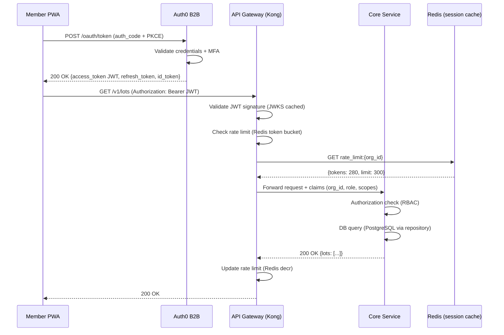
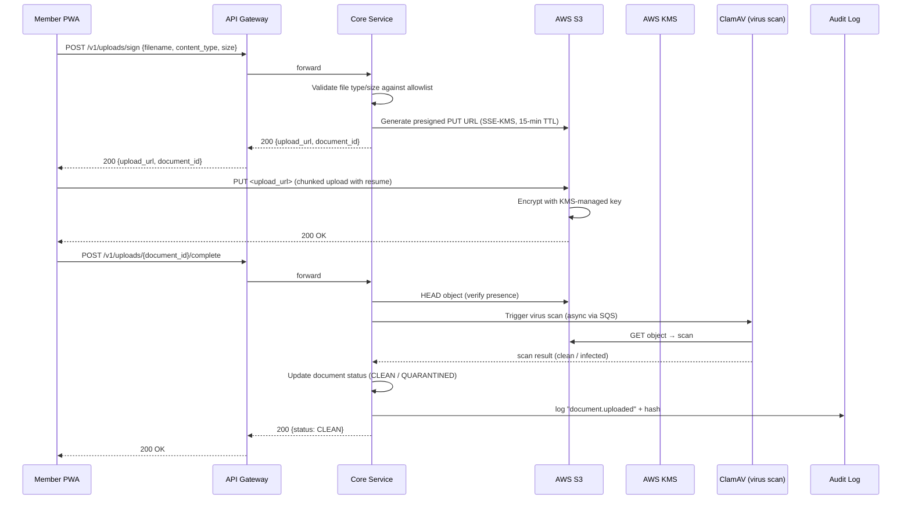
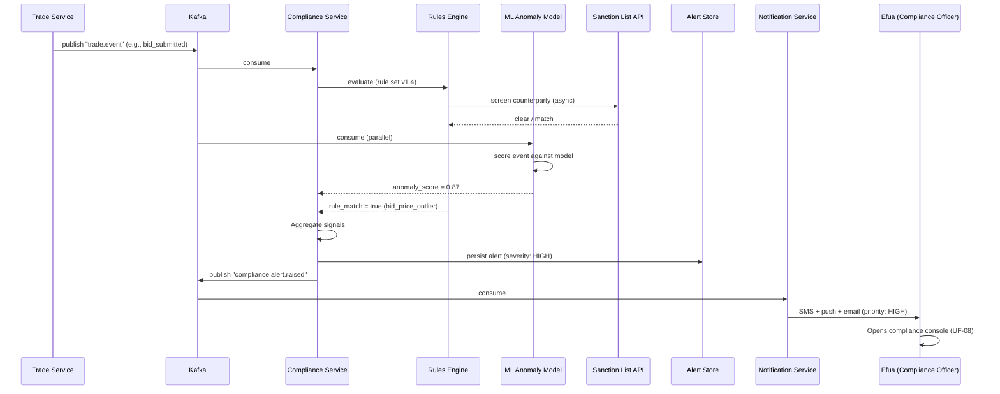
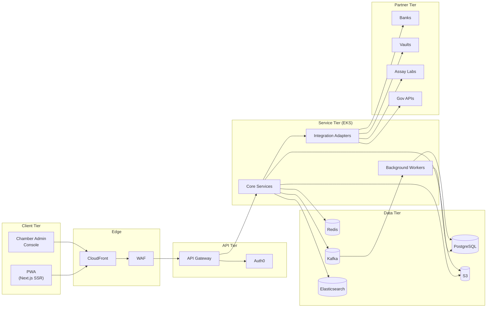
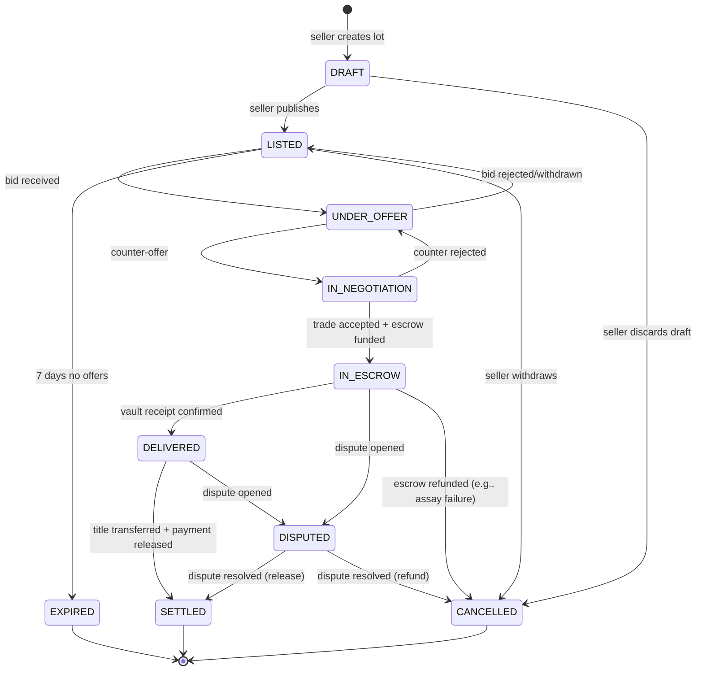
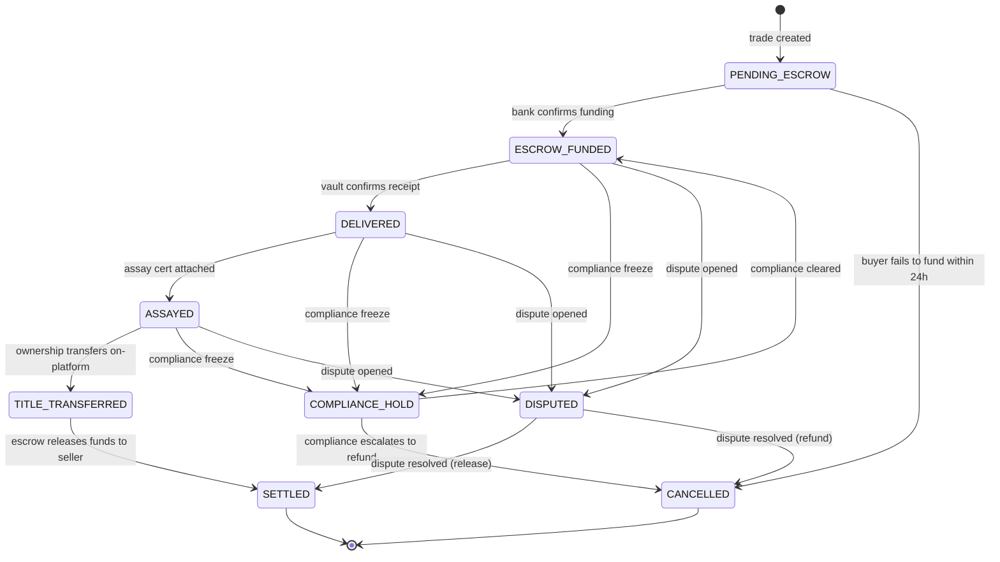
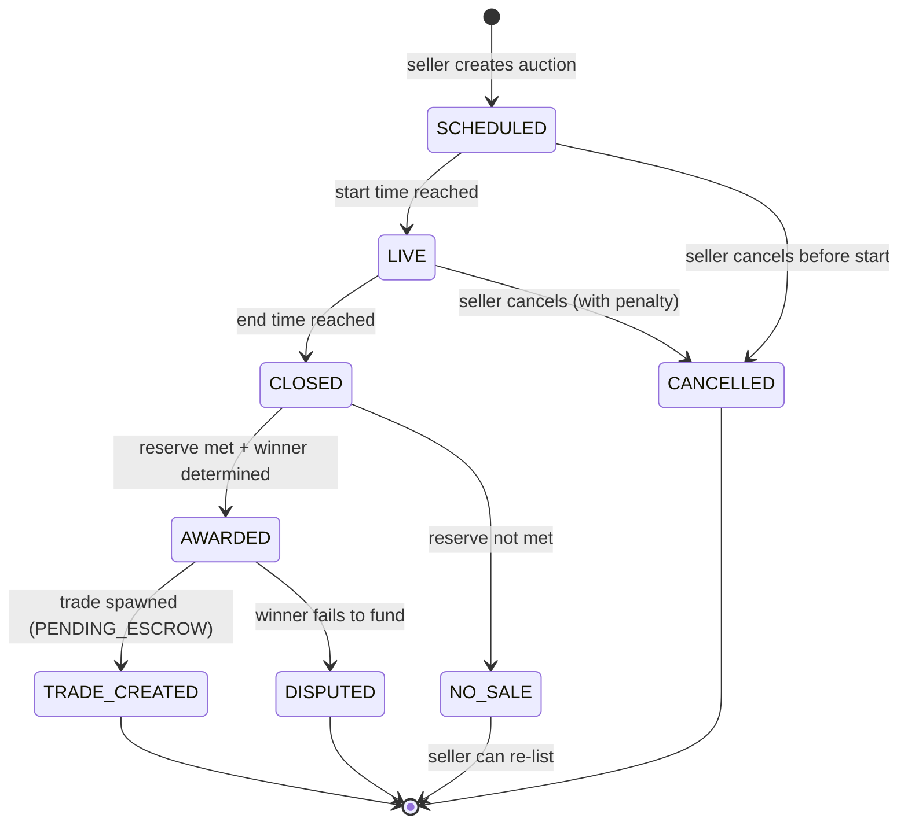
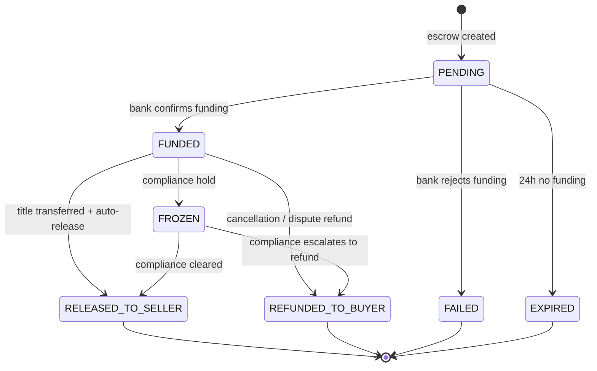
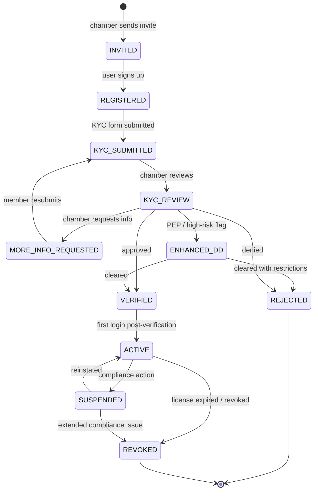
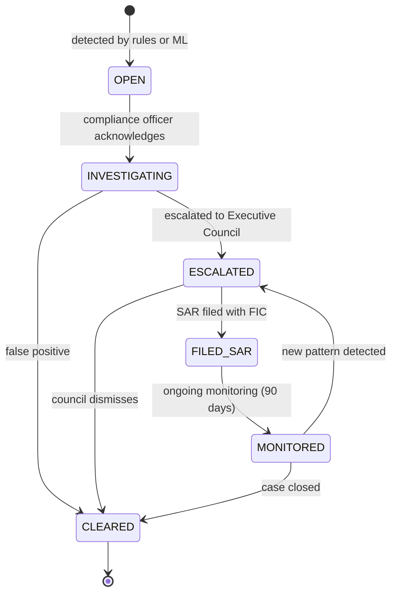

# Document 5 — User Flows & System Flows

## Ghana Gold Exchange Platform (AurumX)

**Document Type:** UX Flows + Technical Sequence / State Diagrams
**Version:** 1.0
**Related Documents:** User Personas (Doc 2) · User Success Journeys (Doc 3) · System Architecture (Doc 4 §3.3)

---

## How to Read This Document

This document describes **how** users move through the product (screen-by-screen flows with branches and edge cases) and how their actions translate into **system behavior** (requests across services, sequence diagrams, state transitions).

Each user flow is mapped to:
1. The persona(s) it primarily serves (cross-ref to **Doc 2**)
2. The journey stage it supports (cross-ref to **Doc 3**)
3. The API endpoints that back it (cross-ref to **Doc 4 §3.3**)

Flows covered:

| # | Flow | Primary Persona | Journey Stage |
|---|---|---|---|
| UF-01 | Member Onboarding | Ibrahim, Abena, Kwame | Journey 1/2/3 Stage 1 |
| UF-02 | Lot Creation & Listing | Ibrahim | Journey 3 Stage 2 |
| UF-03 | RFQ Submission & Negotiation | Kwame, Abena | Journey 1/2 Stage 3 |
| UF-04 | Auction (Timed, Reverse, Sealed-Bid) | Kwame, Abena | Journey 1/2 Stage 3 (alt) |
| UF-05 | Escrow Funding & Settlement | Kwame, Abena, Ibrahim | Journey 1/2/3 Stage 4 |
| UF-06 | Assay Request & Certification | Abena, Chamber | Journey 2 Stage 3 |
| UF-07 | Export Documentation Bundle | Abena | Journey 2 Stage 4 |
| UF-08 | Compliance Investigation | Efua | Journey 4 Stage 2 |
| UF-09 | Dispute Resolution | All | Cross-journey |

State diagrams cover: Lot, Trade, Auction, Escrow, Compliance Alert, Member Onboarding, Dispute.

---

## Part 1 — User Flow Diagrams

### UF-01 — Member Onboarding Flow

**Personas:** Ibrahim (Seller, mobile-only), Abena (Tier 2 Buyer, mobile-first), Kwame (Tier 1 Buyer, desktop).
**Journey Stage:** Journey 1/2/3 — Stage 1 (Discover / Onboard).
**Endpoints:** `POST /v1/organizations`, `POST /v1/organizations/{id}/licenses`, `POST /v1/organizations/{id}/kyc/submit`, `GET /v1/organizations/{id}/kyc/status`.

```mermaid
flowchart TD
    Start([Prospective member receives<br/>Chamber invite via WhatsApp/email]) --> Invite
    Invite[User taps invite link] --> Landing{Has existing<br/>Auth0 account?}
    Landing -- Yes --> Login[Log in with Auth0]
    Landing -- No --> SignUp[Sign up: email + phone<br/>+ MFA enrollment]
    Login --> OrgForm
    SignUp --> OrgForm
    OrgForm[Complete Organization form<br/>name, tier, contact] --> SubmitOrg[POST /v1/organizations]
    SubmitOrg --> OrgCreated{201 Created?}
    OrgCreated -- No --> ShowErr[Show problem+json error]
    ShowErr --> OrgForm
    OrgCreated -- Yes --> LicenseStep[Upload license document<br/>+ license_number]
    LicenseStep --> SubmitLic[POST /v1/organizations/{id}/licenses]
    SubmitLic --> KYCStep[Complete KYC form<br/>beneficial owners, AML questionnaire]
    KYCStep --> SubmitKYC[POST /v1/organizations/{id}/kyc/submit]
    SubmitKYC --> KYCPending[Status: PENDING<br/>notify via WhatsApp + SMS]
    KYCPending --> KYCReview[Chamber compliance<br/>reviews application]
    KYCReview --> Decision{Decision}
    Decision -- Approved --> Verified[Status: VERIFIED<br/>can create/list lots, place bids]
    Decision -- More info needed --> RequestInfo[Notify member<br/>of missing items]
    RequestInfo --> KYCStep
    Decision -- Rejected --> Rejected[Status: REJECTED<br/>notify with reason + appeal path]
```

**Edge cases and branches:**

| Edge Case | Handling | UX Implication |
|---|---|---|
| Uploaded license scan is corrupt or unreadable | Server-side validation rejects with `422 LICENSE_FILE_INVALID`; client shows specific reason | Inline error message with "Re-upload" button; no full-form reset |
| License number already exists in registry | `409 LICENSE_NUMBER_DUPLICATE` | Show: "This license is already registered to another organization. Contact Chamber compliance if you believe this is an error." |
| KYC form timeout (>30 min idle) | Draft auto-saved every 30 seconds; on timeout, return user to last saved step | Toast: "Your progress was saved. Resume where you left off." |
| Mobile network drops mid-upload | Image compressed client-side; upload resumes from where it stopped (chunked) | Progress bar with retry; do NOT show "failed" until 3 retries |
| Beneficial owner is a PEP (Politically Exposed Person) | AML screening flags → triggers enhanced due diligence workflow (manual review by Efua) | Member sees status "Enhanced Review — estimated 5 business days" |
| Chamber compliance team unavailable > SLA (5 business days) | Auto-escalation to Chamber PMO | Member receives apology notification with new ETA |

---

### UF-02 — Lot Creation & Listing Flow

**Personas:** Ibrahim (primary), Chamber staff (oversight).
**Journey Stage:** Journey 3 — Stage 2 (List Lot).
**Endpoints:** `POST /v1/lots`, `POST /v1/lots/{id}/provenance-events`, `POST /v1/lots/{id}/publish`.

```mermaid
flowchart TD
    Start([Ibrahim taps<br/>List a lot]) --> Step1[Capture 2 photos<br/>front + serial number]
    Step1 --> Step2[Enter weight_grams<br/>numeric input with unit]
    Step2 --> Step3[Enter purity<br/>0.992 format, validated]
    Step3 --> Step4[Enter serial_number<br/>free text]
    Step4 --> Step5{Has assay<br/>certificate?}
    Step5 -- Yes --> UploadAssay[Upload assay PDF]
    Step5 -- No --> MarkSelf[Mark lot as<br/>self-declared purity]
    UploadAssay --> DraftSave[POST /v1/lots<br/>status: DRAFT]
    MarkSelf --> DraftSave
    DraftSave --> Preview[Preview lot listing<br/>photo, weight, purity, status]
    Preview --> Confirm{Publish now?}
    Confirm -- No --> SaveDraft[Save as draft<br/>accessible from My Lots]
    Confirm -- Yes --> Publish[POST /v1/lots/{id}/publish]
    Publish --> LotListed[Status: LISTED<br/>visible to qualified buyers]
    LotListed --> NotifyBuyers[Push to Tier 1 priority<br/>+ Tier 2 general<br/>via SMS + email + WhatsApp]
    NotifyBuyers --> End([Ibrahim receives<br/>listing confirmation])
```

**Edge cases:**

| Edge Case | Handling |
|---|---|
| Photo upload times out (3G) | Chunked upload with resume; if all retries fail, save lot as DRAFT with placeholder photos; user prompted to retry photo upload separately |
| Purity entered as "99.2" (not "0.992") | Client-side normalization with confirmation: "Detected 99.2 — did you mean 0.992 (99.2%)?" |
| Weight entered as "3" (unit unclear) | Explicit unit selector (grams default for ASM); never free text |
| Lot serial number collides with existing | Auto-suggest `BANDA-2026-W36-002` if `...001` taken |
| Member's license expired in last 7 days | Soft-block: "Your license expires in N days. Please renew before listing new lots. (Existing lots remain valid.)" |
| Member's organization is under compliance review | Hard-block: "Listing is temporarily disabled while your organization is under review. Contact Chamber compliance." |

---

### UF-03 — RFQ Submission & Negotiation Flow

**Personas:** Kwame (Tier 1 Buyer), Abena (Tier 2 Buyer).
**Journey Stage:** Journey 1 — Stage 3 (First Trade); Journey 2 — Stage 2 (Negotiate & Trade).
**Endpoints:** `POST /v1/rfqs`, `POST /v1/rfqs/{id}/bids`, `POST /v1/rfqs/{id}/negotiate`, `POST /v1/rfqs/{id}/accept`.

```mermaid
flowchart TD
    Start([Buyer browses Lots<br/>or receives Tier 1 priority alert]) --> LotDetail[Lot detail page<br/>weight, purity, provenance, asking_price]
    LotDetail --> RFQDecision{Submit RFQ<br/>or Bid?}
    RFQDecision -- Tier 1 priority --> SubmitRFQ[POST /v1/rfqs<br/>asking_price_usd]
    RFQDecision -- Tier 2 open --> SubmitBid[POST /v1/rfqs/{id}/bids<br/>amount_usd]
    SubmitRFQ --> SellerNotified[Seller notified<br/>via WhatsApp + SMS]
    SubmitBid --> SellerNotified
    SellerNotified --> SellerAction{Seller action}
    SellerAction -- Accept --> Accept[POST /v1/rfqs/{id}/accept<br/>trade created]
    SellerAction -- Counter --> Counter[POST /v1/rfqs/{id}/negotiate<br/>counter_offer_usd]
    SellerAction -- Reject --> Reject[Status: REJECTED<br/>buyer notified]
    SellerAction -- No response 24h --> Expire[Status: EXPIRED<br/>buyer notified]
    Counter --> BuyerNotified[Buyer notified<br/>via WebSocket + push]
    BuyerNotified --> BuyerAction{Buyer action}
    BuyerAction -- Accept --> Accept
    BuyerAction -- Counter --> Counter
    BuyerAction -- Withdraw --> Withdraw[Status: REJECTED]
    Accept --> EscrowCreate[Trade created<br/>status: PENDING_ESCROW]
    EscrowCreate --> NotifyBoth[Both parties notified<br/>escrow funding instructions sent]
```

**Decision points & branches:**

| Decision Point | Logic | UX Implication |
|---|---|---|
| Tier 1 priority alert (4h exclusivity) | Tier 1 buyers with `trade:execute:t1` permission receive lot notifications 4h before Tier 2; `tier_1_priority_until` timestamp visible in negotiation header | Prominent countdown timer in negotiation UI; banner: "Tier 1 priority window: 3h 22m remaining" |
| Counter-offer limits | Max 5 counter-offers per RFQ to prevent stalling | Counter after 5th rejected: "Maximum negotiation rounds reached. Please accept or withdraw." |
| Auto-expiry | RFQ expires 24h after creation if not accepted | Seller sees countdown; buyer sees "expires in X hours" in negotiation panel |
| High-value trade threshold | Trades > US$100K require MFA re-authentication at acceptance | "For your security, please confirm your MFA code to accept this trade above US$100,000." |
| Buyer not on platform's pre-approved counterparty list (seller's panel) | Seller sees warning: "This buyer is not on your preferred panel" but can proceed | Subtle warning, not a block |

---

### UF-04 — Auction Flow (Timed, Reverse, Sealed-Bid)

**Personas:** Kwame (Tier 1 Buyer), Abena (Tier 2 Buyer).
**Journey Stage:** Alternate to UF-03 in Stage 3.
**Endpoints:** `POST /v1/auctions`, `POST /v1/auctions/{id}/bids`, `GET /v1/auctions/{id}/leaderboard`.

```mermaid
flowchart TD
    Seller[Seller chooses<br/>Auction instead of RFQ] --> AuctionType{Auction type?}
    AuctionType -- Timed --> TimedSetup[Set reserve price, start, end]
    AuctionType -- Reverse --> ReverseSetup[Set max acceptable price<br/>buyers bid DOWN]
    AuctionType -- Sealed-bid --> SealedSetup[Set reserve, window<br/>bids invisible to other bidders]
    TimedSetup --> Publish[POST /v1/auctions<br/>status: SCHEDULED]
    ReverseSetup --> Publish
    SealedSetup --> Publish
    Publish --> Notify[Notify qualified buyers<br/>via Tier 1 priority + Tier 2]
    Notify --> StartWindow{Auction start time?}
    StartWindow -- Not yet --> WaitScheduled[Waitlist countdown<br/>on auction detail page]
    StartWindow -- Live --> LiveBidding[Buyers submit bids<br/>POST /v1/auctions/{id}/bids]
    WaitScheduled --> LiveBidding
    LiveBidding --> Visibility{Visibility rules}
    Visibility -- Timed --> Leaderboard[Leaderboard visible<br/>highest bidder shown]
    Visibility -- Reverse --> LeaderboardR[Lowest bidder shown<br/>others hidden]
    Visibility -- Sealed --> Hidden[All bids hidden<br/>until end]
    Leaderboard --> Outbid{Outbid?}
    LeaderboardR --> Outbid
    Outbid -- Yes --> NotifyOutbid[Notify outbid bidder<br/>push + SMS]
    NotifyOutbid --> LiveBidding
    Outbid -- No --> ContinueBid[Standing as highest]
    Hidden --> ContinueBid
    ContinueBid --> EndCheck{Auction end time?}
    EndCheck -- No --> LiveBidding
    EndCheck -- Yes --> CloseAuction[Status: CLOSED<br/>winner determined]
    CloseAuction --> ReserveCheck{Reserve met?}
    ReserveCheck -- Yes --> Winner[Notify winner + seller<br/>trade created]
    ReserveCheck -- No --> NoSale[Notify seller<br/>no qualifying bids<br/>lot can be re-listed]
    Winner --> EscrowCreate[Trade created<br/>PENDING_ESCROW]
```

**Auction-type variants:**

| Variant | Visibility | Best For |
|---|---|---|
| **Timed** | Open leaderboard (highest bid visible) | High-demand lots, drives competitive bidding |
| **Reverse** | Open leaderboard (lowest bid visible) | Seller wants best price; buyers compete by undercutting |
| **Sealed-bid** | All bids hidden until close | Discourages collusion; used when seller suspects bidder coordination |

---

### UF-05 — Escrow Funding & Settlement Flow

**Personas:** Kwame (buyer), Abena (buyer), Ibrahim (seller).
**Journey Stage:** Journey 1/2/3 — Stage 4 (Settle & Deliver).
**Endpoints:** `POST /v1/trades/{id}/escrow/fund`, `POST /v1/trades/{id}/events`, `POST /v1/trades/{id}/escrow/release`.

```mermaid
flowchart TD
    TradeCreated([Trade created<br/>status: PENDING_ESCROW]) --> BuyerAction
    BuyerAction[Buyer taps<br/>Fund Escrow] --> BankSelect{Bank account<br/>pre-authorized?}
    BankSelect -- Yes --> ConfirmAuth[Confirm funding amount<br/>+ bank account last4]
    BankSelect -- No --> AddBank[Add bank account<br/>mini onboarding]
    AddBank --> ConfirmAuth
    ConfirmAuth --> MFA{Amount > US$100K?}
    MFA -- Yes --> MFAChallenge[Re-authenticate via MFA]
    MFA -- No --> Submit
    MFAChallenge --> Submit[POST /v1/trades/{id}/escrow/fund]
    Submit --> BankAPI[Bank adapter calls<br/>partner bank API]
    BankAPI --> BankResp{Bank response}
    BankResp -- Success --> EscrowFunded[Status: FUNDED<br/>both parties notified]
    BankResp -- Insufficient funds --> Err422[422 ESCROW_INSUFFICIENT_FUNDS]
    BankResp -- Bank timeout --> Retry[Retry with exp backoff<br/>max 3 attempts]
    BankResp -- Bank rejected --> Err422b[422 ESCROW_BANK_REJECTED]
    Err422 --> BuyerAction
    Err422b --> BuyerAction
    Retry --> BankResp
    EscrowFunded --> SellerHandover[Seller arranges<br/>armored transport via platform]
    SellerHandover --> VaultReceipt[Vault confirms receipt<br/>via operator API]
    VaultReceipt --> AssayStep[Assay requested<br/>via Assay Service]
    AssayStep --> AssayCert[Assay cert uploaded<br/>auto-attached to trade]
    AssayCert --> TitleTransfer[Title transfers<br/>on-platform]
    TitleTransfer --> ReleaseCheck{Auto-release<br/>or manual?}
    ReleaseCheck -- Auto --> AutoRelease[Escrow auto-released<br/>to seller bank]
    ReleaseCheck -- Manual --> SellerConfirm[Seller taps<br/>Confirm receipt of funds]
    SellerConfirm --> AutoRelease
    AutoRelease --> Settled[Status: SETTLED<br/>both parties notified]
    Settled --> AuditEntry[Immutable audit entry<br/>+ analytics event]
```

**Edge cases:**

| Edge Case | Handling |
|---|---|
| Buyer's bank API is down | Bank adapter falls back to secondary partner bank (Charter Risk R2 mitigation); if both down, escrow marked `BANK_PENDING`, both parties notified, retry every 30 min for 4 hours, then requires manual intervention |
| Vault receipt delayed > 24h | Auto-alert to Chamber ops + seller + buyer; investigation workflow triggered |
| Assay result purity differs > 0.5% from seller's declared purity | Auto-pause settlement; both parties notified; renegotiation workflow triggered (price adjustment or cancellation) |
| Compliance hold placed during escrow | Escrow status: `FROZEN`; trade status: `COMPLIANCE_HOLD`; both parties notified (with appropriate confidentiality); only Compliance Officer can release |
| Buyer disputes delivery (gold damaged/missing) | Trade status: `DISPUTED`; escrow held; dispute workflow UF-09 triggered |

---

### UF-06 — Assay Request & Certification Flow

**Personas:** Abena (requester), Chamber (oversight).
**Journey Stage:** Journey 2 — Stage 3 (Receive & Assay).
**Endpoints:** `POST /v1/lots/{id}/assay-requests`, `POST /v1/lots/{id}/assay-certificates`.

```mermaid
flowchart TD
    VaultConfirm([Gold delivered to vault<br/>receipt confirmed]) --> BuyerRequest[Buyer/Seller requests assay<br/>POST /v1/lots/{id}/assay-requests]
    BuyerRequest --> LabSelect{Lab pre-selected<br/>or choose?}
    LabSelect -- Default --> Lab1[SGS Accra]
    LabSelect -- Choose --> LabOptions[Choose from approved labs<br/>SGS, Intertek, etc.]
    LabOptions --> Lab1
    Lab1 --> LabPickup[Lab pickup<br/>scheduled with vault]
    LabPickup --> LabReceive[Lab receives sample<br/>logs in their LIMS]
    LabReceive --> LabAssay[Assay performed<br/>fire assay + ICP]
    LabAssay --> LabResult{Result}
    LabResult -- Within tolerance --> CertOK[Certificate issued<br/>POST /v1/lots/{id}/assay-certificates]
    LabResult -- Below declared purity --> CertFlag[Auto-flag<br/>renegotiation workflow]
    CertOK --> NotifyBoth[Buyer + seller notified<br/>cert attached to lot]
    NotifyBoth --> ContinueTrade[Trade proceeds to title transfer]
    CertFlag --> Renegotiate[Buyer notified<br/>price adjustment option]
    Renegotiate --> RenegotDecision{Buyer accepts<br/>adjusted price?}
    RenegotDecision -- Yes --> AdjustedOK[Adjusted price recorded<br/>escrow amount adjusted]
    RenegotDecision -- No --> CancelTrade[Trade cancelled<br/>escrow refunded]
```

---

### UF-07 — Export Documentation Bundle Flow

**Personas:** Abena (primary).
**Journey Stage:** Journey 2 — Stage 4 (Export Documentation).
**Endpoints:** `POST /v1/exports`, `GET /v1/exports/{id}/status`, `GET /v1/exports/{id}/bundle`.

```mermaid
flowchart TD
    Settled([Trade settled<br/>gold owned by Abena]) --> StartExport[Abena taps<br/>Initiate Export Workflow]
    StartExport --> EnterDest[Enter destination country<br/>+ buyer details]
    EnterDest --> BundleGen[Platform generates<br/>export document checklist]
    BundleGen --> Parallel{Apply in parallel}
    Parallel -- PMMC --> PMMC[POST /v1/exports/{id}/pmmc<br/>PMMC permit application]
    Parallel -- GRA --> GRA[POST /v1/exports/{id}/gra<br/>GRA customs declaration]
    Parallel -- BoG --> BoG[POST /v1/exports/{id}/bog-fx<br/>BoG FX approval]
    PMMC --> PMMCStatus{PMMC response}
    GRA --> GRAStatus{GRA response}
    BoG --> BoGStatus{BoG response}
    PMMCStatus -- Approved --> PMMCOk[Permit # issued]
    PMMCStatus -- Rejected --> PMMCRej[Reason + retry guidance]
    GRAStatus -- Approved --> GRAOk[Customs code issued]
    GRAStatus -- Rejected --> GRARej[Reason + retry guidance]
    BoGStatus -- Approved --> BoGOk[FX approval # issued]
    BoGStatus -- Rejected --> BoGRej[Reason + retry guidance]
    PMMCOk --> AllApprovals{All 3 approved?}
    GRAOk --> AllApprovals
    BoGOk --> AllApprovals
    AllApprovals -- Yes --> AssembleBundle[Assemble export bundle<br/>PDF + structured JSON]
    AssembleBundle --> DeliverBundle[Bundle delivered via<br/>email + WhatsApp + in-app]
    DeliverBundle --> ReadyForShipment[Ready for shipment<br/>customs can be cleared]
    PMMCRej --> RetryFlow[Retry specific document]
    GRARej --> RetryFlow
    BoGRej --> RetryFlow
    RetryFlow --> Parallel
```

---

### UF-08 — Compliance Investigation Flow

**Personas:** Efua (primary).
**Journey Stage:** Journey 4 — Stage 2 (Investigate).
**Endpoints:** `GET /v1/compliance/alerts`, `GET /v1/compliance/alerts/{id}`, `POST /v1/compliance/alerts/{id}/events`.

```mermaid
flowchart TD
    Alert([Anomaly alert fires<br/>or Efua opens alert]) --> ReviewAlert[Review alert<br/>signals + explanation]
    ReviewAlert --> DrillDown[Drill into specific trade<br/>GET /v1/trades/{id}]
    DrillDown --> Timeline[View trade facts timeline<br/>GET /v1/compliance/audit-log?trade_id=...]
    Timeline --> CrossCheck{Need more?}
    CrossCheck -- KYC history --> KYCHist[Pull counterparty KYC history]
    CrossCheck -- Sanction list --> Sanction[Sanction list screening<br/>POST /v1/compliance/screenings]
    CrossCheck -- Peer trades --> PeerTrades[Comparable peer trades query]
    KYCHist --> DecisionPoint
    Sanction --> DecisionPoint
    PeerTrades --> DecisionPoint
    DecisionPoint{Decision}
    DecisionPoint -- Clear --> Clear[POST alert event<br/>action: CLEARED<br/>trade unfrozen]
    DecisionPoint -- Escalate --> Escalate[POST alert event<br/>action: ESCALATED<br/>Executive Council notified]
    DecisionPoint -- Freeze --> Freeze[POST alert event<br/>action: FROZE_TRADE<br/>escrow held]
    Escalate --> CouncilReview[Executive Council<br/>reviews within 4h]
    CouncilReview --> CouncilDecision{Council decision}
    CouncilDecision -- File SAR --> FileSAR[POST /v1/compliance/sar<br/>FIC filing]
    CouncilDecision -- Dismiss --> Clear
    Freeze --> Investigation[Continued investigation<br/>up to 30 days]
    Investigation --> Outcome{Outcome}
    Outcome -- SAR filed --> FileSAR
    Outcome -- Cleared --> Clear
    FileSAR --> SARFiled[Status: FILED_SAR<br/>FIC acknowledges]
    SARFiled --> PatternUpdate[Pattern added to rules engine<br/>for future detection]
```

---

### UF-09 — Dispute Resolution Flow

**Personas:** Any trade party; mediated by Chamber Compliance.
**Endpoints:** `POST /v1/trades/{id}/disputes`, `POST /v1/disputes/{id}/messages`, `POST /v1/disputes/{id}/resolve`.

```mermaid
flowchart TD
    Trigger([Dispute trigger:<br/>non-payment, quality issue, contract breach]) --> OpenDispute[Either party opens dispute<br/>POST /v1/trades/{id}/disputes]
    OpenDispute --> FreezeTrade[Trade status: DISPUTED<br/>escrow FROZEN]
    FreezeTrade --> NotifyBoth[Both parties + Chamber notified]
    NotifyBoth --> ShareFacts[Platform shares<br/>trade facts timeline<br/>with both parties]
    ShareFacts --> Negotiation[Parties exchange messages<br/>in dispute workspace]
    Negotiation --> ResolutionAttempt{Resolved<br/>within 7 days?}
    ResolutionAttempt -- Yes --> Resolve[Both parties confirm resolution<br/>POST /v1/disputes/{id}/resolve]
    ResolutionAttempt -- No --> ChamberMediate[Chamber compliance<br/>mediates]
    ChamberMediate --> MediationOutcome{Mediation<br/>outcome}
    MediationOutcome -- Settled --> Resolve
    MediationOutcome -- Chamber decision --> ChamberRuling[Chamber issues binding ruling<br/>per Chamber bylaws]
    Resolve --> ExecuteResolution[Execute: release or refund escrow]
    ChamberRuling --> ExecuteResolution
    ExecuteResolution --> CloseDispute[Dispute closed<br/>trade finalized]
    CloseDispute --> RecordForAudit[Record + analytics<br/>fed back to trust scores]
```

---

## Part 2 — System / Data Flow Diagrams

### 2.1 Sequence Diagram — Authentication & First Request



### 2.2 Sequence Diagram — RFQ Submission to Escrow Funding (End-to-End)

> Supports UF-03 + UF-05. Cross-reference: Journey 1 Stage 3, Journey 2 Stage 2.

```mermaid
sequenceDiagram
    participant Buyer as Kwame (Tier 1 Buyer PWA)
    participant Seller as Ibrahim (Seller PWA)
    participant APIGW as API Gateway
    participant RFQ as RFQ Engine
    participant Negot as Negotiation Service
    participant Trade as Trade Service
    participant Escrow as Escrow Service
    participant Bank as Partner Bank API
    participant Kafka as Kafka (event bus)
    participant Notif as Notification Service
    participant Audit as Audit Log

    Buyer->>APIGW: POST /v1/rfqs {lot_id, asking_price_usd}
    APIGW->>RFQ: forward
    RFQ->>RFQ: Validate buyer eligibility (Tier 1 priority window)
    RFQ->>RFQ: DB write (RFQ aggregate) + outbox row
    RFQ->>Kafka: publish event "rfq.submitted"
    RFQ-->>APIGW: 201 Created {rfq_id}
    APIGW-->>Buyer: 201 Created
    Kafka->>Notif: consume "rfq.submitted"
    Notif->>Seller: WhatsApp + SMS notification
    Kafka->>Audit: consume + hash-anchor event

    Seller->>APIGW: POST /v1/rfqs/{id}/negotiate {counter_offer_usd}
    APIGW->>Negot: forward
    Negot->>Negot: DB write (negotiation message)
    Negot->>Kafka: publish "negotiation.message_added"
    Negot->>Buyer: WebSocket push (real-time)
    Buyer->>APIGW: POST /v1/rfqs/{id}/accept
    APIGW->>RFQ: forward
    RFQ->>Trade: create Trade from RFQ (sync call)
    Trade->>Trade: DB write (Trade aggregate, status: PENDING_ESCROW) + outbox
    Trade->>Kafka: publish "trade.created"
    Trade-->>RFQ: trade_id
    RFQ-->>APIGW: 200 OK {trade_id}
    APIGW-->>Buyer: 200 OK {trade_id, escrow_funding_url}
    Kafka->>Notif: consume "trade.created"
    Notif->>Buyer: "Escrow funding instructions"
    Notif->>Seller: "Trade accepted; awaiting escrow funding"

    Buyer->>APIGW: POST /v1/trades/{id}/escrow/fund {bank_account_id, amount}
    APIGW->>Escrow: forward
    Escrow->>Escrow: DB write (Escrow aggregate, status: PENDING) + outbox
    Escrow->>Bank: POST /v1/escrow (bank adapter)
    Bank-->>Escrow: 202 Accepted {bank_reference}
    Note right of Bank: Async webhook will confirm funding
    Bank->>Escrow: POST /webhooks/bank-funding-confirmed {escrow_id, bank_reference}
    Escrow->>Escrow: DB update (status: FUNDED)
    Escrow->>Kafka: publish "escrow.funded"
    Kafka->>Notif: consume
    Notif->>Buyer: "Escrow funded"
    Notif->>Seller: "Escrow funded — you may proceed with delivery"
    Kafka->>Audit: consume + hash-anchor
```

### 2.3 Sequence Diagram — File Upload (Lot Photos, KYC Documents, Assay Certificates)



### 2.4 Sequence Diagram — Compliance Anomaly Detection (Real-Time)



### 2.5 System / Data Flow Diagram — High-Level Component Interaction



---

## Part 3 — State Diagrams

### 3.1 Gold Lot State Machine



### 3.2 Trade State Machine



### 3.3 Auction State Machine



### 3.4 Escrow State Machine



### 3.5 Member Onboarding State Machine



### 3.6 Compliance Alert State Machine



### 3.7 Dispute State Machine

```mermaid
stateDiagram-v2
    [*] --> OPENED: either party opens
    OPENED --> NEGOTIATING: both parties engage
    OPENED --> AUTO_ESCALATED: 7 days no engagement
    NEGOTIATING --> RESOLVED: parties reach agreement
    NEGOTIATING --> MEDIATION: 7 days no resolution
    MEDIATION --> RESOLVED: chamber mediates settlement
    MEDIATION --> CHAMBER_RULING: mediation fails
    AUTO_ESCALATED --> MEDIATION
    CHAMBER_RULING --> RESOLVED: chamber issues binding ruling
    RESOLVED --> [*]
```

---

## Cross-References

- **Document 1 — Project Charter:** UF-01 enables Charter Obj #1 (Phase 1 onboarding). UF-03, UF-04, UF-05 enable Obj #2 (US$50M trade value) and Obj #3 (MTTTS ≤ 48h). UF-08 enables Obj #5 (compliance alignment).
- **Document 2 — User Personas:** Each flow's primary persona is listed in its header.
- **Document 3 — User Success Journeys:** Each flow's "Journey Stage" header maps directly to a stage in Doc 3.
- **Document 4 — System Architecture:** §3.3 API endpoints are the contract for the flows here. State diagrams in Part 3 align with the data model aggregates in Doc 4 §2.1.
- **Document 6 — DevOps Documentation:** UF-08's 24-hour alert SLA drives monitoring thresholds in Doc 6 §6. UF-05's escrow retry logic is operationalized by the deployment runbook in Doc 6 §4.
- **Document 7 — Security & Compliance:** UF-08's compliance freeze action requires the RBAC permissions defined in Doc 7 §1.2.
