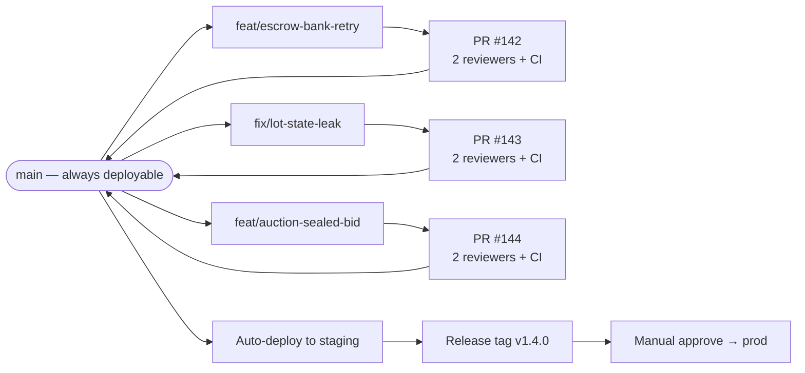
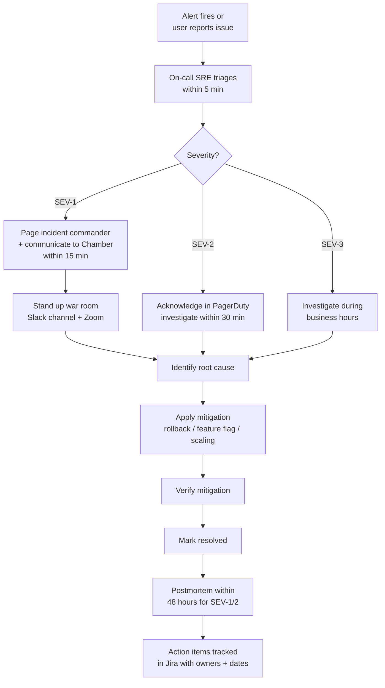

# Document 6 — Development & Operations Documentation

## Ghana Gold Exchange Platform (AurumX)

**Document Type:** Engineering How-To (README, env vars, conventions, runbooks, CI/CD, monitoring, DR)
**Version:** 1.0
**Related Documents:** System Architecture (Doc 4) · User Flows (Doc 5) · Security & Compliance (Doc 7) · Charter Risks (Doc 1 §9)

---

## Table of Contents

1. README.md Template
2. Environment Variables Guide
3. Coding Standards & Conventions
4. Deployment Runbook
5. CI/CD Pipeline Documentation
6. Monitoring, Logging & Alerting
7. Disaster Recovery & Backup

---

## 1. README.md Template

> This section reproduces the canonical `README.md` that lives at the root of the `aurumx` monorepo. It is the single entry-point for any engineer joining the project.

````markdown
# AurumX — Ghana Gold Exchange Platform

**Digital trading infrastructure for the Ghana Chamber of Gold Buyers.**
Member-gated, RFQ- and negotiation-driven B2B gold exchange with escrow, logistics, assay, and export documentation services.

> ⚠️ **Production-critical system.** All changes require PR review, passing CI, and adherence to the coding standards in `docs/06-devops.md` §3. Security-sensitive changes (auth, escrow, audit log) require additional sign-off from the Security & Compliance Engineer.

## Repository Structure

```
aurumx/
├── apps/
│   ├── portal/                 # Next.js 16 PWA (member portal)
│   ├── admin/                  # Next.js 16 (Chamber admin console)
│   └── marketing/              # Public marketing site
├── services/
│   ├── member/                 # Member Service (NestJS)
│   ├── lot/                    # Lot Service
│   ├── rfq/                    # RFQ Engine
│   ├── auction/                # Auction Engine
│   ├── negotiation/            # Negotiation Service (WebSocket)
│   ├── trade/                  # Trade Service
│   ├── escrow/                 # Escrow Service
│   ├── assay/                  # Assay Service
│   ├── logistics/              # Logistics Service
│   ├── vault/                  # Vault Service
│   ├── export-doc/             # Export Documentation Service
│   ├── compliance/             # Compliance Service
│   ├── analytics/              # Analytics Service
│   ├── notification/           # Notification Service
│   └── audit-log/              # Audit Log Service
├── packages/
│   ├── shared-types/           # Shared TypeScript types (OpenAPI generated)
│   ├── shared-config/          # ESLint, Prettier, TS configs
│   ├── ui/                     # Shared React UI components (shadcn/ui based)
│   ├── domain/                 # Shared domain primitives (Money, Purity, etc.)
│   └── test-utils/             # Shared test utilities
├── infra/
│   ├── terraform/              # AWS infrastructure as code
│   ├── helm/                   # Kubernetes Helm charts
│   └── argocd/                 # Argo CD application manifests
├── docs/
│   ├── openapi/                # OpenAPI 3.1 specs per service
│   ├── adr/                    # Architecture Decision Records
│   └── runbooks/               # Operational runbooks
├── .github/
│   ├── workflows/              # GitHub Actions CI/CD pipelines
│   └── PULL_REQUEST_TEMPLATE.md
├── package.json                # pnpm workspace root
├── pnpm-workspace.yaml
├── turbo.json                  # Turborepo build pipeline
└── README.md
```

## Prerequisites

| Tool | Minimum Version | Why |
|---|---|---|
| Node.js | 22.x LTS | Backend NestJS services + Next.js frontend |
| pnpm | 9.x | Monorepo package management (workspace + strict deps) |
| Docker | 24.x | Local container runtime |
| Kubernetes (kubectl) | 1.30+ | Local dev cluster (kind / minikube); prod is EKS |
| Terraform | 1.9+ | Infrastructure as code |
| AWS CLI | 2.x | AWS access (sandbox account per engineer) |
| Helm | 3.14+ | K8s release management |
| Pre-commit | 3.x | Git hooks (lint, format, secret scan) |

## Local Setup

### 1. Clone and install dependencies

```bash
git clone git@github.com:vanta-tech/aurumx.git
cd aurumx
pnpm install --frozen-lockfile
```

### 2. Set up environment variables

Copy `.env.example` to `.env` in each service directory and fill in values. See `docs/06-devops.md` §2 for the full variable reference. For local dev, most defaults in `.env.example` work against the docker-compose stack.

### 3. Start local infrastructure

```bash
# Spin up PostgreSQL, Redis, Kafka, Elasticsearch, local S3 (LocalStack)
docker compose -f infra/docker-compose.dev.yml up -d

# Apply DB migrations
pnpm --filter @aurumx/db migrate:dev

# Seed minimal dev data (3 orgs: 1 Tier 1, 1 Tier 2, 1 Seller)
pnpm --filter @aurumx/db seed:dev
```

### 4. Start services (Turborepo)

```bash
pnpm dev
# This runs all services in parallel via turbo with hot reload.
# Portal: http://localhost:3000
# Admin:  http://localhost:3001
# API Gateway: http://localhost:8080
```

### 5. Verify health

```bash
./scripts/health-check.sh
# Should return all-green for: portal, admin, gateway, all services, db, redis, kafka, es.
```

## How to Run Tests, Linting, and Type-Checking

```bash
# Lint + format check (all workspaces)
pnpm lint
pnpm format:check

# Type-check (no emit)
pnpm typecheck

# Unit tests (Vitest)
pnpm test

# Integration tests (Testcontainers + real Postgres/Kafka)
pnpm test:integration

# End-to-end tests (Playwright against local stack)
pnpm test:e2e

# Coverage report
pnpm test:coverage
```

**Coverage gates:** Core domain services (Trade, Escrow, Compliance, Audit Log) require ≥ 90% line coverage; other services require ≥ 80%.

## How to Contribute

### Branching Strategy

We use **trunk-based development** with short-lived feature branches. See §3.4 below for the full strategy.

### Pull Request Process

1. Branch from `main` with naming: `<type>/<scope>-<short-desc>` (e.g., `feat/escrow-bank-retry`, `fix/lot-state-leak`).
2. Implement change; ensure tests + linting pass locally.
3. Open PR against `main` using the template in `.github/PULL_REQUEST_TEMPLATE.md`.
4. Required reviews: 2 reviewers for `main`. For security-sensitive paths (`services/escrow/**`, `services/compliance/**`, `services/audit-log/**`, `infra/terraform/**`), one reviewer must be from the Security & Compliance Engineer roster.
5. CI must pass: lint, typecheck, unit, integration, e2e smoke, SAST (Snyk), dependency scan, Terraform plan.
6. Squash-and-merge to `main` with a Conventional Commit message.
7. Delete the feature branch after merge.

### PR Template

```markdown
## Summary
<1-3 sentences: what changed and why>

## Type of Change
- [ ] feat — New feature
- [ ] fix — Bug fix
- [ ] refactor — Refactor (no behavior change)
- [ ] perf — Performance improvement
- [ ] chore — Tooling / dependency bump
- [ ] docs — Documentation only
- [ ] security — Security-sensitive (requires Security & Compliance reviewer)

## Related Issues
Closes #XYZ

## Breaking Changes
- [ ] None
- [ ] Yes — see migration notes below

## Testing
- [ ] Unit tests added / updated
- [ ] Integration tests added / updated
- [ ] Manually tested in local stack
- [ ] Tested against staging

## Screenshots / Recordings
(if UI change)

## Checklist
- [ ] Code follows style guide (`docs/06-devops.md` §3)
- [ ] Self-reviewed
- [ ] Comments added for non-obvious code
- [ ] Docs updated (if applicable)
- [ ] No new warnings in CI
- [ ] Secrets not committed (verified by git-secrets + pre-commit hook)
```

### Conventional Commits

```
<type>(<scope>): <subject>

<body>

<footer>
```

Examples: `feat(escrow): add bank retry with exponential backoff`, `fix(lot): correct purity validation boundary`, `docs(api): document v1 trade endpoints`, `chore(deps): bump @nestjs/core to 10.4.0`.
````

---

## 2. Environment Variables Guide

> **Principle:** No secrets are ever committed. `.env.example` files contain placeholders only. Secrets in production come from AWS Secrets Manager; in staging from a separate Secrets Manager namespace; in local dev from `.env` files (gitignored).

### 2.1 Service-Level Variables (Common Across All Services)

| Variable | Required | Description | Where to Find / Generate |
|---|---|---|---|
| `NODE_ENV` | Yes | `development` \| `staging` \| `production` | Set by deployment env |
| `LOG_LEVEL` | Yes | `debug` \| `info` \| `warn` \| `error` | Dev: `debug`; Staging: `info`; Prod: `info` |
| `PORT` | Yes | Service listen port | Defined in `infra/helm/values.yaml` |
| `DATABASE_URL` | Yes | PostgreSQL connection string | AWS Secrets Manager: `aurumx/{env}/db/master` |
| `REDIS_URL` | Yes | Redis cluster URL | AWS Secrets Manager: `aurumx/{env}/redis` |
| `KAFKA_BROKERS` | Yes | Comma-separated Kafka broker list | AWS Secrets Manager: `aurumx/{env}/kafka` |
| `KAFKA_SASL_USERNAME` | Conditional | SASL username if MSK IAM disabled | AWS Secrets Manager |
| `KAFKA_SASL_PASSWORD` | Conditional | SASL password | AWS Secrets Manager |
| `S3_DOCUMENTS_BUCKET` | Yes | Bucket for KYC docs, contracts, assay certs | `aurumx-{env}-documents-{region}` |
| `AWS_REGION` | Yes | AWS region | `af-west-1` (prod) / `eu-west-1` (DR / dev) |
| `JWT_ISSUER` | Yes | Auth0 tenant URL | `https://aurumx-{env}.auth0.com/` |
| `JWT_AUDIENCE` | Yes | Expected audience claim | `https://api.aurumx.gh` |
| `JWKS_URI` | Yes | Auth0 JWKS endpoint | `{JWT_ISSUER}.well-known/jwks.json` |
| `OTEL_EXPORTER_OTLP_ENDPOINT` | Yes | OpenTelemetry collector endpoint | Datadog Agent sidecar |
| `DATADOG_API_KEY` | Yes | Datadog ingestion key | AWS Secrets Manager: `aurumx/{env}/datadog` |
| `SENTRY_DSN` | Yes | Sentry project DSN | AWS Secrets Manager: `aurumx/{env}/sentry` |
| `FEATURE_FLAGS_PROVIDER` | Yes | `launchdarkly` \| `env` | Staging/prod: `launchdarkly`; Dev: `env` |

### 2.2 Service-Specific Variables

#### Member Service

| Variable | Description |
|---|---|
| `CHAMBER_REGISTRY_API_URL` | Chamber member registry base URL |
| `CHAMBER_REGISTRY_API_KEY` | API key (Secrets Manager: `aurumx/{env}/chamber-registry`) |

#### Escrow Service

| Variable | Description |
|---|---|
| `ESCROW_BANK_ADAPTERS` | Comma-separated list of enabled bank adapters (`stanbic,ecobank,calbank`) |
| `STANBIC_API_BASE_URL` | Stanbic API base |
| `STANBIC_API_KEY` | Secrets Manager: `aurumx/{env}/bank/stanbic` |
| `STANBIC_WEBHOOK_SECRET` | HMAC verification secret |
| `ECOBANK_API_BASE_URL` | Ecobank API base |
| `ECOBANK_API_KEY` | Secrets Manager: `aurumx/{env}/bank/ecobank` |
| `ECOBANK_WEBHOOK_SECRET` | HMAC verification secret |
| `ESCROW_FUNDING_TIMEOUT_SECONDS` | Max time to wait for bank funding confirmation (default: 86400 = 24h) |
| `ESCROW_AUTO_RELEASE_ENABLED` | `true` \| `false` |

#### Compliance Service

| Variable | Description |
|---|---|
| `OFAC_API_KEY` | OFAC sanction list API (Secrets Manager) |
| `EU_SANCTION_API_KEY` | EU consolidated list API (Secrets Manager) |
| `UN_SANCTION_API_KEY` | UN Security Council list (Secrets Manager) |
| `GH_MOF_SANCTION_REFRESH_HOURS` | Refresh interval for Ghana MoF list (default: 24) |
| `ANOMALY_ML_MODEL_ENDPOINT` | KServe / SageMaker endpoint for ML scoring |
| `ANOMALY_ML_MODEL_VERSION` | Pinned model version (semver) |
| `FIC_SAR_API_URL` | Financial Intelligence Centre SAR filing endpoint |
| `FIC_SAR_API_KEY` | Secrets Manager: `aurumx/{env}/fic-sar` |

#### Notification Service

| Variable | Description |
|---|---|
| `TWILIO_ACCOUNT_SID` | Twilio Account SID (Secrets Manager) |
| `TWILIO_AUTH_TOKEN` | Twilio Auth Token (Secrets Manager) |
| `TWILIO_WHATSAPP_FROM` | WhatsApp Business sender number |
| `TWILIO_SMS_FROM` | SMS sender (Ghana shortcode) |
| `SENDGRID_API_KEY` | SendGrid for transactional email |
| `SENDGRID_FROM_EMAIL` | From address (`no-reply@aurumx.gh`) |
| `WEB_PUSH_VAPID_PUBLIC_KEY` | VAPID public key for web push |
| `WEB_PUSH_VAPID_PRIVATE_KEY` | VAPID private key (Secrets Manager) |

#### Export Documentation Service

| Variable | Description |
|---|---|
| `PMMC_API_BASE_URL` | PMMC export permit API |
| `PMMC_API_KEY` | Secrets Manager |
| `GRA_CUSTOMS_API_BASE_URL` | GRA customs declaration API |
| `GRA_CUSTOMS_API_KEY` | Secrets Manager |
| `BOG_FX_API_BASE_URL` | Bank of Ghana FX approval API |
| `BOG_FX_API_KEY` | Secrets Manager |

#### Audit Log Service

| Variable | Description |
|---|---|
| `AUDIT_LOG_KAFKA_TOPIC` | Kafka compacted topic (default: `aurumx.audit-log.v1`) |
| `AUDIT_LOG_S3_WORM_BUCKET` | S3 bucket with Object Lock enabled (WORM) |
| `AUDIT_LOG_HASH_CHAIN_SALT` | Per-environment salt for hash anchoring (Secrets Manager) |

### 2.3 Local Development Variables

For local dev, the project root `.env.example` provides sensible defaults that point to the docker-compose stack (PostgreSQL on `localhost:5432`, Redis on `localhost:6379`, etc.). Engineers override specific variables in per-service `.env.local` files (gitignored).

### 2.4 Secret Rotation

| Secret Type | Rotation Cadence | Owner |
|---|---|---|
| Database master password | 90 days (automatic via RDS rotation) | SRE |
| Bank API keys | Annual or on bank schedule | Compliance Eng + Bank liaison |
| Auth0 client secrets | Annual | Security Eng |
| JWT signing keys | Rotated by Auth0 automatically | N/A |
| Webhook HMAC secrets | Quarterly | SRE + Integration owners |
| VAPID keys | Annual (rotation requires re-subscription of web push endpoints) | Frontend + SRE |
| Sanction list API keys | Per provider schedule | Compliance Eng |

---

## 3. Coding Standards & Conventions

### 3.1 Naming Conventions

| Element | Convention | Example |
|---|---|---|
| Files (TypeScript) | `kebab-case.ts` | `bank-adapter.ts`, `trade.service.ts` |
| Folders | `kebab-case` | `services/escrow/`, `apps/portal/` |
| Classes | `PascalCase` | `TradeService`, `EscrowAggregate` |
| Interfaces | `PascalCase`, no `I` prefix | `EscrowProvider`, `Repository<T>` |
| Functions / methods | `camelCase` | `fundEscrow()`, `validateKyc()` |
| Variables | `camelCase` | `tradeId`, `sellerOrgId` |
| Constants | `UPPER_SNAKE_CASE` | `MAX_NEGOTIATION_ROUNDS = 5` |
| Enums | `PascalCase` for type, `UPPER_SNAKE_CASE` for values | `enum TradeStatus { PENDING_ESCROW, ESCROW_FUNDED, ... }` |
| Database tables | `snake_case`, plural | `organizations`, `gold_lots`, `trade_events` |
| Database columns | `snake_case` | `seller_org_id`, `created_at` |
| Database indexes | `idx_<table>_<col1>_<col2>` | `idx_gold_lots_status_listed_at` |
| Kafka topics | `<domain>.<event-type>.v<n>` | `trade.created.v1`, `compliance.alert.raised.v1` |
| Environment variables | `UPPER_SNAKE_CASE` | `DATABASE_URL`, `KAFKA_BROKERS` |
| API paths | `kebab-case`, plural nouns | `/v1/gold-lots`, `/v1/escrow-transactions` |
| JSON fields | `camelCase` | `sellerOrgId`, `tradeId` |

### 3.2 Folder Structure (per NestJS Service)

```
services/escrow/
├── src/
│   ├── escrow.module.ts            # NestJS module definition
│   ├── escrow.controller.ts        # HTTP controllers (thin)
│   ├── escrow.service.ts           # Application service (orchestration)
│   ├── domain/                     # Domain layer (rich models, no framework deps)
│   │   ├── escrow-aggregate.ts     # Escrow aggregate root
│   │   ├── escrow-events.ts         # Domain events
│   │   └── escrow-errors.ts        # Domain errors
│   ├── application/                # Application layer (use cases)
│   │   ├── commands/               # CQRS commands
│   │   ├── queries/                # CQRS queries
│   │   └── sagas/                  # Saga orchestrators
│   ├── infrastructure/             # Infrastructure layer
│   │   ├── persistence/
│   │   │   ├── escrow.repository.ts
│   │   │   ├── escrow.orm-entity.ts
│   │   │   └── outbox.repository.ts
│   │   ├── bank-adapters/          # Strategy pattern implementations
│   │   │   ├── bank-adapter.interface.ts
│   │   │   ├── stanbic.adapter.ts
│   │   │   └── ecobank.adapter.ts
│   │   └── messaging/
│   │       └── kafka.producer.ts
│   └── main.ts                     # Bootstrap
├── test/
│   ├── unit/
│   ├── integration/
│   └── e2e/
├── Dockerfile
├── package.json
├── tsconfig.json
└── README.md
```

### 3.3 Code Style

- **TypeScript strict mode** required (`"strict": true` in `tsconfig.json`).
- **No `any`** without an inline `// eslint-disable-next-line` comment explaining why.
- **No `console.log`** in committed code — use the structured logger (`pino`).
- **Functions ≤ 50 lines** preferred; longer requires review.
- **Files ≤ 300 lines** preferred; longer should be split.
- **No magic numbers** — define named constants.
- **Error handling:** Domain errors extend a base `DomainError` class; HTTP layer translates to RFC 7807 problem+json.
- **Async/await** required; no `.then()` chains except in explicit pipeline cases.
- **Imports:** absolute paths via `@aurumx/<package>` (configured in `tsconfig.json` `paths`).

### 3.4 Git Branching Strategy — Trunk-Based Development



| Rule | Detail |
|---|---|
| Branch lifetime | ≤ 3 days for `feat`; ≤ 1 day for `fix` |
| Branch naming | `<type>/<scope>-<short-desc>` |
| Trunk (`main`) state | Always deployable; protected; squash-merge only |
| Release tags | Semantic versioning (`vMAJOR.MINOR.PATCH`) |
| Hotfix | Branch from `main` as `hotfix/<scope>-<desc>`, fast-tracked PR (1 reviewer + Security Eng for sensitive paths), deploy to prod, cherry-pick back to `main` |
| Release branches | Only for major releases requiring long support — create `release/v1.x` and backport critical fixes |

### 3.5 Code Review Checklist

```markdown
- [ ] **Functionality**: Does the change do what the PR says it does? Are edge cases covered?
- [ ] **Tests**: Are unit + integration tests added? Do they exercise the new behavior?
- [ ] **Architecture**: Does the change respect service boundaries (Doc 4 §2.4)? No cross-service DB access?
- [ ] **API contracts**: If endpoints changed, is OpenAPI spec updated? Are breaking changes flagged?
- [ ] **Data model**: If schema changed, is there a migration? Is it backward-compatible? Are old rows handled?
- [ ] **Idempotency**: If the endpoint has side effects, does it use `Idempotency-Key`?
- [ ] **Security**: No secrets in code? No SQL injection vectors? RBAC enforced? Input validated?
- [ ] **Observability**: Are logs structured? Are metrics emitted? Are traces propagated?
- [ ] **Performance**: No N+1 queries? No unbounded result sets? Hot paths optimized?
- [ ] **Error handling**: Domain errors used? RFC 7807 format? No leaked stack traces?
- [ ] **Documentation**: ADRs updated for architecture changes? Inline comments for non-obvious logic?
- [ ] **Accessibility**: UI changes pass WCAG 2.1 AA? Keyboard navigable? Screen-reader labels?
- [ ] **Internationalization**: No hardcoded user-facing strings? (Doc 2 personas: English + Twi + Hausa)
```

---

## 4. Deployment Runbook

### 4.1 Environments

| Environment | Purpose | AWS Account | Region | Access |
|---|---|---|---|---|
| `dev` (local) | Engineer local dev | N/A | N/A | Engineer |
| `staging` | Pre-prod, integration testing, UAT | `aurumx-staging` | `af-west-1` | Engineering + QA + Chamber PMO (read) |
| `prod` | Production | `aurumx-prod` | `af-west-1` (primary), `eu-west-1` (DR) | SRE on-call + Prod-deploy approvers (change management) |

### 4.2 Pre-Deployment Checklist

```markdown
- [ ] PR merged to `main` with all CI checks green
- [ ] Feature flags configured in LaunchDarkly for any new behavior (default OFF for prod)
- [ ] Database migrations reviewed; backward-compatible; can be run without downtime
- [ ] Secrets (if new) added to AWS Secrets Manager in both staging and prod
- [ ] Runbook updated for any new operational procedure
- [ ] Stakeholder comms sent (Slack #aurumx-releases) with target deploy window
- [ ] For prod: change management ticket approved by Change Advisory Board
- [ ] Rollback plan documented and tested in staging
```

### 4.3 Deploy to Staging (Automated)

Staging deploys automatically on every merge to `main`. Argo CD watches the `infra/argocd/staging/` directory; on Git change, it syncs.

```bash
# To manually trigger a staging deploy (rare — usually automatic)
git push origin main
# Argo CD auto-syncs within 60 seconds

# To verify staging deploy
kubectl --context aurumx-staging get pods -n aurumx
./scripts/verify-staging.sh
```

### 4.4 Deploy to Production (Manual Approval Required)

```bash
# 1. Create release tag
git checkout main
git pull origin main
git tag -a v1.4.0 -m "Release v1.4.0: Sealed-bid auction + escrow bank retry"
git push origin v1.4.0

# 2. GitHub Actions workflow `release.yml` triggers:
#    - Builds container images, pushes to ECR
#    - Updates Helm values in infra/argocd/prod/ with new image tags
#    - Opens a PR to the argocd-config repo

# 3. After PR approval + merge, Argo CD syncs to prod
#    - Rolling update with 3-replica min, maxSurge=1, maxUnavailable=0
#    - Health checks (readiness probe) gate rollout
#    - Auto-rollback if rollout exceeds 5 min or readiness fails

# 4. Verify prod deploy
kubectl --context aurumx-prod get pods -n aurumx
./scripts/verify-prod.sh

# 5. Post-deploy verification (smoke tests)
pnpm test:smoke -- --env=prod

# 6. Notify stakeholders
./scripts/notify-release.sh v1.4.0
```

### 4.5 Database Migration Procedure

```bash
# Migrations are forward-only and backward-compatible.
# Apply BEFORE deploying new code (expand-and-contract pattern).

# Staging
pnpm --filter @aurumx/db migrate:staging

# Prod (requires CAB approval + SRE on-call present)
pnpm --filter @aurumx/db migrate:prod

# If migration fails mid-way:
# - Migration tool tracks current version in `_migrations` table
# - Re-run command to resume
# - For destructive failures, restore from latest PITR snapshot (see §7)
```

### 4.6 Rollback Procedure

```bash
# Application rollback (Argo CD)
argocd app rollback aurumx-prod <previous-revision>

# Or via Git: revert the PR that updated Helm values
git revert <merge-commit>
git push origin main
# Argo CD auto-syncs to the reverted state

# Database rollback (LAST RESORT — only if migration broke data)
# Forward-only migration model means we deploy a NEW migration that reverses the previous one
# Never restore from backup in prod unless data corruption is confirmed

# Feature flag kill switch (FASTEST rollback for behavior changes)
# Use LaunchDarkly to toggle off the feature flag; effect is global within 60s
```

### 4.7 Post-Deployment Verification

```markdown
- [ ] All pods in `Running` state, no `CrashLoopBackOff`
- [ ] Datadog APM shows no error spike (compare to pre-deploy baseline)
- [ ] Datadog Synthetics checks pass for /health, /v1/lots (public), /v1/organizations (auth)
- [ ] Smoke test suite (Playwright) passes against prod URL
- [ ] Error budget consumption post-deploy < 5% of monthly budget
- [ ] On-call engineer confirms "no unusual alerts" for 30 minutes post-deploy
```

---

## 5. CI/CD Pipeline Documentation

### 5.1 Pipeline Overview

```mermaid
graph LR
    PR[Pull Request opened] --> CI1[Lint + Format check]
    CI1 --> CI2[TypeScript typecheck]
    CI2 --> CI3[Unit tests + coverage gate]
    CI3 --> CI4[Integration tests<br/>with Testcontainers]
    CI4 --> CI5[SAST - Snyk]
    CI5 --> CI6[Dependency scan]
    CI6 --> CI7[Container build + scan - Trivy]
    CI7 --> CI8[E2E smoke - Playwright]
    CI8 --> CI9[Terraform plan<br/>if infra/ changed]
    CI9 --> Review{2+ reviewers<br/>approve?}
    Review -- Yes --> Merge[Squash-merge to main]
    Merge --> StageBuild[Build + push to ECR]
    StageBuild --> StageDeploy[Argo CD auto-deploy staging]
    StageDeploy --> StageVerify[Smoke tests staging]
    StageVerify --> ReadyTag{Ready for prod?}
    ReadyTag -- Tag created --> ProdBuild[Build + push ECR prod tag]
    ProdBuild --> ProdPR[PR to argocd-config]
    ProdPR --> ProdApprove[CAB approval]
    ProdApprove --> ProdDeploy[Argo CD sync prod]
    ProdDeploy --> ProdVerify[Smoke tests prod]
    ProdVerify --> Notify[Notify release]
```



### 5.2 Tools Used

| Stage | Tool | Why |
|---|---|---|
| Build orchestration | Turborepo | Monorepo caching, parallel builds, content-hashed outputs |
| Package manager | pnpm 9 | Strict dependency resolution, workspaces, fast installs |
| Linting | ESLint 9 + `@typescript-eslint` | Code style + TypeScript-specific rules |
| Formatting | Prettier 3 | Consistent code formatting; enforced via pre-commit hook |
| Type-checking | `tsc --noEmit` | Catch type errors before runtime |
| Unit testing | Vitest 2 | Fast Jest-compatible test runner with ESM support |
| Integration testing | Vitest + Testcontainers | Real Postgres/Redis/Kafka in ephemeral containers |
| E2E testing | Playwright 1.48 | Cross-browser, supports PWA testing |
| Coverage gate | c8 + Vitest | Block PRs below threshold (90% for critical services) |
| SAST | Snyk Code | Static analysis for security vulnerabilities |
| Dependency scan | Snyk Open Source + GitHub Dependabot | Known CVEs in dependencies |
| Container scan | Trivy | Container image vulnerabilities |
| Secret scanning | git-secrets + GitHub secret scanning + pre-commit | Prevent secrets from being committed |
| Container registry | AWS ECR | Native AWS, vulnerability scanning enabled |
| CI/CD platform | GitHub Actions | Native to GitHub, large ecosystem |
| GitOps | Argo CD | Declarative K8s deployments, drift detection, rollback |
| IaC | Terraform 1.9 + Terragrunt | Cloud-agnostic, state in S3 + DynamoDB lock |
| Feature flags | LaunchDarkly | Decouple deploy from release; targeted rollouts |
| Change management | Jira Service Management | CAB approval workflow for prod changes |

### 5.3 Pipeline Stages (Detailed)

| Stage | Trigger | Duration (median) | Failure Action |
|---|---|---|---|
| `lint-format` | PR opened / updated | 30s | Block PR |
| `typecheck` | PR opened / updated | 60s | Block PR |
| `unit-tests` | PR opened / updated | 2 min | Block PR; coverage gate enforced |
| `integration-tests` | PR opened / updated (only on changes to `services/**`) | 4 min | Block PR |
| `e2e-smoke` | PR opened / updated (only on changes to `apps/**` or `services/**`) | 5 min | Block PR |
| `sast-snyk` | PR opened / updated | 90s | Block PR; security reviewer tagged for high-severity findings |
| `dependency-scan` | PR opened / updated + nightly on main | 60s | Block PR for high-severity CVEs; advisory for medium |
| `container-build` | Merge to main | 3 min | Block deploy to staging |
| `container-scan-trivy` | After container build | 60s | Block deploy if CRITICAL vulnerabilities found |
| `terraform-plan` | PR opened if `infra/terraform/**` changed | 90s | Block PR; plan output posted as PR comment |
| `deploy-staging` | Merge to main | 4 min (Argo CD sync) | Alert SRE; manual intervention |
| `smoke-staging` | After staging deploy | 90s | Auto-rollback staging; alert SRE |
| `deploy-prod` | Manual tag + CAB approval | 5 min | Auto-rollback prod; page on-call SRE |
| `smoke-prod` | After prod deploy | 90s | Auto-rollback prod; page on-call SRE; post-mortem required |

### 5.4 Quality Gates

| Gate | Threshold | Enforcement |
|---|---|---|
| Unit test coverage (critical services) | ≥ 90% lines | CI fails PR |
| Unit test coverage (other services) | ≥ 80% lines | CI fails PR |
| E2E test coverage for trade flows | 100% of UF-01 through UF-09 paths | CI fails PR |
| Snyk SAST | No `high` or `critical` findings | CI fails PR (override only with Security Eng sign-off) |
| Trivy container scan | No `critical` findings | CI fails deploy |
| Dependency scan | No `high`/`critical` CVEs unfixed > 30 days | CI fails PR |
| Bundle size (PWA) | ≤ 200 KB gzipped (initial route) | CI warns; blocks on regression > 10% |
| Lighthouse PWA score | ≥ 90 (performance, accessibility, best practices, SEO) | CI warns on regression |

---

## 6. Monitoring, Logging & Alerting

### 6.1 Observability Stack

| Pillar | Tool | Retention | Purpose |
|---|---|---|---|
| Metrics | Datadog Metrics | 15 months | Time-series metrics for infra + app |
| Logs | Datadog Logs | 90 days hot, 2 years cold (S3 + Athena) | Structured application + audit logs |
| Traces | Datadog APM (OpenTelemetry) | 30 days | Distributed tracing across services |
| Errors | Sentry | 90 days | Frontend + backend error aggregation |
| Uptime | Datadog Synthetics | 30 days | Proactive endpoint checks |
| Real user monitoring | Datadog RUM | 30 days | Frontend performance + errors |
| Infrastructure | Datadog AWS Integration | 15 months | EC2, RDS, EKS, S3, MSK metrics |
| Security alerts | AWS GuardDuty + Datadog Cloud SIEM | 13 months | Threat detection |

### 6.2 Dashboards

| Dashboard | Audience | Key Panels |
|---|---|---|
| **Platform Overview** | SRE on-call | Request rate, error rate, p50/p95/p99 latency, pod health, DB connections, Kafka lag |
| **Business Metrics** | Chamber PMO + Vendor PM | Trades per day, cumulative trade value, active members, escrow balance, dispute rate |
| **Compliance Health** | Efua + Compliance team | Open alerts by severity, mean time to acknowledge, mean time to resolve, SAR filings |
| **Trade Lifecycle** | Engineering | Funnel: lot listed → bid → negotiated → escrow funded → delivered → settled; drop-off at each stage |
| **API Health** | Engineering | Top endpoints by volume, error rate, latency; rate-limit hits; 4xx vs 5xx breakdown |
| **Database Health** | SRE | Connections, slow queries, replication lag, disk usage, buffer hit ratio |
| **Cost** | Vendor PM | Daily AWS spend by service, budget vs actual, forecasted month-end |
| **Security** | Security Eng | Failed logins, MFA challenges, suspicious IPs, GuardDuty findings, secrets access anomalies |

### 6.3 Key Metrics & SLOs

| SLO | Target | Error Budget (Monthly) | Source |
|---|---|---|---|
| API availability (per region) | 99.95% | 22 min | Datadog Synthetics |
| API p95 latency (read endpoints) | ≤ 500 ms | N/A (latency SLO) | Datadog APM |
| API p95 latency (write endpoints, non-escrow) | ≤ 1.5 s | N/A | Datadog APM |
| API p95 latency (escrow fund) | ≤ 3 s (sync portion) | N/A | Datadog APM |
| API error rate (5xx) | < 0.1% | N/A | Datadog APM |
| Audit log integrity (hash chain) | 100% (no breaks) | 0 (zero tolerance) | Audit Log Service |
| Kafka consumer lag (compliance) | < 30 s | 5 min/month | Datadog Kafka integration |
| Escrow funding success rate | ≥ 99.5% | 22 min/month of degraded mode | Escrow Service metrics |
| Compliance alert ack time (HIGH/CRITICAL) | ≤ 1 hour, 95th percentile | 5 events/month over SLA | Compliance Service |
| Anomaly detection false-positive rate | ≤ 10% | N/A | ML model metrics |

### 6.4 Alert Triggers

> **Design principle:** Every alert must be **actionable** (engineer can do something about it) and **specific** (alert message names the failing component + runbook link). Alerts without a runbook are forbidden.

| Alert | Trigger Condition | Severity | Runbook |
|---|---|---|---|
| `HighErrorRate` | 5xx error rate > 1% for 5 min (rolling) | SEV-2 | `docs/runbooks/high-error-rate.md` |
| `PodCrashLooping` | Any pod in CrashLoopBackOff for 5 min | SEV-2 | `docs/runbooks/crash-loop.md` |
| `DatabaseConnectionsHigh` | RDS connections > 80% of max for 10 min | SEV-3 | `docs/runbooks/db-connections.md` |
| `DatabaseCPUHigh` | RDS CPU > 80% for 5 min | SEV-3 | `docs/runbooks/db-cpu.md` |
| `KafkaConsumerLagHigh` | Lag > 1000 messages for 5 min (compliance topic) | SEV-2 | `docs/runbooks/kafka-lag.md` |
| `EscrowFundingFailure` | Escrow funding failure rate > 2% for 15 min | SEV-1 | `docs/runbooks/escrow-funding.md` |
| `AuditLogHashChainBreak` | ANY hash chain integrity check failure | SEV-1 | `docs/runbooks/audit-hash-break.md` |
| `Auth0Outage` | Auth0 health check fails for 2 min | SEV-1 | `docs/runbooks/auth0-outage.md` |
| `ComplianceAlertAckBreach` | HIGH/CRITICAL compliance alert unack > 1 hour | SEV-2 | `docs/runbooks/compliance-ack-breach.md` |
| `WAFBlockedTrafficSpike` | WAF blocked requests > 1000/min | SEV-3 | `docs/runbooks/waf-spike.md` |
| `GuardDutyHighSeverityFinding` | Any GuardDuty HIGH finding | SEV-1 | `docs/runbooks/guardduty-finding.md` |
| `SecretsManagerAccessAnomaly` | Unusual Secrets Manager access pattern | SEV-2 | `docs/runbooks/secrets-anomaly.md` |
| `CertificateExpiring` | TLS cert < 14 days to expiry | SEV-3 | `docs/runbooks/cert-expiry.md` |
| `S3BucketAccessAnomaly` | Unexpected access pattern to documents bucket | SEV-2 | `docs/runbooks/s3-access.md` |
| `DRReplicationLag` | Cross-region replication lag > 5 min | SEV-2 | `docs/runbooks/dr-lag.md` |

### 6.5 Incident Response Runbook



#### Severity Definitions

| Severity | Definition | Response Time | Communication |
|---|---|---|---|
| SEV-1 | Production down; data loss; trade-blocking; security breach | 5 min ack, 15 min mitigation start | Page on-call SRE + Security Eng + Vendor PM; notify Chamber PMO within 15 min; status page update within 30 min |
| SEV-2 | Significant degradation; trade-friction; non-critical path broken | 30 min ack, 2 hr mitigation | Page on-call SRE; notify Chamber PMO within 1 hr |
| SEV-3 | Minor issue; workaround exists | Next business day | Slack #aurumx-incidents |
| SEV-4 | Cosmetic; non-impactful | Backlog | N/A |

### 6.6 Audit Log Integrity Monitoring

The audit log hash chain is verified continuously by a background worker. Any break triggers a SEV-1 alert immediately (Charter §8 C4 — compliance non-negotiable).

```bash
# Manual integrity check (run during audits)
./scripts/audit-log-verify.sh --from=2026-09-01 --to=2026-09-30
# Outputs: total events, hash chain valid (true/false), first-broken-event-id (if any)
```

---

## 7. Disaster Recovery & Backup

### 7.1 Backup Strategy

| Data Type | Backup Method | Frequency | Retention | Storage |
|---|---|---|---|---|
| PostgreSQL (RDS) | Automated snapshot + PITR (Point-in-Time Recovery) | Snapshots daily; PITR every 5 min | Snapshots 30 days; PITR 14 days | AWS-managed, encrypted (KMS) |
| PostgreSQL (cross-region) | Cross-region automated snapshot copy | Daily | 30 days | `eu-west-1` (DR region) |
| S3 documents (KYC, contracts, assay certs) | S3 Cross-Region Replication (CRR) | Continuous | 7 years (regulatory) | `aurumx-prod-documents-eu-west-1` |
| S3 documents versioning | S3 Object Lock (WORM mode for audit) | On write | 7 years | Same bucket, Object Lock |
| Kafka audit log topic | Log compaction + S3 archival | Continuous | 7 years | S3 Object Lock |
| Redis (cache) | Not backed up (ephemeral; rebuildable from PostgreSQL) | N/A | N/A | N/A |
| Elasticsearch | Daily snapshot to S3 | Daily | 30 days | S3 |
| EKS cluster state | Argo CD GitOps (state is in Git) + EKS etcd snapshot | Continuous (Git) + daily (etcd) | Git: indefinite; etcd: 30 days | GitHub + AWS |
| Terraform state | S3 + DynamoDB lock | Continuous | Indefinite | S3 |
| Secrets (Secrets Manager) | AWS-managed; versioned | On change | 90 days of versions | AWS-managed |

### 7.2 RTO and RPO

| Tier | Workload | RTO (Recovery Time Objective) | RPO (Recovery Point Objective) | Strategy |
|---|---|---|---|---|
| Tier 0 | Trade, Escrow, Audit Log | ≤ 4 hours | ≤ 5 minutes | Multi-AZ RDS; warm standby in DR region; cross-region Kafka MirrorMaker2 |
| Tier 1 | Member, RFQ, Auction, Negotiation | ≤ 8 hours | ≤ 15 minutes | Multi-AZ RDS; restore from cross-region snapshot in DR |
| Tier 2 | Analytics, Notification, Export Doc | ≤ 24 hours | ≤ 1 hour | Restore from snapshots; non-critical |
| Tier 3 | Marketing site, internal tools | ≤ 48 hours | ≤ 24 hours | Restore from latest backup |

### 7.3 Recovery Procedures

#### 7.3.1 PostgreSQL Failover (Within Primary Region)

```bash
# Automatic: RDS Multi-AZ detects failure and promotes standby (typically 60-120 seconds)
# Verify:
aws rds describe-db-instances --db-instance-identifier aurumx-prod --query 'DBInstances[0].Status'
kubectl --context aurumx-prod get pods -n aurumx  # pods should reconnect automatically

# Manual failover (if automatic fails):
aws rds failover-db-cluster --db-cluster-identifier aurumx-prod-cluster
```

#### 7.3.2 Cross-Region DR Failover (Full Region Loss)

> Triggers: AWS region outage; regional disaster; major security incident requiring full region rebuild.

```bash
# 1. Declare DR activation (Vendor PM + Chamber Exec)
# 2. Promote DR read replica in eu-west-1
aws rds promote-read-replica --db-instance-identifier aurumx-prod-dr-replica

# 3. Restore S3 documents (CRR is continuous; verify count)
./scripts/verify-s3-crr.sh

# 4. Start Kafka MirrorMaker2 (if not already running) to bridge any events from primary region
# 5. Update DNS (Route 53) to point api.aurumx.gh to DR region's ALB
aws route53 change-resource-record-sets --hosted-zone-id Z123... \
  --change-batch file://infra/route53/dr-failover.json

# 6. Verify DR endpoints
./scripts/verify-dr-endpoints.sh

# 7. Notify all stakeholders
./scripts/notify-dr-activation.sh

# Estimated RTO: 2-4 hours (most of which is DNS propagation + verification)
```

#### 7.3.3 Audit Log Recovery

The audit log is the most critical data. Three layers of protection:

1. **Live:** Kafka compacted topic in primary region.
2. **Warm:** S3 with Object Lock (WORM) in primary region; events written within 60 seconds of generation.
3. **Cold:** S3 with Object Lock in DR region (eu-west-1) via CRR; events written within 5 minutes.

Recovery from any single layer is possible. Hash chain integrity is re-verified on any recovery.

#### 7.3.4 Point-in-Time Recovery (PITR)

```bash
# Restore RDS to a specific point in time (e.g., before a bad migration)
aws rds restore-db-instance-to-point-in-time \
  --source-db-instance-identifier aurumx-prod \
  --target-db-instance-identifier aurumx-prod-pitr-202609151030 \
  --restore-time 2026-09-15T10:30:00Z

# Wait for restore (~30-90 min depending on DB size)
# Verify restored DB
# Cut over application to restored instance
```

### 7.4 DR Testing Schedule

| Test Type | Frequency | Scope | Owner |
|---|---|---|---|
| Tabletop exercise | Quarterly | Walk-through DR plan; no systems touched | SRE + Vendor PM |
| Failover test (staging) | Quarterly | Promote DR replica in staging; verify | SRE |
| Failover test (prod) | Annually | Coordinated prod failover during low-traffic window | SRE + Vendor PM + Chamber PMO |
| Backup restore test | Monthly | Restore one PostgreSQL snapshot to staging; verify data integrity | SRE |
| Audit log integrity test | Weekly (automated) | Hash chain verification on full log | Compliance Eng |
| Chaos engineering | Monthly (staging only) | Kill random pods; verify auto-recovery | SRE |

### 7.5 Business Continuity — Vendor and Chamber

| Scenario | Mitigation |
|---|---|
| Vendor (Vanta Technologies) insolvency | Source code escrow with Chamber's legal counsel; Chamber has perpetual license to operate the platform on handover; runbook for handover in `docs/runbooks/vendor-handover.md` |
| Key vendor personnel departure | Cross-training documented; ADRs and runbooks kept current; minimum 2-week notice clause in employment contracts for key roles (architect, TPM, principal engineer) |
| Chamber dissolves / restructures | Code and infrastructure ownership transfers to a successor entity designated by the Chamber; 12-month transition clause in MSA |
| AWS region outage | Multi-AZ within primary region + warm standby in DR region (eu-west-1) |
| AWS-wide outage (extremely rare) | Documented offline procedures; Chamber can issue manual trade confirmations via notarized PDFs for the duration; data integrity guaranteed by S3 cross-region replication |

---

## Cross-References

- **Document 1 — Project Charter:** §6.2 team composition informs reviewer assignments in §3.4. §9 Risks R2/R4/R5 mitigated by monitoring (§6), DR (§7), and branching strategy (§3.4).
- **Document 4 — System Architecture:** §1.4 cloud infrastructure is operationalized by §4 (deployment) and §5 (CI/CD) here. ADR-003 (Kafka) and ADR-004 (Outbox) drive the data backup strategy in §7.
- **Document 5 — User Flows & System Flows:** UF-05 (Escrow) edge cases drive §6.4 `EscrowFundingFailure` alert. UF-08 (Compliance Investigation) 24h SLA drives §6.4 `ComplianceAlertAckBreach` alert.
- **Document 7 — Security & Compliance:** §6.4 security alerts (GuardDuty, Secrets Manager) tie into Doc 7's incident response. §7.5 vendor handover scenario is detailed in Doc 7's data sovereignty section.
