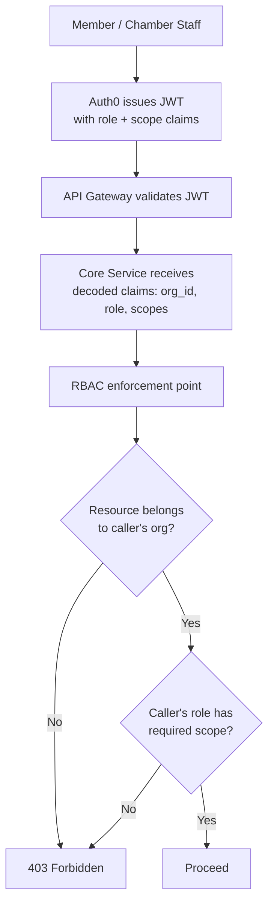
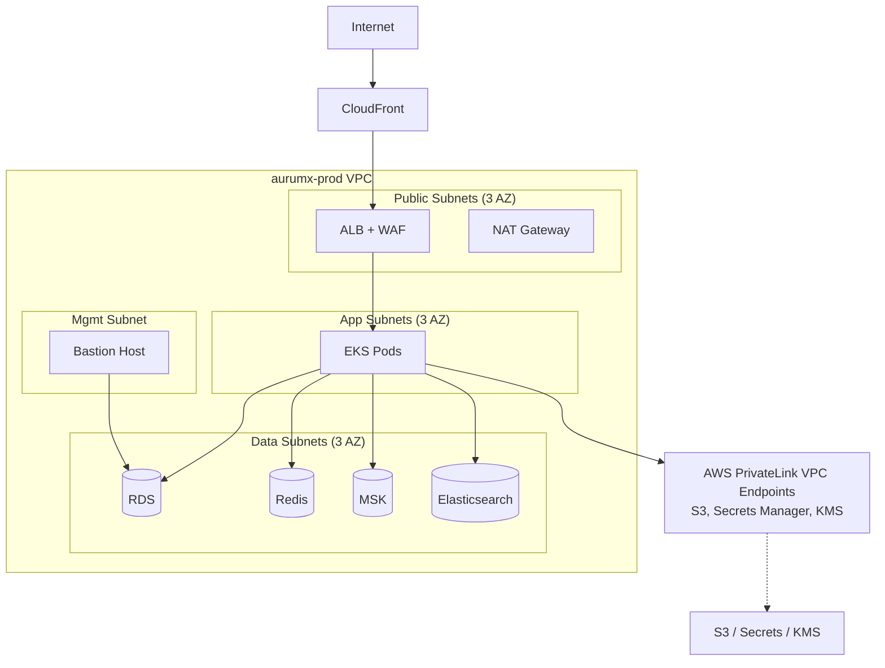
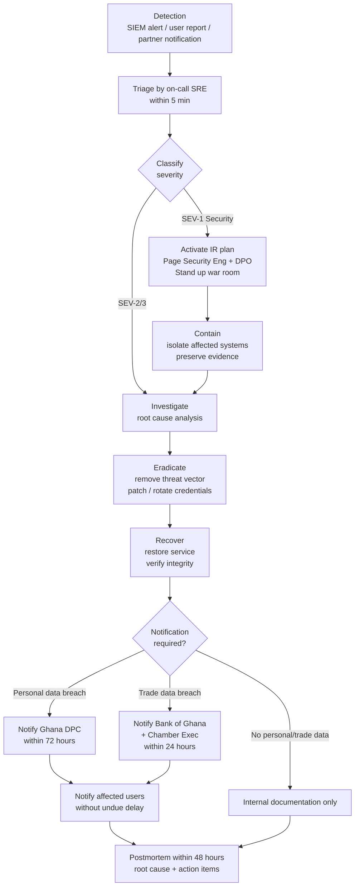

# Document 7 — Security & Compliance

## Ghana Gold Exchange Platform (AurumX)

**Document Type:** Security Architecture + Compliance Treatment
**Version:** 1.0
**Classification:** Confidential — Security & Compliance Reviewers Only
**Related Documents:** Charter §8 (Constraints), §9 (Risks) · System Architecture (Doc 4) · DevOps (Doc 6)

---

## Table of Contents

1. Security Architecture
2. Secrets Management
3. Compliance Notes
4. Incident Response & Breach Notification
5. Audit & Assurance

---

## 1. Security Architecture

### 1.1 Security Principles

| # | Principle | How Implemented |
|---|---|---|
| S1 | **Zero Trust** — every request authenticated, authorized, and inspected, regardless of source | mTLS between services; OAuth/JWT at the edge; service-to-service authn via SPIFFE/SPIRE in Phase 2; deny-by-default network policies in EKS |
| S2 | **Defense in Depth** — multiple independent controls so that no single failure compromises the system | WAF + ALB + service-level RBAC + DB row-level security + field-level encryption for PII |
| S3 | **Least Privilege** — every identity (human or service) has the minimum permissions needed | AWS IAM roles scoped per service; Auth0 RBAC with fine-grained scopes; PostgreSQL row-level security policies |
| S4 | **Audit Everything** — every state-changing action is logged with actor, target, timestamp, and immutable hash | Audit Log Service (Doc 4 §2.4); 7-year retention; hash-anchored chain |
| S5 | **Encrypt Everywhere** — at rest, in transit, and in processing where feasible | TLS 1.3 in transit; KMS-managed encryption at rest; field-level encryption for PII columns |
| S6 | **Secure by Default** — secure configurations are the default; insecure requires explicit opt-in | Security linters in CI; pre-commit hooks; CSP-enabled PWA; HSTS preload |
| S7 | **Assume Breach** — design assumes the perimeter will be breached; contain blast radius | Network segmentation; service accounts per service; Secrets Manager with auto-rotation; canary tokens in document buckets |

### 1.2 Authentication & Authorization

#### 1.2.1 Authentication Mechanism

| Layer | Mechanism | Provider |
|---|---|---|
| Member-facing PWA | OAuth 2.0 Authorization Code + PKCE; OpenID Connect ID tokens | Auth0 B2B |
| Tier 1 machine-to-machine (SAP integration) | OAuth 2.0 Client Credentials; mTLS for high-value Tier 1 buyers | Auth0 B2B |
| Chamber staff | SAML SSO with Chamber's IdP (Microsoft Entra ID); MFA required | Auth0 federated to Entra ID |
| Service-to-service (internal) | mTLS via SPIFFE/SPIRE workload identities (Phase 2); short-lived (1 hour) JWTs | SPIRE cluster |
| Partner inbound webhooks | HMAC-SHA256 signature + shared secret + IP allowlisting | Custom (per partner) |
| API keys (Tier 1 programmatic) | OAuth bearer tokens; rotated quarterly | Auth0 B2B |

#### 1.2.2 RBAC Model

The platform uses a layered RBAC model. Permissions (`scope:action`) are attached to roles; roles are scoped to either an Organization (for members) or globally (for Chamber staff).



**Roles & Permissions (Selected):**

| Role | Scope | Org Scope | Sample Permissions |
|---|---|---|---|
| `org.admin` | Organization | Single org | `org:read`, `org:write`, `member:invite`, `member:revoke`, `lot:create`, `trade:execute`, `kyc:submit` |
| `org.trader` | Organization | Single org | `lot:read`, `lot:create`, `rfq:submit`, `bid:submit`, `trade:execute`, `negotiate:participate` |
| `org.compliance` | Organization | Single org | `trade:read:own`, `audit:read:own`, `dispute:open` |
| `org.viewer` | Organization | Single org | `lot:read:own`, `trade:read:own` |
| `chamber.compliance` | Global | All orgs | `member:read:any`, `trade:read:any`, `compliance:investigate`, `compliance:freeze`, `audit:read:any`, `alert:manage`, `sar:file` |
| `chamber.executive` | Global | All orgs | `member:read:any`, `trade:read:any`, `report:read:any`, `dispute:mediate` |
| `chamber.ops` | Global | All orgs | `member:onboard`, `license:verify`, `kyc:review` |
| `system.audit-log-writer` | System | N/A | `audit:write` (only Audit Log Service holds this) |

**MFA requirements:**

| Action | MFA Required |
|---|---|
| Member login | Step-up: optional for `org.trader` / `org.viewer`; required for `org.admin` |
| Chamber staff login | Required always |
| Trade acceptance ≥ US$100K | Step-up MFA required (TOTP or WebAuthn) |
| Trade acceptance ≥ US$500K | WebAuthn (hardware key) required |
| Compliance freeze / SAR filing | WebAuthn required |
| Production deployments | WebAuthn required for the deploying engineer |
| Production DB access | WebAuthn + just-in-time approval (max 4-hour session) |

**Password policy:** Auth0-hosted login enforces ≥ 14 characters, breached-password detection (Auth0 Breached Password Detection), passwordless (WebAuthn, magic link) encouraged for `org.admin` and Chamber staff.

#### 1.2.3 Session Management

- **Access tokens:** JWT, RS256-signed, 1-hour expiry. Audience (`aud`) = `https://api.aurumx.gh`. Issuer (`iss`) = Auth0 tenant URL.
- **Refresh tokens:** 30-day sliding window; rotated on each use; revocable via Auth0 dashboard.
- **Session storage:** PWA stores tokens in `HttpOnly`, `Secure`, `SameSite=Strict` cookies (no `localStorage`).
- **Logout:** OIDC RP-Initiated Logout; tokens revoked server-side; session cookie cleared.
- **Idle timeout:** 30 min inactivity → token refresh attempt; if refresh fails, redirect to login.

#### 1.2.4 Network-Level Authorization

| Layer | Control |
|---|---|
| Edge | AWS WAF with OWASP Top 10 managed rules + custom rate-limit rules; CloudFront geo-blocks non-essential countries (allowlist: GH, CH, UK, US, AE, IN, ZA — Tier 1 buyer + key trade-route countries) |
| ALB | TLS 1.3 termination; mTLS optional for Tier 1 programmatic API access (Phase 2) |
| EKS Network Policies | Default-deny ingress; explicit allow per namespace; service-to-service traffic mTLS via Istio (Phase 2) |
| Database | RDS in private subnet; access only from EKS via security group; no public endpoints |
| Secrets Manager | Private VPC endpoint; access from EKS only |
| S3 | Bucket policies deny non-TLS requests; access via VPC endpoint from EKS; bucket public access blocked |

### 1.3 Data Encryption

#### 1.3.1 Encryption in Transit

| Channel | Cipher | Cert Authority |
|---|---|---|
| Public internet (PWA ↔ CloudFront) | TLS 1.3 | AWS Certificate Manager (ACM) — auto-renewed |
| CloudFront ↔ ALB | TLS 1.3 | ACM |
| ALB ↔ EKS pods | TLS 1.3 (mTLS optional) | ACM + Istio Citadel (Phase 2) |
| EKS pods ↔ RDS | TLS 1.3 | RDS-managed |
| EKS pods ↔ Kafka (MSK) | TLS 1.3 + SASL/SCRAM-SHA-512 | MSK-managed |
| EKS pods ↔ S3 / Secrets Manager | TLS 1.3 | AWS-managed (VPC endpoints) |
| Partner bank APIs (outbound) | TLS 1.3 + mTLS (bank-provided client cert) | Bank-issued |
| Webhooks (outbound to partners) | TLS 1.3 + HMAC signature | HMAC shared secret |

**Certificate management:** All TLS certificates managed via ACM with auto-renewal. Customer-provided certificates for mTLS to banks are stored in AWS Certificate Manager Private CA and rotated 60 days before expiry.

#### 1.3.2 Encryption at Rest

| Data Store | Encryption Method | Key Management |
|---|---|---|
| PostgreSQL (RDS) | AES-256, TDE | AWS KMS — customer-managed key (CMK) `aurumx-prod-rds-key` with annual rotation |
| Redis (ElastiCache) | AES-256 at-rest encryption | AWS KMS — CMK `aurumx-prod-redis-key` |
| Kafka (MSK) | AES-256 in-transit between brokers + at-rest encryption | AWS KMS — CMK `aurumx-prod-msk-key` |
| Elasticsearch | AES-256 at-rest | AWS KMS — CMK `aurumx-prod-es-key` |
| S3 documents | AES-256 server-side encryption with customer keys (SSE-KMS) | AWS KMS — CMK `aurumx-prod-docs-key` (separate from RDS for blast-radius isolation) |
| S3 audit log (WORM) | SSE-KMS + Object Lock (Compliance mode, 7-year retention) | AWS KMS — CMK `aurumx-prod-audit-key` (separate CMK, never exposed to application code) |
| EBS volumes (EKS) | AES-256 | AWS KMS — CMK `aurumx-prod-ebs-key` |
| Secrets Manager | AWS-managed encryption + envelope encryption with CMK | AWS KMS — CMK `aurumx-prod-secrets-key` |
| Database backups (cross-region) | AES-256 with the same CMK as primary | Same CMK, replicated cross-region via KMS multi-region key |
| Terraform state | AES-256 (S3 default + SSE-KMS) | AWS KMS — CMK `aurumx-prod-terraform-key` |

#### 1.3.3 Field-Level Encryption (PII)

Specific PII columns receive additional application-layer encryption using envelope encryption:

| Column | Field-Level Encryption |
|---|---|
| `members.email` | Yes — encrypted with data key derived from `aurumx-prod-pii-cmk` |
| `members.phone` | Yes |
| `members.identity_document_number` | Yes (e.g., Ghana Card number) |
| `organizations.beneficial_owners` (JSONB) | Yes |
| `bank_accounts.account_full_number` | Yes — tokenized; only `account_last4` stored in plaintext |
| `assay_certificates.lab_internal_reference` | Yes (lab confidentiality) |

Field-level encryption uses AES-256-GCM with per-row data keys. Data keys are envelope-encrypted with the KMS CMK and stored alongside the ciphertext.

#### 1.3.4 Key Management Service (KMS)

- **CMK hierarchy:** One CMK per data class (RDS, Redis, MSK, ES, S3 docs, S3 audit, Secrets, PII, EBS, Terraform). No single CMK spans multiple data classes (blast-radius isolation).
- **Rotation:** All CMKs configured for automatic annual rotation.
- **Key administrators:** Distinct IAM role `KMSKeyAdmin` (separate from `DBAdmin`, `AppAdmin`). Key administrative actions (disable, delete, schedule deletion) require MFA and are logged.
- **Key usage policy:** Only services that need to decrypt data have `kms:Decrypt` permission for the relevant CMK.
- **Multi-region keys:** For DR failover, the audit log CMK is configured as a multi-region key with a replica in `eu-west-1`.

### 1.4 Audit Trail & Tamper Evidence

The Audit Log Service (Doc 4 §2.4) is the canonical audit trail. Design choices that ensure tamper evidence:

1. **Append-only:** No update or delete operations are exposed by the Audit Log Service API. The PostgreSQL table uses triggers that reject any `UPDATE` or `DELETE` operation.
2. **Hash-anchored chain:** Each event includes `previous_event_hash` and `current_hash = SHA256(salt + previous_hash + event_payload + timestamp)`. The salt is stored only in Secrets Manager and is never accessible to the application layer at read time (only at write time, in the Audit Log Service's internal writer).
3. **Multi-layer storage:** Live in Kafka compacted topic → warm in S3 with Object Lock (Compliance mode) → cold in S3 in DR region via CRR. Object Lock prevents even root account deletion for the 7-year retention period.
4. **Continuous verification:** A background worker (`audit-log-verifier` cron job) recomputes the hash chain every hour. Any break triggers a SEV-1 alert (`AuditLogHashChainBreak`, see Doc 6 §6.4).
5. **Independent reviewer access:** The Chamber Compliance team (`chamber.compliance` role) has direct read access to the audit log; they can verify hash integrity independently using the public verification API (`GET /v1/compliance/audit-log/verify?from=...&to=...`).

### 1.5 Application Security

#### 1.5.1 Input Validation

- All API endpoints validate input against JSON Schema (generated from OpenAPI 3.1 spec) using `ajv` with `strict: true`.
- String inputs sanitized to prevent XSS (DOMPurify for HTML contexts; parameterized queries for SQL).
- File uploads validated by MIME type (allowlist), file signature (magic bytes), and virus scan (ClamAV) — see Doc 5 §2.3.
- Numeric inputs (especially monetary amounts) parsed as `Decimal.js` to avoid floating-point errors.

#### 1.5.2 Output Encoding

- All HTML rendered by Next.js escapes by default; `dangerouslySetInnerHTML` is forbidden (lint rule).
- JSON API responses are `Content-Type: application/json`; browsers cannot interpret as HTML.

#### 1.5.3 Cross-Site Request Forgery (CSRF)

- PWA uses `SameSite=Strict` cookies for session tokens.
- API Gateway validates `Origin` header for browser-originated requests.
- State-changing endpoints require `Idempotency-Key` (additional CSRF defense).

#### 1.5.4 Content Security Policy

```
Content-Security-Policy:
  default-src 'self';
  script-src 'self' 'wasm-unsafe-eval';
  style-src 'self' 'unsafe-inline';
  img-src 'self' data: blob:;
  font-src 'self';
  connect-src 'self' https://*.aurumx.gh https://api.aurumx.gh wss://negotiation.aurumx.gh;
  frame-ancestors 'none';
  form-action 'self';
  base-uri 'self';
  object-src 'none';
  upgrade-insecure-requests;
  report-uri /csp-report;
```

#### 1.5.5 Dependency Security

- **Snyk Open Source** runs in CI on every PR + nightly on `main`. Blocks PRs with `high`/`critical` CVEs.
- **Dependabot** configured for weekly dependency update PRs.
- **Pinned versions:** `pnpm` lockfile is committed; `pnpm install --frozen-lockfile` enforced in CI.
- **License compliance:** `license-checker` validates all dependencies against an allowlist (Apache 2.0, MIT, BSD, ISC permitted; GPL/AGPL forbidden).

### 1.6 Network Security



- **No public RDS endpoint.** Database access only from EKS pods via security group, or from the bastion host via Session Manager (not SSH).
- **No public Redis, MSK, ES endpoints.** All accessed only from EKS via security groups.
- **Egress controls:** EKS pods use egress-only NAT gateway; outbound allowlist maintained in security groups. Default egress is `0.0.0.0/0` today, but Phase 2 introduces a stricter allowlist (only partner bank APIs, Twilio, SendGrid, Auth0, Datadog).
- **Bastion access:** AWS Systems Manager Session Manager (no SSH keys). MFA + IAM role-based access. All sessions logged. Maximum 4-hour session.

### 1.7 Infrastructure Security

| Control | Implementation |
|---|---|
| AWS account isolation | Separate AWS accounts for `aurumx-staging` and `aurumx-prod` via AWS Organizations. Prod account has additional SCP (Service Control Policy) denying risky actions (e.g., disabling CloudTrail, creating public S3 buckets). |
| IAM | No long-lived access keys. All programmatic access via IAM roles + STS temporary credentials. Human access via SSO + IAM Identity Center. |
| CloudTrail | Enabled in all accounts, all regions. Logs shipped to a central security-logging account with S3 Object Lock. |
| GuardDuty | Enabled in all accounts. Findings routed to Datadog Cloud SIEM + Slack alerting. |
| AWS Config | Enabled with conformance packs checking for CIS AWS Foundations Benchmark compliance. |
| Security Hub | Aggregated findings from GuardDuty, Config, Inspector. Daily report to Security Eng. |
| Macie | Enabled on the S3 documents bucket to detect PII exposure. |
| Inspector | ECR image scans + EKS workload scans. Critical findings block deploy. |
| AWS Access Analyzer | Identifies unintended resource access (e.g., public S3, over-permissive IAM). |

---

## 2. Secrets Management

### 2.1 Secrets Stores

| Secret Type | Store | Rotation | Access |
|---|---|---|---|
| Database master password | AWS Secrets Manager | 90 days (automatic, RDS managed rotation Lambda) | RDS only |
| Database app password (per-service users) | AWS Secrets Manager | 90 days (automatic) | Service IAM role only |
| Bank API keys | AWS Secrets Manager | Annual or per bank schedule | Escrow Service IAM role only |
| Auth0 client secrets | AWS Secrets Manager | Annual (manual, by Security Eng) | Member Service + Admin app only |
| Webhook HMAC secrets | AWS Secrets Manager | Quarterly (manual, joint with partner) | Notification Service + partner |
| Twilio / SendGrid / LaunchDarkly API keys | AWS Secrets Manager | Annual or per provider | Notification Service only |
| VAPID private key | AWS Secrets Manager | Annual (rotation requires client re-subscription) | Notification Service only |
| Government API keys (PMMC, GRA, BoG) | AWS Secrets Manager | Per agency schedule | Export Documentation Service only |
| Audit log hash salt | AWS Secrets Manager | Never rotated (would invalidate chain); if compromised, hard-fork chain with Chamber legal sign-off | Audit Log Service writer only; read access denied even to SRE |
| TLS private keys | AWS ACM (managed) | Auto-renewed | ACM only |
| GitHub Actions secrets (e.g., Datadog API key for CI) | GitHub encrypted secrets | Annual | CI workflows only |
| Local development secrets | `.env.local` files (gitignored); generated by `./scripts/gen-dev-secrets.sh` | Per developer | Local only |

### 2.2 Secrets Lifecycle

```mermaid
graph LR
    Request[Engineer requests secret creation<br/>via Jira ticket] --> Approval[Security Eng approves]
    Approval --> Create[Secret created in Secrets Manager<br/>via Terraform]
    Create --> Tag[Tagged with owner, environment, rotation policy]
    Tag --> Grant[IAM policy grants access to specific service role]
    Grant --> Deploy[Terraform applies IAM policy; service restarted to pick up new secret]
    Deploy --> Monitor[Access logged via CloudTrail]
    Monitor --> Rotate[Rotation Lambda or manual rotation per policy]
    Rotate --> Monitor
    Monitor --> Revoke[Revoke on personnel change or compromise]
    Revoke --> Rotate
```



### 2.3 Secret Access Patterns

- **No secrets in environment variables in plain text.** Services fetch secrets at startup via the AWS SDK, using the EKS pod's IAM role (IRSA — IAM Roles for Service Accounts).
- **No secrets in container images.** Images contain only code; secrets are injected at runtime.
- **No secrets in CI logs.** GitHub Actions masks secrets automatically; engineers verify with `git-secrets` pre-commit hook.
- **Just-in-time access:** Engineers needing to read a production secret (e.g., for debugging) request access via a break-glass workflow: Jira ticket → Security Eng approval → 4-hour STS session → all access logged → automatic revocation.

### 2.4 What We Never Store

| Item | Why |
|---|---|
| Full bank account numbers | Tokenize on receipt from bank adapter; store only `last4` in plaintext, full number encrypted with field-level key (used only for bank reconciliation) |
| Cardholder data (PAN, CVV) | Out of scope — platform does not accept cards directly; PSPs handle |
| Biometric data | WebAuthn uses public keys only; no biometric data leaves the user's device |
| plaintext passwords | Auth0 stores hashed (Argon2id); platform never sees plaintext |
| Private keys of trade parties | Tier 1 buyers' mTLS client certs stored in their own HSM; platform holds only public keys for verification |

---

## 3. Compliance Notes

### 3.1 Regulatory Landscape

The platform operates within a multi-layered regulatory environment. The table below lists the regulations assessed as applicable; each is treated in a dedicated subsection.

| Regulation | Jurisdiction | Applicability | Section |
|---|---|---|---|
| Ghana Data Protection Act, 2012 (Act 843) | Ghana | Applies — platform processes personal data of Ghanaian residents | §3.2 |
| Bank of Ghana AML/CFT/CPF Directives & Guidelines (2022) | Ghana | Applies — escrow integration, gold trading is a regulated financial activity | §3.3 |
| Ghana Minerals and Mining Act, 2006 (Act 703) + Minerals Commission regulations | Ghana | Applies — gold licensing, export permits | §3.4 |
| FATF Recommendations (esp. Rec. 22 on precious metals) | International | Applies — Ghana is a FATF member; Chamber aligns to FATF standards | §3.5 |
| OECD Due Diligence Guidance for Responsible Supply Chains of Minerals from Conflict-Affected and High-Risk Areas (Annex II) | International | Applies — Tier 1 buyers (LBMA refiners) require OECD-aligned due diligence | §3.6 |
| LBMA Responsible Gold Guidance | International | Indirect — Tier 1 buyers must comply; platform enables their compliance | §3.6 |
| EU Conflict Minerals Regulation (2017/821) | EU | Applies indirectly — EU-importing Tier 1 buyers require provenance chain | §3.6 |
| US Dodd-Frank Act §1502 | US | Applies indirectly — US-listed Tier 1 buyers require conflict-minerals reporting | §3.6 |
| SOC 2 Type II | International | Applies — vendor-side commitment to Tier 1 buyers | §3.7 |
| ISO/IEC 27001 | International | Target — Year 2 | §3.7 |
| PCI-DSS | International | **Out of scope** — platform does not accept card payments directly; PSPs handle and are PCI-DSS compliant | N/A |
| HIPAA | US | **Out of scope** — no health data processed | N/A |

### 3.2 Ghana Data Protection Act, 2012 (Act 843)

| Requirement | How We Comply |
|---|---|
| Lawful basis for processing (§17) | Contract performance (trade execution); legal obligation (AML, sanctions screening); legitimate interest (member directory). Disclosed in privacy policy. |
| Consent for sensitive data (§18) | Beneficial ownership + enhanced KYC collected under explicit consent at onboarding; revocable (member can close account; data retained per AML law) |
| Data subject rights — access, rectification, erasure, portability (§33–36) | Self-service portal for access + rectification; erasure honored unless legal retention (AML = 7 years). Portability: JSON export of all personal data via API |
| Cross-border transfer (§84) | Lawful basis documented: EU/US hosting providers (AWS) added to the list of approved recipients; Standard Contractual Clauses (SCCs) in place with AWS; transfer impact assessment completed. If AWS `af-west-1` GA by Phase 1, primary data stays in-region. |
| Data breach notification (§38) | Notification to Data Protection Commission within 72 hours of breach awareness; affected data subjects notified "without undue delay". See §4 of this document. |
| Data Protection Officer (§24) | Vendor-side DPO: [name TBC]; Chamber-side DPO: Mrs. Efua Boateng (Compliance Officer) |
| Data Protection Impact Assessment (DPIA) | DPIA completed before Phase 1 launch; reviewed annually; updated on material platform change |
| Retention | Personal data retained 7 years post-account-closure (AML requirement); trade data 7 years; thereafter securely destroyed (KMS key rotation cascades to ciphertext destruction) |

### 3.3 Bank of Ghana AML/CFT/CPF Directives

| Requirement | How We Comply |
|---|---|
| Customer Due Diligence (CDD) | Three-tier CDD: Simplified (Tier 2 low-value), Standard (default), Enhanced (PEPs, high-risk jurisdictions, high-value trades ≥ US$100K). Documented in `docs/compliance/cdd-matrix.md`. |
| Beneficial ownership identification | Required at onboarding for all organizations. Beneficial owners defined as ≥ 10% ownership or control. Verified against Ghana BO Registry (where available) + Chamber registry. |
| PEP screening | All members + beneficial owners screened against a PEP database (refinitiv World-Check, [ASSUMPTION: provider selection pending RFP]). PEP status triggers Enhanced Due Diligence. |
| Sanction list screening | Daily refresh of OFAC SDN, EU consolidated, UN Security Council, Ghana MoF. Screening runs at onboarding and continuously (re-screen on every trade event). |
| Suspicious Transaction Reporting | Compliance Officer files SAR with FIC within 24 hours of detection via platform-integrated workflow (UF-08, Journey 4). |
| Record keeping (§30) | All trade + KYC records retained 7 years; tamper-evident audit log; retrievable within 24 hours for regulatory request |
| Training | Annual AML training for all Chamber + vendor staff with platform access. Tracked in LMS. |
| Independent audit | Annual third-party AML audit; report submitted to BoG. First audit scheduled Q1 2028. |

### 3.4 Ghana Minerals and Mining Act, 2006 (Act 703)

| Requirement | How We Comply |
|---|---|
| Licensing verification | Only Minerals Commission-licensed entities can trade. License status verified at onboarding + continuously (weekly refresh of Chamber registry data). |
| Export permit requirement | Export Documentation Service VAS orchestrates PMMC + GRA + BoG permit acquisition; no export can proceed without all three permits present in the platform. |
| Royalty / tax reporting | Platform generates export documentation that flows to GRA; royalty payments remain the responsibility of the licensed exporter (platform does not calculate or remit royalties — Charter §4.2 Out-of-Scope). |
| Audit trail | Audit Log Service captures all trade events for 7 years, available to Minerals Commission on lawful request |
| Small-scale mining (ASM) protections | Cooperative accounts (Persona 3 — Ibrahim) are first-class entities in the data model, with group decision-making workflows and fair-trade-compatible ledger exports |

### 3.5 FATF Recommendation 22 (Precious Metals)

| Recommendation | How We Comply |
|---|---|
| Apply CDD to dealers in precious metals | All members CDD-screened at onboarding; ongoing monitoring for high-risk trades |
| Report suspicious transactions | SAR workflow integrated; 24-hour SLA |
| Maintain records for 5+ years | Platform retains 7 years (above FATF minimum) |
| Licensing / registration of dealers | Members must be Chamber-licensed; license status verified continuously |
| Cash transaction threshold monitoring | Platform flags any cash-equivalent transaction ≥ US$10,000 (single or structured). All actual cash handling is out of platform scope (PSP / bank handled). |
| Internal compliance program | Chamber maintains AML program; platform enforces it technically |
| Correspondent banking controls (where applicable) | Escrow partner banks must be BoG-licensed; platform verifies bank license status quarterly |

### 3.6 OECD Due Diligence Guidance (Annex II) & LBMA Responsible Gold

The platform enables — but does not certify — Tier 1 buyers' OECD compliance. Specific features:

| OECD Step | Platform Support |
|---|---|
| Step 1: Establish strong company management systems | Tier 1 buyer's counterparty directory + approved panel; trade history ledger; annual counterparty review auto-generated |
| Step 2: Identify and assess risk in the supply chain | Each lot carries a provenance chain (mine → aggregator → vault → buyer); each counterparty profile includes OECD Annex II red-flag indicators (origin region, supplier source, payment patterns, transportation route) |
| Step 3: Design and implement a strategy to respond to identified risks | Enhanced Due Diligence pack per counterparty; risk-based review cadence (high-risk = quarterly, standard = annual) |
| Step 4: Carry out independent third-party audit of supply chain due diligence | Platform exports audit-ready bundles (PDF + structured JSON) for Tier 1 buyers' third-party auditors; immutable audit log provides third-party-verifiable evidence |
| Step 5: Report on supply chain due diligence | Annual report template pre-populated from trade history; Tier 1 buyer can edit + submit to LBMA / OECD downstream |

**LBMA Responsible Gold Guidance (RGG) alignment:** Platform's provenance chain + red-flag indicators are mapped to LBMA RGG §3 requirements. Tier 1 buyers can use the platform's audit log as part of their annual LBMA refiner audit evidence.

### 3.7 SOC 2 Type II + ISO 27001

| Framework | Status | Target | Approach |
|---|---|---|---|
| SOC 2 Type I | In progress | Q1 2028 | Readiness assessment Q3 2027; controls operational Q4 2027; Type I report Q1 2028 |
| SOC 2 Type II | In progress | Q3 2028 (Charter Obj #5) | 12-month observation window from Type I; Type II report by Q3 2028 |
| ISO 27001:2022 | Planned | Year 2 (2029) | Gap assessment Q2 2028; certification audit Q4 2028 |
| ISO 27701 (Privacy) | Planned | Year 3 (2029) | Build on ISO 27001 |

**Trust Service Categories (SOC 2):** Scope covers Security (common criteria) + Availability + Confidentiality. Processing Integrity excluded (gold assay handled by independent labs). Privacy excluded (no direct consumer data).

**Key SOC 2 controls in place:**

| Control | Implementation |
|---|---|
| CC1 — Control Environment | Documented policies in `docs/policies/`; tone from Chamber + Vendor leadership |
| CC2 — Communication | Stakeholders informed of security via onboarding; breach notification per §4 |
| CC3 — Risk Assessment | Annual risk assessment; quarterly review of risk register (Charter §9) |
| CC4 — Monitoring | Continuous monitoring (Doc 6 §6); quarterly internal audit |
| CC5 — Control Activities | Documented runbooks; segregation of duties (dev ≠ deploy ≠ prod-access) |
| CC6 — Logical & Physical Access | Auth0 RBAC; AWS IAM SSO; physical access via AWS data centers (already SOC-audited) |
| CC7 — System Operations | Change management; CI/CD pipeline; deployment runbook (Doc 6 §4) |
| CC8 — Change Management | PR + 2-reviewer approval; CAB for prod changes; ADRs for architecture changes |
| CC9 — Risk Mitigation | Incident response (§4); DR (Doc 6 §7); cyber insurance |
| A1 — Availability | Multi-AZ; DR in eu-west-1; uptime SLO 99.95% |
| C1 — Confidentiality | Encryption at rest + in transit; field-level encryption for PII |

### 3.8 Data Sovereignty & Cross-Border Considerations

[ASSUMPTION: Ghana does not currently mandate on-shore-only hosting for trade data. If this changes — see Charter §8 A6 — the platform's DR strategy will be re-evaluated.]

- **Primary region:** AWS `af-west-1` (Cape Town) — geographically closest AWS region to Ghana with adequate African regulatory alignment.
- **DR region:** AWS `eu-west-1` (Ireland) — well-established EU regulatory framework, supports SCCs.
- **Cross-border transfer lawful basis:** Documented under Ghana Data Protection Act §84; SCCs in place with AWS; transfer impact assessment (TIA) completed and reviewed annually.
- **Government access:** Lawful requests for data must come through Ghanaian legal channels (court order or BoG directive); platform will honor valid requests and log all disclosures in the audit log.
- **Source code location:** Source code in GitHub (US-hosted); does not contain personal data; does not require Ghana Data Protection Act compliance for code hosting.

---

## 4. Incident Response & Breach Notification

### 4.1 Incident Response Plan



### 4.2 Notification Timelines

| Trigger | Recipient | Timeline | Channel |
|---|---|---|---|
| Personal data breach (DPA §38) | Ghana Data Protection Commission | Within 72 hours of awareness | Formal written notice + email to `dpc@dataprotection.gov.gh` |
| Personal data breach (high risk to data subjects) | Affected data subjects | Without undue delay after DPC notification | Email + SMS (platform-managed) |
| Trade data breach / suspicious trading activity | Bank of Ghana (Financial Stability Dept.) | Within 24 hours | Formal letter + email to BoG liaison |
| Trade data breach (material to Chamber) | Chamber Executive Council | Within 4 hours | Phone call + in-person briefing |
| Material security incident affecting Tier 1 buyers | Affected Tier 1 buyer's compliance team | Within 24 hours (per MSA) | Email to designated Tier 1 compliance contact |
| SOC 2 reportable incident | SOC 2 auditor (Crowe LLP, [ASSUMPTION]) | At next quarterly audit window | Audit log entry + summary memo |

### 4.3 Forensic Preservation

- Affected EKS pods are **cordoned but not terminated**; forensic image captured via `kubectl debug` + EBS snapshot before any remediation.
- RDS snapshot taken immediately upon incident declaration; retained for 90 days minimum.
- CloudTrail logs + Datadog logs + GuardDuty findings exported to a forensic S3 bucket with Object Lock (7-year retention).
- Chain-of-custody log maintained by Security Eng for any evidence handed to law enforcement.

### 4.4 Postmortem Process

For every SEV-1 or SEV-2 incident:

1. **Postmortem doc** published within 48 hours in `docs/postmortems/` using the blameless postmortem template.
2. **Sections:** Timeline, Impact, Root Cause, Contributing Factors, What Went Well, What Went Poorly, Action Items (with owners + due dates).
3. **Review meeting** within 5 business days, attended by on-call SRE, Security Eng, Vendor PM, Chamber PMO (for SEV-1).
4. **Action items** tracked in Jira; reviewed monthly until closed.

---

## 5. Audit & Assurance

### 5.1 Internal Audit Cadence

| Audit | Frequency | Scope | Owner |
|---|---|---|---|
| Access review | Quarterly | All IAM roles + Auth0 users + Chamber staff access | Security Eng |
| Secrets access review | Quarterly | All Secrets Manager access logs | Security Eng |
| Change management review | Quarterly | Sample of prod changes for CAB compliance | Vendor PM |
| DR test | Quarterly (staging) + Annually (prod) | See Doc 6 §7.4 | SRE |
| Audit log integrity test | Weekly (automated) | Hash chain verification | Compliance Eng |
| Penetration test | Annually + on major releases | External, third-party | Security Eng + Vendor PM |
| Code security audit | Annually | External review of critical paths (auth, escrow, audit log, compliance) | Security Eng |
| Vendor security review | Annually | All third-party vendors (Auth0, Datadog, banks, vaults, assay labs) | Security Eng |
| AML compliance audit | Annually | Third-party AML auditor; report to BoG | Compliance Officer (Chamber) |
| Privacy impact assessment | Annually + on material change | DPIA review + update | DPO |

### 5.2 External Audit Support

| Audit / Certification | Cadence | Evidence Source |
|---|---|---|
| SOC 2 Type II | Annual observation; Type II report annually | Audit Log Service + Datadog + CloudTrail + IAM + policy docs |
| BoG AML audit | Annual | Audit Log + Compliance console exports |
| Minerals Commission compliance review | Annual | Audit Log + trade ledger exports |
| Chamber internal audit | Quarterly | Audit Log + dashboards |
| Tier 1 buyer's OECD / LBMA audit | Annual (per Tier 1 buyer) | Platform-exported OECD-aligned bundles (per Tier 1 buyer scope) |

### 5.3 Findings Management

All audit findings tracked in Jira with severity, owner, due date. Monthly review meeting with Security Eng, Compliance Officer, and Vendor PM. Findings overdue > 30 days escalate to Chamber Executive Council.

| Severity | SLA to Remediate |
|---|---|
| Critical | 7 days |
| High | 30 days |
| Medium | 90 days |
| Low | Next quarterly release |

---

## Cross-References

- **Document 1 — Project Charter:** §8 Constraints C4 (SOC 2), C5 (DPA), C7 (BoG-licensed PSPs) → addressed in §3.2, §3.3, §3.7 here. §9 Risks R3 (regulatory change), R4 (cybersecurity incident) → addressed in §3, §4 here.
- **Document 2 — User Personas:** Persona 4 (Efua) is the primary user of the Compliance Console; her role permissions are defined in §1.2.2 here.
- **Document 3 — User Success Journeys:** Journey 4 (Efua's 24-hour detection-to-action) operationalizes §3.3 (AML/CFT controls) and §4 (incident response) here.
- **Document 4 — System Architecture:** §3.2 (Authentication) of Doc 4 aligns with §1.2 here. ADR-002 (Auth0) and ADR-004 (Outbox) directly support §1.4 (audit trail).
- **Document 5 — User Flows & System Flows:** UF-08 (Compliance Investigation) requires the RBAC permissions in §1.2.2 here. UF-05 (Escrow) edge cases (compliance freeze) require the freeze control described in §1.2.2.
- **Document 6 — DevOps Documentation:** §6.4 (alerts) cross-references §1.7 (infrastructure security alerts). §7 (DR) is the operational implementation of §3.7 (SOC 2 Availability criterion).
