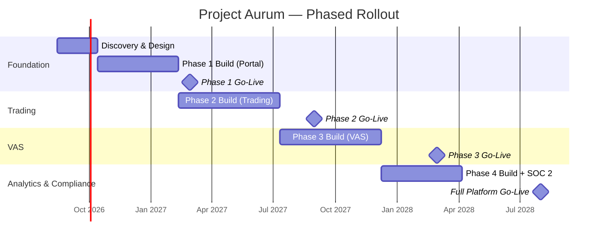
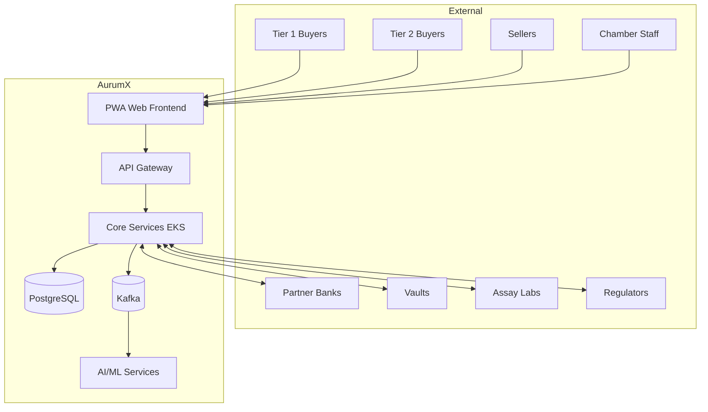
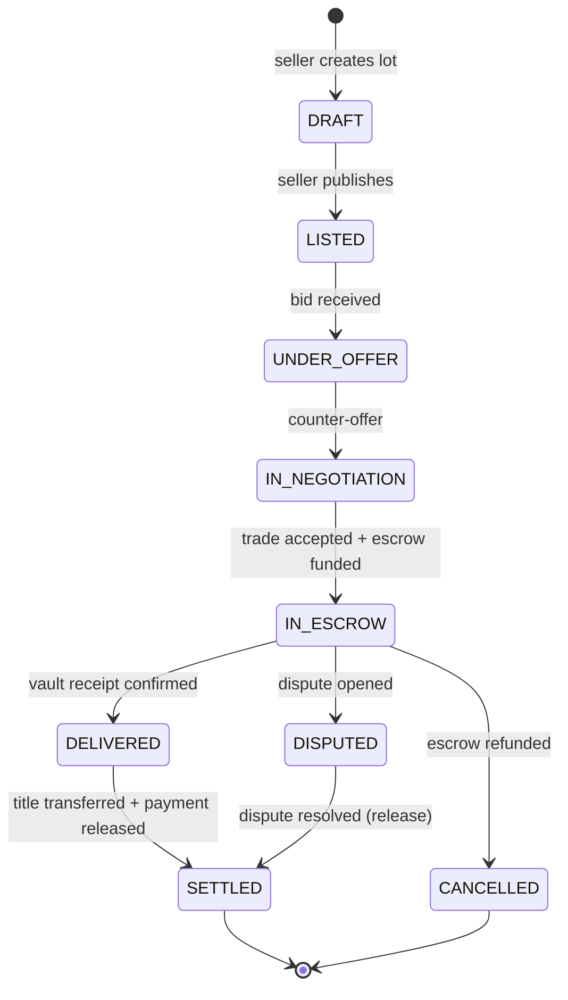
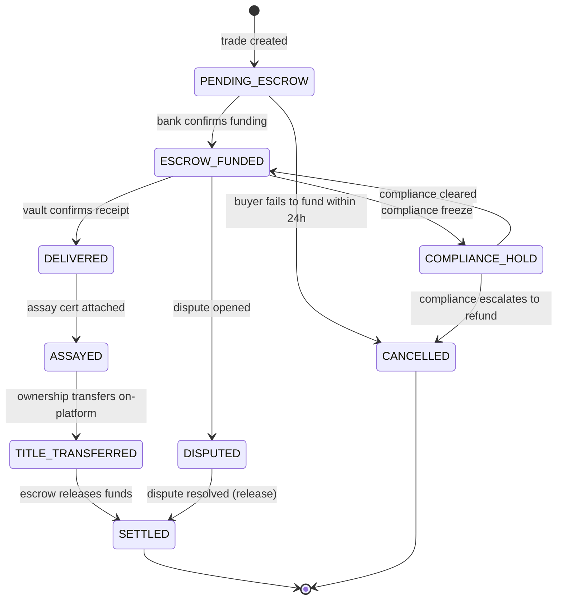
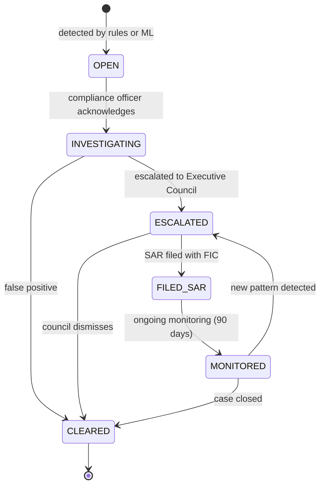
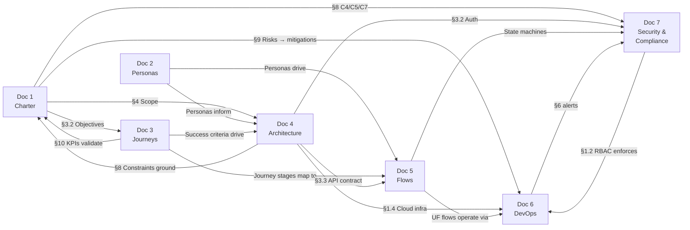

# AurumX — Ghana Gold Exchange Platform
## Project Documentation Suite (Condensed Edition)

| Field | Value |
|---|---|
| **Project Codename** | Project Aurum (product: AurumX) |
| **Sponsor** | Ghana Chamber of Gold Buyers |
| **Technology Partner** | Vanta Technologies Ltd. [ASSUMPTION] |
| **Commercial Model** | SaaS with Revenue Sharing (70% Vendor / 30% Chamber) |
| **Authorization Date** | 15 August 2026 |
| **Phase 1 Go-Live** | 28 February 2027 |
| **Full Platform (Phase 4) Go-Live** | 31 July 2028 |
| **Document Version** | 1.0 — Condensed |
| **Classification** | Confidential — Chamber & Vendor Internal |

> **Reader's note:** This is the condensed edition (~18 pages) of the full 7-document suite. The full suite (~70 pages with detailed ADRs, exhaustive flow diagrams, and full compliance mapping) is available alongside this edition. Assumptions are flagged inline with `[ASSUMPTION: ...]` for validation by the joint Change Control Board.

---

## Document Map

| # | Document | Primary Question | Pages |
|---|---|---|---|
| 1 | Project Charter | Why are we doing this? | 3 |
| 2 | User Personas | Who are we building for? | 2 |
| 3 | User Success Journeys | What does success look like? | 2 |
| 4 | System Architecture & Design | What is the blueprint? | 3 |
| 5 | User & System Flows | How does it work? | 3 |
| 6 | Development & Operations | How do we build and run it? | 3 |
| 7 | Security & Compliance | How do we keep it safe and legal? | 2 |
| — | Cross-References & Open Items | How do the docs connect? | 1 |

---

# Document 1 — Project Charter

## 1.1 Executive Summary

The Ghanaian gold sector loses an estimated US$2.3 billion annually to informal trading, royalty leakage, and unverified supply chains. The Ghana Chamber of Gold Buyers currently manages member licensing, dispute resolution, and export compliance through fragmented, paper-based workflows that take 7–14 days per trade to settle and 4–6 weeks per new member to onboard.

**Project Aurum (product name: AurumX)** will deliver a controlled B2B digital exchange — *not* an open marketplace — that combines RFQ (Request for Quote), negotiated trading, and optional auction mechanics within a strict identity, licensing, and compliance perimeter. The platform will digitize the entire trade lifecycle from seller listing through escrow settlement, assay certification, vault logistics, and export documentation.

Unlike a generic marketplace, every participant must be licensed and verified before they can trade. The Chamber owns governance and member relationships; the technology partner (Vanta Technologies Ltd. [ASSUMPTION]) owns, operates, and continuously improves the technology under a revenue-sharing SaaS agreement that removes the Chamber's upfront capital barrier. Beyond trading, the platform provides the Chamber with a member-management portal, compliance audit trails, and recurring revenue lines (transaction fees, escrow fees, premium subscriptions, value-added services) that scale with adoption.

## 1.2 Business Case & SMART Objectives

The platform is justified by five quantified value levers: informal trade capture (target ≥ 55% of national production vs. ~30% today), royalty recovery (+US$120M/year [ASSUMPTION]), trade settlement speed (7–14 days → ≤ 48 hours), compliance audit response (2–4 weeks → ≤ 48 hours), and recurring revenue diversification for the Chamber.

| # | SMART Objective | Target Date |
|---|---|---|
| O1 | Launch Phase 1 Digital Member Portal with verified onboarding for ≥ 100 Chamber members | 2027-02-28 |
| O2 | Enable end-to-end digital RFQ-to-settlement trading with escrow for ≥ US$50M cumulative trade value | 2027-12-31 |
| O3 | Achieve Mean Time to Trade Settlement (MTTTS) of ≤ 48 hours for ≥ 90% of completed trades | 2028-03-31 |
| O4 | Generate ≥ US$1.2M cumulative platform revenue in the first 12 months post Phase 2 (30% to Chamber) | 2028-08-31 |
| O5 | Achieve SOC 2 Type II certification and full FATF AML Recommendation 22 alignment | 2028-06-30 |

## 1.3 Project Scope

### In-Scope

| Module | Phase | Description |
|---|---|---|
| Identity, Licensing & KYC/AML | P1 | Verified onboarding, license validation, ongoing AML screening |
| Member Portal | P1 | Member profiles, document repository, notifications, secure messaging |
| Gold Lot Management | P2 | Lot creation with weight, purity, serial numbers, provenance chain |
| RFQ & Auction Engines | P2 | Multi-buyer RFQ + timed/reverse/sealed-bid auctions |
| Negotiation & Smart Matching | P2 | Counter-offer workflow; AI-assisted buyer-lot matching |
| Digital Contracts & Escrow | P2 | e-Signature contracts, escrow account integration |
| Assay & Certification VAS | P3 | Assay request workflow, digital certificate issuance |
| Logistics & Vault Management | P3 | Armored transport, vault storage, title transfer records |
| Export Documentation VAS | P3 | PMMC, GRA Customs, BoG FX permit orchestration |
| Analytics & BI Dashboards | P4 | Market prices, trade volumes, regional demand, compliance reporting |
| Admin & Compliance Console | P1→P4 | Chamber staff oversight, dispute resolution, audit tools |

### Out-of-Scope (Explicit)

| Item | Reason |
|---|---|
| Direct payment rails / mobile money wallet | Regulated PSP activity outside vendor remit |
| Physical gold custody by the platform | Liability + insurance exposure outside vendor remit |
| Consumer (B2C) gold trading | Outside Chamber's B2B mandate |
| Tax calculation & filing | Government competence; provide export data via API to GRA |
| Trade finance origination | Banking activity; referral commissions to partner banks only |
| Mobile native apps (iOS/Android) | PWA-first in Phases 1–4; native apps in Phase 5+ |

## 1.4 High-Level Timeline



| Milestone | Target Date | Exit Criteria |
|---|---|---|
| Charter signed | 2026-08-15 | This document signed by Sponsor & Vendor CEO |
| Discovery complete | 2026-10-15 | Architecture signed off; ADRs 1–5 approved |
| **Phase 1 Go-Live (Portal)** | 2027-02-28 | ≥ 100 members onboarded; Chamber staff trained |
| **Phase 2 Go-Live (Trading)** | 2027-08-31 | First 10 real trades settled through escrow |
| **Phase 3 Go-Live (VAS)** | 2028-02-28 | Assay + logistics + export flows live with ≥ 2 partners each |
| SOC 2 Type II report issued | 2028-06-30 | Third-party auditor sign-off |
| **Phase 4 Go-Live (Analytics)** | 2028-07-31 | BI dashboards in production; first quarterly compliance report generated |

## 1.5 Budget & Resources

### Year 1 Vendor Cost (USD)

| Category | Estimate | Notes |
|---|---|---|
| Engineering labour (8 FTE × 12 months) | $576,000 | Loaded cost |
| Design & UX | $48,000 | 1 designer × 4 months Phase 1 |
| QA & test automation | $96,000 | 2 QA × 6 months |
| DevOps & SRE setup | $72,000 | IaC, CI/CD, observability |
| Security & compliance engineering | $120,000 | AML/KYC integration, SOC 2 prep |
| Project management | $84,000 | 1 TPM, full allocation |
| Cloud infrastructure (AWS) | $54,000 | ~$4.5k/month ramp |
| Third-party services | $36,000 | Auth0, Twilio, Datadog |
| External audit (SOC 2 Type II) | $60,000 | One-time Year 1 |
| Contingency (15%) | $173,400 | Standard PM reserve |
| **Total Year 1** | **$1,319,400** | Vendor-funded under SaaS risk model |
| **Year 2 Run Cost (annual)** | **~$680,000** | Reduced build; steady-state operations |

### Team Composition (~16 FTE)

| Role | Headcount | Allocation |
|---|---|---|
| Project Manager (TPM) | 1 | 100% |
| Principal Architect | 1 | 80% |
| Backend Engineers (NestJS) | 3 | 100% |
| Frontend Engineers (Next.js) | 2 | 100% |
| Mobile / PWA Engineer | 1 | 100% |
| Data Engineer | 1 | 100% (P3+) |
| ML Engineer | 1 | 50% (P2+) |
| DevOps / SRE | 1 | 100% |
| Security & Compliance Engineer | 1 | 100% |
| QA Engineers | 2 | 100% |
| UX / Product Designer | 1 | 50% |
| Product Manager | 1 | 50% |

## 1.6 Key Stakeholders & RACI Matrix

| Stakeholder | Interest | Influence |
|---|---|---|
| Ghana Chamber of Gold Buyers (Executive Council) | Strategic, financial, reputational | High (Sponsor) |
| Minerals Commission of Ghana | Compliance, royalty reporting | High (veto) |
| Bank of Ghana (Financial Stability Dept.) | Escrow, AML oversight | High (veto) |
| Tier 1 Buyers (refiners, bullion banks) | Liquidity, security, audit trail | High |
| Tier 2 Buyers (exporters, jewelers) | Access to supply, fair pricing | Medium |
| Licensed Sellers (miners, aggregators) | Price discovery, faster settlement | Medium |
| Partner Banks (escrow) | Fee revenue, compliance | Medium |
| Vault Operators / Assay Labs | Service revenue | Medium |
| Vanta Technologies (Vendor) | Revenue share, reference customer | High |

### RACI Matrix — Selected Decisions

| Activity | Chamber Exec | Vendor PM | Vendor Architect | Compliance Officer |
|---|---|---|---|---|
| Charter approval | **A** | R | C | C |
| Architecture sign-off (ADRs) | I | **A** | R | C |
| Phase exit / Go-Live decision | **A** | R | C | C |
| Trading rules & fee schedule | **A** | C | I | C |
| AML / KYC thresholds | C | C | I | **A** |
| Security incident response | I | R | C | **A** |
| Production deployments | I | C | R | I |
| Compliance audit participation | C | R | C | **A** |
| Disaster recovery test | I | R | C | C |

> R = Responsible · A = Accountable · C = Consulted · I = Informed

## 1.7 Assumptions, Constraints & Dependencies

**Key Assumptions:**
- A1: Chamber member registry (~340 licensed buyers) available in structured exportable format by Week 3 of Phase 1.
- A2: At least two Ghanaian commercial banks execute escrow integration MOUs by end of Phase 1 (2027-01-30).
- A3: Minerals Commission issues a digital export permit API by Q2 2027.
- A4: AWS `af-west-1` (Cape Town) generally available by Phase 1 launch.
- A5: Tier 1 buyers accept third-party-operated platform provided SOC 2 + Chamber endorsement are in place.

**Constraints:**
- C1: Must launch Phase 1 (Portal) before 2027-Q2 Chamber AGM (time).
- C2: Must use Auth0 for identity — enterprise agreement in place (technical).
- C3: Must NOT operate as a licensed PSP or take custody of physical gold (legal).
- C4: Must achieve SOC 2 Type II before Tier 1 institutional buyers onboard (compliance).
- C5: Trade data subject to Ghana Data Protection Act 2012; cross-border transfer requires lawful basis (legal).

**Dependencies:**
- Chamber member registry data export → blocks P1 onboarding.
- Bank escrow integration MOUs → blocks Phase 2 go-live.
- Minerals Commission export-permit API → blocks Phase 3 export VAS.
- Assay lab API contracts → blocks Phase 3 assay VAS.

## 1.8 High-Level Risks

| # | Risk | Likelihood | Impact | Mitigation |
|---|---|---|---|---|
| R1 | Anchor Tier 1 buyer declines due to platform trust concerns | Medium | High | Secure 2 anchor Tier 1 buyers under LOI before Phase 2; Chamber endorsement; SOC 2 prerequisite |
| R2 | Escrow partner bank withdraws or fails to integrate | Medium | High | Dual-track two bank MOUs; fallback to licensed PSP; `EscrowProvider` interface abstraction |
| R3 | Regulatory change imposes new licensing requirement | Low | Critical | Quarterly compliance review; 90-day regulatory horizon scan; legal counsel retained |
| R4 | Cybersecurity incident (data breach or trade data exfiltration) | Medium | Critical | Defense-in-depth (WAF + IDS + KMS + immutable audit log); SOC 2 controls; 24h BoG notification; cyber insurance US$5M |
| R5 | Vendor key personnel departure (architect, TPM) | Medium | High | Pair programming; ADRs in repo; 2-week notice clause; documented runbooks |
| R6 | Trading volume underperforms forecast | Medium | High | Conservative base-case model (1/3 of forecast); premium subscriptions as volume-independent revenue |
| R7 | Phase 1 member onboarding slower than target (KYC friction) | Medium | Medium | Pre-load verified member data; tiered KYC; in-app document upload + status tracking |

## 1.9 Success Criteria / KPIs

Measured 90 days post Phase 4 Go-Live (by 2028-10-31):

| KPI Category | Metric | Target |
|---|---|---|
| Adoption | Active licensed members | ≥ 280 of ~340 (82%) |
| Adoption | Tier 1 buyer participation | ≥ 8 of top 10 Ghana-licensed refiners |
| Trading Volume | Cumulative trade value settled through escrow | ≥ US$500M trailing 12 months |
| Efficiency | Mean Time to Trade Settlement (MTTTS) | ≤ 48 hours, 90th percentile |
| Efficiency | Member onboarding time | ≤ 5 business days, median |
| Reliability | Platform uptime | ≥ 99.95% measured monthly |
| Security | SOC 2 Type II report | Issued and unqualified |
| Compliance | AML alert turnaround time | ≤ 24 hours, 95th percentile |
| Financial | Platform gross revenue (trailing 12 months) | ≥ US$2.4M |
| Financial | Chamber revenue share remitted | ≥ US$720K (30%) |
| Customer Experience | Member NPS | ≥ 45 |
| Customer Experience | Trade dispute rate | < 2% of trades |

---

# Document 2 — User Personas

Four primary personas anchor the design of the AurumX platform. Each is fictional but anchored in real stakeholder archetypes observed in the Ghanaian gold-buying sector.

## 2.1 Persona 1 — Kwame Asare, Tier 1 Buyer

| Attribute | Detail |
|---|---|
| **Name / Age** | Kwame Asare, 52 |
| **Job title** | Head of West African Sourcing, Helvetia Refining AG (Swiss LBMA Good Delivery refiner) [ASSUMPTION] |
| **Technical skill** | High — daily user of Bloomberg Terminal, SAP S/4HANA; skeptical of consumer-grade UX |
| **Annual procurement budget** | US$250M–$400M of doré and refined gold |

**Goals:** Source 30–50 kg/week from Ghanaian Tier 2 sellers at or below LBMA benchmark with full provenance for Swiss import compliance. Pre-qualify and maintain a vetted panel of 12–15 Ghanaian counterparties with continuously-validated KYC. Reduce per-deal admin from 6–8 hours to under 1 hour. Receive early visibility of large lots (≥ 5 kg, ≥ 99.5% purity) with right of first refusal. Maintain audit trail defensible against FINMA and OECD Due Diligence reviews.

**Pain Points:** Counterparty discovery is relationship-bound (WhatsApp + phone calls). Documentation is paper-heavy and error-prone. Provenance gaps create OECD Annex II risk. Price opacity at the local level. No early-warning for supply disruptions.

> *"I do not need another marketplace. I need a verified counterparty on the other side of every kilogram, with paper that survives a FINMA audit."*

**Product Implications:** Verified counterparty directory with live license status (P1); Tier 1 pre-notification with optional RFQ exclusivity window (P2); full provenance chain with hash-anchored documents (P2–3); OECD Annex II red-flag indicators on counterparty profiles (P1); API access for SAP integration (P2); desktop-first UX, mobile read-only (P1).

## 2.2 Persona 2 — Abena Owusu, Tier 2 Buyer

| Attribute | Detail |
|---|---|
| **Name / Age** | Abena Owusu, 34 |
| **Job title** | Managing Director, GoldLink Exports Ltd. (Accra-based licensed gold exporter) [ASSUMPTION] |
| **Technical skill** | Medium-High — power user of Excel, WhatsApp Business; limited API literacy |
| **Annual export volume** | 80–150 kg/year, primarily to UAE and India |

**Goals:** Maintain steady pipeline of 8–12 kg/week for export from 4–6 trusted aggregators. Reduce time from gold-in-vault to export permit approved from 10–14 days to under 5 days. Negotiate better margins by accessing multiple competing seller offers. Manage export documentation in one place. Build track record that unlocks bank trade finance.

**Pain Points:** Liquidity is unpredictable — when an aggregator falters, she has no fast alternative. Documentation is exhausting — 7 documents across 4 agencies per shipment. Price discovery is opaque. Bank credit is hard despite clean track record. Cash flow timing is brutal — pays sellers within 48 hours but buyers pay T+7 to T+30, leaving her bearing all settlement risk.

> *"If I can move gold from vault to export permit in five days instead of fourteen, I can take three more shipments a month. That is the difference between surviving and growing."*

**Product Implications:** Mobile-first UX (P1, critical); one-stop export documentation workflow (P3); RFQ comparison view side-by-side (P2); escrow as default settlement (P2); trade history export for bank trade finance (P2); bidirectional SMS/WhatsApp notifications (P1); lightweight financial dashboard (P3).

## 2.3 Persona 3 — Ibrahim Toure, Seller

| Attribute | Detail |
|---|---|
| **Name / Age** | Ibrahim Toure, 48 |
| **Job title** | General Secretary, Banda Small-Scale Miners Cooperative (Upper West Region) [ASSUMPTION] |
| **Technical skill** | Low-Medium — comfortable with basic smartphone apps; struggles with complex forms |
| **Organization** | Cooperative of ~140 small-scale miners; ~3 kg/week throughput |

**Goals:** Sell the cooperative's gold at the best available price without traveling to Accra. Receive payment within 48 hours of delivery (currently 5–10 days). Build a verifiable, auditable record of production and sales for fair-trade certification. Reduce dependence on a single aggregator-middleman (currently 4–6% margin). Get proactive alerts when buyer demand spikes.

**Pain Points:** Logistics are dangerous and expensive (US$800–1,200 for armored Wa-to-Accra transport). Buyer default risk — burned twice in three years. Price discovery is broken — single middleman's quote with no comparison. Documentation is hard to maintain — last license renewal took 11 weeks. No access to finance — no bank will advance working capital.

> *"We mine the gold. Someone else sets the price. If this platform lets me see three offers before I sell, and the money is in escrow before the gold leaves my hand, I will use it every week."*

**Product Implications:** Extremely low-bandwidth mobile UX; SMS fallback (P1, critical); one-tap lot creation with photo + weight capture (P2); escrow visible to seller before gold leaves possession (P2, critical); WhatsApp-based trade confirmations (P1); localized pricing USD primary + GHS secondary (P2); voice-guided onboarding English + Twi + Hausa (P1); cooperative account with multi-user roles (P1); demand-spike alerts via SMS (P2).

## 2.4 Persona 4 — Efua Boateng, Compliance Officer

| Attribute | Detail |
|---|---|
| **Name / Age** | Efua Boateng, 44 |
| **Job title** | Director of Compliance & Member Affairs, Ghana Chamber of Gold Buyers |
| **Technical skill** | High — former Big 4 auditor; comfortable with BI tools and SQL |
| **Team** | Chamber staff of 18; Efua's team of 3 covers compliance, onboarding, dispute resolution |

**Goals:** Provide monthly compliance health metrics with drill-down to specific trades. Reduce member onboarding from 4–6 weeks to under 5 business days. Detect and investigate suspicious trading within 24 hours. Maintain audit trail defensible against BoG, MinCom, and FATF review. Standardize and automate quarterly compliance reporting.

**Pain Points:** No real-time visibility into member trading — learns of suspicious trades weeks or months late. Onboarding is paper-bound — each application requires 4–6 manual cross-checks. Dispute resolution is slow and opaque. Regulatory reporting is a quarterly fire-drill. Audit defensibility is shaky — gaps in the paper trail create exposure.

> *"I am not asking for magic. I am asking for one source of truth, with timestamps, that I can hand to a Bank of Ghana examiner at 9 AM on a Monday."*

**Product Implications:** Real-time compliance dashboard with drill-down (P1→P4); workflow engine for member onboarding with parallel cross-checks (P1); sanction list screening with daily refresh (P1, critical); anomaly detection with explainable alerts (P2/P4); immutable audit log with hash-anchored records (P1, critical); dispute resolution module with shared trade fact view (P3); automated quarterly regulatory report generation (P4).

---

# Document 3 — User Success Journeys

A user success journey describes the end-to-end experience a persona has while pursuing their single most critical goal. Each journey is broken into stages with actions, touchpoints, emotions, and opportunities.

## 3.1 Journey 1 — Kwame: Vet and Onboard a New Tier 2 Counterparty (21 days)

**Goal:** Identify, vet, and onboard a new Ghanaian Tier 2 seller — from initial discovery to first completed trade with full audit defensibility — in under 21 days.

| Stage | Duration | Actions | Key Emotion |
|---|---|---|---|
| **Discover** | Days 1–3 | Receives in-platform alert of newly-verified Tier 2 seller (GoldLink/Abena). Filters counterparty directory by region, license type, trade volume. Reviews AML/risk screen rating. Shortlists 3 candidates. | 😊 Delight at proactive notification |
| **Validate** | Days 4–10 | Requests Enhanced Due Diligence (EDD) pack. Reviews license scan, tax certificate, beneficial ownership. Validates against OECD Annex II indicators. Approves GoldLink as Tier 1-listed counterparty. | 😊 Relief at comprehensive pack |
| **First Trade** | Days 11–14 | GoldLink lists 5 kg, 99.5% lot. Kwame gets Tier 1 priority alert (4-hour exclusivity). Submits counter-offer at US$2 below LBMA fix. Negotiates 2 rounds. Escrow funded automatically by bank integration. | 😊 Delight at exclusivity + auto-escrow |
| **Settle & Deliver** | Days 15–18 | Vault confirms receipt. SGS assay certificate auto-attached. Title transfers on-platform. Export documentation bundle auto-generated (PMMC + GRA + BoG). | 😊 Major delight — eliminates 6–8 hours paperwork |
| **Habitual Use** | Days 19–21+ | Adds GoldLink to preferred panel. Sets auto-alert for 5+ kg lots. Per-deal admin time drops from 6–8 hours to under 45 minutes. | 😊 Significant productivity gain |

**Summary:** Kwame's journey moves from proactive discovery through structured validation, into the first trade, and finally into habitual partnership. His per-deal admin time falls from 6–8 hours to under 1 hour, directly enabling Charter Objective #3 (MTTTS ≤ 48 hours).

## 3.2 Journey 2 — Abena: Source, Sell, and Export Within 5 Days

**Goal:** Source gold from a new aggregator, complete the trade through escrow, and obtain a full export permit set within 5 business days (vs. 10–14 days today).

| Stage | Duration | Actions | Key Emotion |
|---|---|---|---|
| **Discover Supply** | Day 1 | Logs in via mobile PWA during commute. Reviews 4 RFQs from aggregators. Side-by-side comparison of weight, purity, asking price vs. LBMA, seller trust score. Selects Banda Cooperative's 3 kg lot. | 😊 Delight at mobile comparison |
| **Negotiate & Trade** | Day 2 | Submits counter-offer via mobile. Ibrahim responds within 2 hours via WhatsApp (platform mirrors in-app). Settle after one round. Escrow funded automatically by Stanbic. | 😊 Major relief — first auto-escrow |
| **Receive & Assay** | Day 3 | Gold delivered to Brink's Accra vault. Vault receipt confirmed via operator API. SGS assays within 12 hours, digital certificate auto-attached. Title transfers. Cooperative paid within 30 minutes. | 😊 Major delight — assay in hours |
| **Export Documentation** | Days 4–5 | Initiates export workflow with one tap. Platform auto-applies PMMC, pre-populates GRA customs, routes BoG FX approval. All 3 permits within 48 hours. Export bundle auto-assembled. | 😊 Major delight — 5 days vs. 14 |
| **Habitual Use** | Weeks 2+ | Exports trade history as PDF+JSON. Stanbic approves US$500K working capital line against documented trade history. Within 8 weeks, 6 trades completed; weekly export volume +40%. | 😊 First credit access in 4 years |

**Summary:** Abena's journey is the platform's commercial core. Her ability to move from gold-in-vault to export-permit-set in 5 days instead of 14 directly enables Charter Objective #2 (US$50M cumulative trade value processed). Her access to bank working capital — unlocked by the auditable trade history — multiplies her trade volume, which in turn drives the platform's transaction-fee revenue.

## 3.3 Journey 3 — Ibrahim: Sell Gold Safely Without Traveling to Accra

**Goal:** List the cooperative's 3 kg of weekly gold, receive three competing offers, sell to the highest bidder, and receive payment in escrow before the gold leaves his possession — all without traveling.

**Onboard (Days 1–5):** Receives WhatsApp invite from Chamber. Taps link → opens PWA. Creates organization account, adds himself as Secretary plus Treasurer + Chairman with different permissions. Uploads mining license + member roster. Chamber verifies within 5 business days (vs. 6 weeks paper-based).

**List & Receive Offers (Days 6–8):** Taps "List a lot" on phone. Captures 2 photos, enters weight (3.0 kg) + purity (99.2%). SMS confirmation received. Within 2 hours first offer arrives; by Day 2, three competing offers visible side-by-side (USD primary + GHS secondary). Executive committee reviews via WhatsApp. Accepts Abena's offer (highest).

**Deliver & Settle (Days 9–10):** Escrow funded before gold leaves — SMS confirms escrow balance. Arranges armored transport via platform logistics VAS (Brink's Wa-to-Accra, US$950). Gold arrives Accra vault next morning. Vault receipt confirmed; payment released to cooperative's bank account within 30 minutes.

**Summary:** Ibrahim's journey is the platform's social-impact story. His transition from middleman-dependent to platform-empowered directly addresses the Charter's broader objective of capturing informal trade into the formal channel (from ~30% to ≥ 55%).

## 3.4 Journey 4 — Efua: Detect and Investigate a Suspicious Trade Within 24 Hours

**Goal:** Detect a suspicious trade within 24 hours, investigate with full audit trail access, and either clear or escalate within 48 hours.

**Monitor (Hour 0–2):** At 8 AM, Efua opens compliance dashboard. Anomaly-detection engine has flagged an overnight trade: Tier 2 buyer (6 weeks old) placed unusually high bid (12% above next-highest) on 4 kg lot, with payment from newly-onboarded bank account. Alert explanation cites 3 signals: bid-price-outlier, counterparty-velocity-anomaly, payment-source-recently-onboarded. She drills into the trade.

**Investigate (Hour 2–8):** Opens trade-facts timeline — chronological view of every event. Pulls counterparty KYC history (3 prior trades, all clean). Cross-checks OFAC, EU, UN, Ghana MoF sanction lists (no matches). Reviews 12 comparable peer trades — flagged bid is clear outlier.

**Decide (Hour 8–24):** Escalates to Executive Council with pre-filled investigation pack. Council reviews within 4 hours, approves formal inquiry. Efua files Suspicious Activity Report (SAR) with FIC via platform-integrated workflow. Through the platform, she freezes the trade — escrow held, buyer suspended, seller notified with confidentiality.

**Habitual Use (Weeks 2+):** Pattern added as permanent rule in anomaly-detection engine. Event auto-included in next quarterly BoG report. Pattern (anonymized) shared with members in compliance training.

**Summary:** Efua's journey is the platform's regulatory and reputational safeguard. Her 24-hour detection-to-action capability — vs. weeks or months today — is the precondition for Bank of Ghana and Minerals Commission confidence, without which Tier 1 institutional buyers will not participate.

## 3.5 Journey-to-Charter Cross-Reference

| Charter Objective | Primary Journey | Success Indicator |
|---|---|---|
| #1 — Phase 1 Portal, ≥ 100 members | Journey 1 + 3 (Stage 1) | Kwame + Ibrahim onboarding within target |
| #2 — US$50M cumulative trade value | Journey 2 + 3 (full) | Abena + Ibrahim trade cycles repeat weekly |
| #3 — MTTTS ≤ 48h, 90th percentile | Journey 1 + 2 (Stage 4) | Kwame settlement ≤ 48h; Abena full cycle ≤ 5 days |
| #4 — US$1.2M platform revenue | Journey 1 + 2 (Stage 5) | Habitual weekly trade cycles sustain fee revenue |
| #5 — SOC 2 + FATF Rec 22 | Journey 4 (full) | 24-hour detection-to-action cycle |

---

# Document 4 — System Architecture & Design

## 4.1 Architecture Principles

| # | Principle | Rationale |
|---|---|---|
| AP1 | Member-gated, not open marketplace | High-value regulated commodity requires membership gate |
| AP2 | Event-driven core | Trade state changes emit domain events for compliance (24h SLA) |
| AP3 | Audit-first data model | Every state transition persisted as immutable, hash-anchored event |
| AP4 | Vendor and partner agnostic | Integrations abstracted behind interfaces (mitigates Charter Risk R2) |
| AP5 | Mobile-first, desktop-required for high-value | Persona coverage: Ibrahim (mobile-only) vs. Kwame (desktop-required) |
| AP6 | Cost-aware scaling | Stateless services scale horizontally; stateful vertically first |

## 4.2 Technology Stack

| Layer | Technology | Rationale |
|---|---|---|
| Frontend (PWA) | Next.js 16 + React 19 + TypeScript + Tailwind | Server-rendered PWA supports low-bandwidth mobile; strong typing for financial UX |
| Backend | NestJS (Node.js 22 LTS, TypeScript) | Opinionated module system; first-class DI; matches frontend language |
| API style | REST (primary) + GraphQL (BFF) + WebSocket + Webhooks | REST for partner integrations; GraphQL for portal; WebSocket for negotiation |
| Database | PostgreSQL 16 | ACID guarantees; JSONB for flexible metadata; Row-Level Security for tenant isolation |
| Cache | Redis 7 (cluster mode) | Session store, rate-limit counters, real-time negotiation state |
| Search | Elasticsearch 8 | Lot discovery, full-text on member directory, audit-log search |
| Event bus | Apache Kafka (AWS MSK) | Domain events for audit log, anomaly detection, notifications; 7-year retention |
| Object storage | AWS S3 + KMS encryption | Document storage with lifecycle to Glacier |
| Identity | Auth0 B2B | Enterprise agreement (Charter C2); organization-level RBAC; SSO for Tier 1 |
| Orchestration | AWS EKS | Multi-AZ, autoscaling, mature ecosystem |
| CI/CD | GitHub Actions + Argo CD | Branch-driven builds; declarative K8s deployments |
| Observability | Datadog + Sentry | Unified APM + logs + metrics; OpenTelemetry support |
| IaC | Terraform + Helm | Cloud-agnostic; Helm for K8s release management |
| Cloud | AWS af-west-1 (primary), eu-west-1 (DR) | African region for data residency; EU region for DR |

## 4.3 System Context



## 4.4 Core Aggregates & Design Patterns

| Aggregate | Owning Service | Key Fields |
|---|---|---|
| Organization | Member Service | name, tier, status, kyc_status |
| GoldLot | Lot Service | seller_org_id, weight_grams, purity, serial_number, status |
| RFQ / Auction | RFQ / Auction Engine | lot_id, buyer_org_id, asking_price_usd, status |
| Trade | Trade Service | lot_id, buyer_org_id, seller_org_id, amount_usd, status, settled_at |
| Escrow | Escrow Service | trade_id, bank_account_id, amount_usd, status, bank_reference |
| TradeEvent | Audit Log Service | trade_id, event_type, event_payload, hash_anchor, occurred_at |
| ComplianceAlert | Compliance Service | triggered_by_trade_id, severity, status, signals |

| Pattern | Where Applied | Why |
|---|---|---|
| Domain-Driven Design (DDD) | Core domain services | Complex business rules require rich domain models |
| Event Sourcing (partial) | Trade, Compliance Alert | Audit-defensible history; replayable for investigations |
| CQRS | Lot read model (Elasticsearch); write (PostgreSQL) | High-read lot discovery optimization |
| Strategy | EscrowProvider, PaymentProvider, NotificationProvider, AssayProvider | Vendor-agnostic — provider swap mitigates Charter R2 |
| Outbox Pattern | All services publishing to Kafka | Atomic DB write + event publish (no dual-write inconsistency) |
| Saga (choreography) | Trade lifecycle (8+ stages) | Long-running distributed transaction without 2PC |

## 4.5 API Design

**Conventions:** HTTPS only (TLS 1.3). JSON with ISO 8601 UTC timestamps and decimal-string monetary amounts. URL versioning (`/v1/`, `/v2/`). Cursor-based pagination. Idempotency-Key header required for all POST that creates resources (24-hour window). RFC 7807 Problem Details for errors. Token-bucket rate limiting per API key.

**Authentication:** Auth0 B2B with Organizations. Authorization Code + PKCE for PWA; Client Credentials for machine-to-machine. JWT (RS256), 1-hour access tokens; 30-day sliding refresh. RBAC: roles scoped per Organization (`org.admin`, `org.trader`, `org.compliance`, `org.viewer`) and globally (`chamber.compliance`, `chamber.executive`). MFA required for org.admin, all Chamber roles, and any trade action above US$100K.

**Selected Endpoints:**

| Endpoint | Purpose | Backs User Flow |
|---|---|---|
| `POST /v1/organizations` | Create new member organization | UF-01 Onboarding |
| `POST /v1/organizations/{id}/kyc/submit` | Submit KYC form | UF-01 Onboarding |
| `POST /v1/lots` | Create a new gold lot | UF-02 Lot Creation |
| `POST /v1/rfqs` | Submit RFQ with asking price | UF-03 RFQ Submission |
| `POST /v1/rfqs/{id}/bids` | Submit a bid | UF-03 RFQ Submission |
| `POST /v1/rfqs/{id}/accept` | Accept terms; trade created | UF-03 RFQ Submission |
| `POST /v1/trades/{id}/escrow/fund` | Trigger bank escrow funding | UF-05 Escrow |
| `POST /v1/trades/{id}/freeze` | Freeze trade (compliance only) | UF-08 Investigation |
| `GET /v1/compliance/alerts` | List compliance alerts | UF-08 Investigation |
| `POST /v1/exports` | Initiate export documentation workflow | UF-07 Export Docs |

## 4.6 Architecture Decision Records (ADRs)

### ADR-001 — Event-Driven SOA over Monolith
**Context:** Heterogeneous concerns (onboarding, trade, escrow, compliance) with sharply different scaling profiles. Compliance requires 24-hour detection-to-action SLA. SOC 2 Type II mandatory.
**Decision:** Event-driven service-oriented architecture (not full microservices) with Kafka as the event backbone, Outbox pattern for atomic DB writes + event publish, Saga choreography for the trade lifecycle. One PostgreSQL cluster shared across services via separate schemas.
**Consequences:** (+) Independent scaling; intrinsic audit trail; compliance subscribes to all events without coupling. (−) Operational complexity; distributed-systems pitfalls.

### ADR-002 — Auth0 B2B for Identity
**Context:** Organization-scoped RBAC, MFA, SSO for Tier 1 buyers (SAML), per-organization IP allowlisting. Charter §8 C2 mandates Auth0.
**Decision:** Auth0 B2B with Organizations. Custom claims for fine-grained permissions. SAML/OIDC enterprise connections for Tier 1 buyers.
**Consequences:** (+) SOC 2 already in place for Auth0; MFA + SSO built-in. (−) Vendor lock-in; per-MAU pricing.

### ADR-003 — Kafka (AWS MSK) over RabbitMQ/SQS
**Context:** Trade lifecycle is a long-running saga with 8+ stages. Compliance must replay any trade's full event history on demand. Throughput forecast: ~500 events/sec peak.
**Decision:** Apache Kafka (AWS MSK Standard, 3-broker multi-AZ). Outbox pattern for atomic publish. Log-compacted audit-log topic as canonical replay source. Retention: 7 years.
**Consequences:** (+) Replayable event history — direct enabler for compliance and SOC 2 audit. (−) MSK operational cost (~US$1,800/month baseline).

### ADR-004 — Outbox Pattern for Atomic Event Publish
**Context:** Dual-write problem: if service writes to PostgreSQL then publishes to Kafka, a failure between leaves system inconsistent. Unacceptable for audited financial platform.
**Decision:** Every service that publishes events uses the Outbox pattern — single DB transaction writes aggregate AND inserts outbox row; separate worker reads outbox and publishes to Kafka. Idempotent consumers deduplicate by event ID.
**Consequences:** (+) Atomicity guarantee; recoverable from any failure. (−) Adds outbox table per service; slight write-latency.

### ADR-005 — Next.js PWA, No Native Apps in Phases 1–4
**Context:** Persona coverage spans Kwame (desktop-required) and Ibrahim (mobile-only on 3G). Native iOS+Android = 2 codebases + App Store review cycles.
**Decision:** Entire member-facing UI as Next.js PWA. Server-rendered pages for low-bandwidth first paint. Service worker for offline-tolerant document capture. Push notifications via Web Push API with SMS/WhatsApp fallback.
**Consequences:** (+) Single codebase across desktop, tablet, mobile; no App Store review cycles. (−) Some Tier 1 buyers may push back; mitigated by excellent PWA + API access for SAP.

---

# Document 5 — User Flows & System Flows

## 5.1 User Flow Inventory

| # | Flow | Primary Persona | Journey Stage |
|---|---|---|---|
| UF-01 | Member Onboarding | Ibrahim, Abena, Kwame | J1/2/3 Stage 1 |
| UF-02 | Lot Creation & Listing | Ibrahim | J3 Stage 2 |
| UF-03 | RFQ Submission & Negotiation | Kwame, Abena | J1/2 Stage 3 |
| UF-04 | Auction (Timed, Reverse, Sealed-Bid) | Kwame, Abena | J1/2 Stage 3 (alt) |
| UF-05 | Escrow Funding & Settlement | Kwame, Abena, Ibrahim | J1/2/3 Stage 4 |
| UF-06 | Assay Request & Certification | Abena, Chamber | J2 Stage 3 |
| UF-07 | Export Documentation Bundle | Abena | J2 Stage 4 |
| UF-08 | Compliance Investigation | Efua | J4 Stage 2 |
| UF-09 | Dispute Resolution | All | Cross-journey |

## 5.2 UF-03 — RFQ Submission & Negotiation (Detailed)

Buyer browses Lots or receives Tier 1 priority alert → submits RFQ with asking price (Tier 1) or bid (Tier 2 open) → seller notified via WhatsApp + SMS → seller accepts, counters, or rejects → counter-offers iterate (max 5 rounds) → on acceptance, Trade created (status PENDING_ESCROW) → both parties notified with escrow funding instructions.

**Decision Points & Edge Cases:**

| Decision Point | Logic | UX Implication |
|---|---|---|
| Tier 1 priority alert (4h exclusivity) | Tier 1 buyers receive lot notifications 4h before Tier 2 | Prominent countdown timer in negotiation UI |
| Counter-offer limits | Max 5 counter-offers per RFQ to prevent stalling | Counter after 5th rejected: "Maximum reached" |
| Auto-expiry | RFQ expires 24h after creation if not accepted | Seller sees countdown; buyer sees "expires in X hours" |
| High-value trade threshold | Trades > US$100K require MFA re-authentication | "Please confirm MFA code to accept this trade above US$100,000" |

## 5.3 UF-05 — Escrow Funding & Settlement (Detailed)

Trade created (PENDING_ESCROW) → buyer taps Fund Escrow → confirm funding amount + bank account last4 → if amount > US$100K, MFA challenge → POST `/v1/trades/{id}/escrow/fund` triggers bank adapter → bank adapter calls partner bank API → on success, status FUNDED, both parties notified → seller arranges armored transport via platform → vault confirms receipt via operator API → assay requested, certificate auto-attached → title transfers on-platform → escrow auto-released to seller bank account → status SETTLED → immutable audit entry + analytics event recorded.

**Edge Cases:**

| Edge Case | Handling |
|---|---|
| Buyer's bank API down | Bank adapter falls back to secondary partner bank (Charter R2 mitigation); if both down, retry every 30 min for 4 hours |
| Vault receipt delayed > 24h | Auto-alert to Chamber ops + seller + buyer; investigation workflow triggered |
| Assay purity differs > 0.5% from declared | Auto-pause settlement; both parties notified; renegotiation workflow (price adjustment or cancellation) |
| Compliance hold during escrow | Escrow status FROZEN; trade status COMPLIANCE_HOLD; only Compliance Officer can release |
| Buyer disputes delivery | Trade status DISPUTED; escrow held; dispute workflow UF-09 triggered |

## 5.4 Sequence Diagram — RFQ to Escrow Funding

```mermaid
sequenceDiagram
    participant Buyer as Kwame (Tier 1)
    participant Seller as Ibrahim (Seller)
    participant API as API Gateway
    participant RFQ as RFQ Engine
    participant Trade as Trade Service
    participant Escrow as Escrow Service
    participant Bank as Partner Bank
    participant Kafka as Kafka
    participant Notif as Notification Service

    Buyer->>API: POST /v1/rfqs {lot_id, asking_price}
    API->>RFQ: forward
    RFQ->>RFQ: Validate + DB write + outbox
    RFQ->>Kafka: publish "rfq.submitted"
    RFQ-->>API: 201 Created
    API-->>Buyer: 201 Created
    Kafka->>Notif: consume
    Notif->>Seller: WhatsApp + SMS notification

    Seller->>API: POST /v1/rfqs/{id}/negotiate {counter_offer}
    API->>RFQ: forward
    RFQ->>Buyer: WebSocket push (real-time)

    Buyer->>API: POST /v1/rfqs/{id}/accept
    API->>Trade: create Trade from RFQ
    Trade->>Trade: DB write (status: PENDING_ESCROW) + outbox
    Trade->>Kafka: publish "trade.created"
    Trade-->>API: trade_id
    API-->>Buyer: 200 OK {trade_id, escrow_funding_url}
    Kafka->>Notif: consume "trade.created"
    Notif->>Buyer: "Escrow funding instructions"
    Notif->>Seller: "Trade accepted; awaiting escrow"

    Buyer->>API: POST /v1/trades/{id}/escrow/fund
    API->>Escrow: forward
    Escrow->>Escrow: DB write (status: PENDING) + outbox
    Escrow->>Bank: POST /v1/escrow (bank adapter)
    Bank-->>Escrow: 202 Accepted {bank_reference}
    Bank->>Escrow: webhook "funding-confirmed"
    Escrow->>Escrow: DB update (status: FUNDED)
    Escrow->>Kafka: publish "escrow.funded"
    Kafka->>Notif: consume
    Notif->>Buyer: "Escrow funded"
    Notif->>Seller: "Escrow funded — proceed with delivery"
```

## 5.5 State Diagrams

### Gold Lot State Machine



### Trade State Machine



### Compliance Alert State Machine



---

# Document 6 — Development & Operations Documentation

## 6.1 Repository Structure

```
aurumx/
├── apps/                    # Next.js apps (portal, admin, marketing)
├── services/                # NestJS services (member, lot, rfq, trade, escrow, compliance, ...)
├── packages/                # Shared types, config, UI, domain primitives, test-utils
├── infra/                   # Terraform, Helm, Argo CD manifests
├── docs/                    # OpenAPI specs, ADRs, runbooks
├── .github/workflows/       # GitHub Actions CI/CD pipelines
├── package.json             # pnpm workspace root
├── pnpm-workspace.yaml
└── turbo.json               # Turborepo build pipeline
```

## 6.2 Environment Variables (Selected)

| Variable | Required | Description | Source |
|---|---|---|---|
| `NODE_ENV` | Yes | `development` \| `staging` \| `production` | Deployment env |
| `DATABASE_URL` | Yes | PostgreSQL connection string | Secrets Manager: `aurumx/{env}/db/master` |
| `REDIS_URL` | Yes | Redis cluster URL | Secrets Manager |
| `KAFKA_BROKERS` | Yes | Comma-separated Kafka broker list | Secrets Manager |
| `S3_DOCUMENTS_BUCKET` | Yes | Bucket for KYC docs, contracts, assay certs | `aurumx-{env}-documents-{region}` |
| `AWS_REGION` | Yes | AWS region (`af-west-1` prod / `eu-west-1` DR) | Config |
| `JWKS_URI` | Yes | Auth0 JWKS endpoint | `{JWT_ISSUER}.well-known/jwks.json` |
| `DATADOG_API_KEY` | Yes | Datadog ingestion key | Secrets Manager |
| `STANBIC_API_KEY` | Yes | Stanbic escrow API key | Secrets Manager |
| `PMMC_API_KEY` | Yes | PMMC export permit API | Secrets Manager |
| `BOG_FX_API_KEY` | Yes | Bank of Ghana FX approval API | Secrets Manager |
| `TWILIO_AUTH_TOKEN` | Yes | Twilio WhatsApp + SMS | Secrets Manager |
| `AUDIT_LOG_HASH_CHAIN_SALT` | Yes | Per-env salt for hash anchoring | Secrets Manager — read denied to SRE |

**Secret rotation:** Database master password 90 days (automatic); bank API keys annual or per bank schedule; Auth0 client secrets annual; webhook HMAC secrets quarterly; audit log hash salt never rotated (would invalidate chain).

## 6.3 Coding Standards

| Element | Convention | Example |
|---|---|---|
| Files (TypeScript) | `kebab-case.ts` | `bank-adapter.ts` |
| Classes | PascalCase | `TradeService, EscrowAggregate` |
| Interfaces | PascalCase, no `I` prefix | `EscrowProvider` |
| Functions / variables | camelCase | `fundEscrow(), tradeId` |
| Constants | UPPER_SNAKE_CASE | `MAX_NEGOTIATION_ROUNDS = 5` |
| Database tables | snake_case, plural | `organizations, gold_lots` |
| Kafka topics | `<domain>.<event-type>.v<n>` | `trade.created.v1` |
| API paths | kebab-case, plural nouns | `/v1/gold-lots` |
| JSON fields | camelCase | `sellerOrgId, tradeId` |

**Git branching:** Trunk-based development with short-lived feature branches (`<type>/<scope>-<short-desc>`). PR requires 2 reviewers (Security & Compliance Engineer required for `services/escrow/**`, `services/compliance/**`, `services/audit-log/**`, `infra/terraform/**`). CI must pass: lint, typecheck, unit, integration, e2e smoke, SAST (Snyk), dependency scan, Terraform plan. Squash-and-merge with Conventional Commit message.

## 6.4 Deployment Runbook

**Environments:**

| Environment | Purpose | AWS Account | Region |
|---|---|---|---|
| `dev` (local) | Engineer local dev | N/A | N/A |
| `staging` | Pre-prod, UAT | `aurumx-staging` | `af-west-1` |
| `prod` | Production | `aurumx-prod` | `af-west-1` (primary), `eu-west-1` (DR) |

**Production deploy (manual approval required):**
1. Create release tag (e.g., `v1.4.0`).
2. GitHub Actions workflow builds container images, pushes to ECR, updates Helm values in `infra/argocd/prod/`, opens PR to `argocd-config` repo.
3. After PR approval + merge, Argo CD syncs to prod with rolling update (3-replica min, `maxSurge=1`, `maxUnavailable=0`).
4. Health checks (readiness probe) gate rollout. Auto-rollback if rollout exceeds 5 min or readiness fails.
5. Post-deploy verification via Datadog APM error-rate check, Datadog Synthetics, and Playwright smoke tests against prod URL.

**Rollback:** Argo CD rollback to previous revision, OR revert the PR that updated Helm values and let Argo CD auto-sync. Database rollback is last resort — forward-only migration model means deploy a NEW migration that reverses the previous one. Feature flag kill switch (LaunchDarkly) is the fastest rollback for behavior changes (global effect within 60 seconds).

## 6.5 CI/CD Pipeline

```mermaid
graph LR
    PR[Pull Request] --> Lint[Lint + Format]
    Lint --> TC[Typecheck]
    TC --> Unit[Unit Tests + Coverage Gate]
    Unit --> Integ[Integration Tests Testcontainers]
    Integ --> SAST[SAST - Snyk]
    SAST --> Deps[Dependency Scan]
    Deps --> Build[Container Build + Trivy Scan]
    Build --> E2E[E2E Smoke - Playwright]
    E2E --> TF[Terraform Plan if infra/ changed]
    TF --> Review[2+ Reviewers Approve]
    Review --> Merge[Squash-merge to main]
    Merge --> StageDeploy[Argo CD auto-deploy staging]
    StageDeploy --> StageSmoke[Smoke tests staging]
    StageSmoke --> Tag[Manual release tag]
    Tag --> CAB[CAB approval]
    CAB --> ProdDeploy[Argo CD sync prod]
    ProdDeploy --> ProdSmoke[Smoke tests prod]
    ProdSmoke --> Notify[Notify stakeholders]
```



**Quality Gates:**

| Gate | Threshold | Enforcement |
|---|---|---|
| Unit test coverage (critical services) | ≥ 90% lines | CI fails PR |
| Unit test coverage (other services) | ≥ 80% lines | CI fails PR |
| E2E test coverage for trade flows | 100% of UF-01 through UF-09 | CI fails PR |
| Snyk SAST | No `high`/`critical` findings | CI fails PR |
| Trivy container scan | No `critical` findings | CI fails deploy |
| Bundle size (PWA) | ≤ 200 KB gzipped (initial route) | CI warns; blocks on regression > 10% |
| Lighthouse PWA score | ≥ 90 (perf, a11y, best practices, SEO) | CI warns on regression |

## 6.6 Monitoring, Logging & Alerting

| Pillar | Tool | Retention | Purpose |
|---|---|---|---|
| Metrics | Datadog Metrics | 15 months | Time-series metrics for infra + app |
| Logs | Datadog Logs | 90 days hot, 2 years cold | Structured application + audit logs |
| Traces | Datadog APM (OpenTelemetry) | 30 days | Distributed tracing across services |
| Errors | Sentry | 90 days | Frontend + backend error aggregation |
| Uptime | Datadog Synthetics | 30 days | Proactive endpoint checks |
| Security alerts | AWS GuardDuty + Datadog Cloud SIEM | 13 months | Threat detection |

**Key SLOs:**

| SLO | Target | Error Budget (Monthly) |
|---|---|---|
| API availability (per region) | 99.95% | 22 min |
| API p95 latency (read endpoints) | ≤ 500 ms | N/A (latency SLO) |
| API p95 latency (write endpoints, non-escrow) | ≤ 1.5 s | N/A |
| API error rate (5xx) | < 0.1% | N/A |
| Audit log integrity (hash chain) | 100% (no breaks) | 0 (zero tolerance) |
| Kafka consumer lag (compliance) | < 30 s | 5 min/month |
| Escrow funding success rate | ≥ 99.5% | 22 min/month degraded |
| Compliance alert ack time (HIGH/CRITICAL) | ≤ 1 hour, 95th percentile | 5 events/month over SLA |

**Alert Triggers (Selected):**

| Alert | Trigger Condition | Severity |
|---|---|---|
| `HighErrorRate` | 5xx error rate > 1% for 5 min | SEV-2 |
| `PodCrashLooping` | Any pod in CrashLoopBackOff for 5 min | SEV-2 |
| `DatabaseCPUHigh` | RDS CPU > 80% for 5 min | SEV-3 |
| `KafkaConsumerLagHigh` | Lag > 1000 messages for 5 min (compliance topic) | SEV-2 |
| `EscrowFundingFailure` | Escrow funding failure rate > 2% for 15 min | SEV-1 |
| `AuditLogHashChainBreak` | ANY hash chain integrity check failure | SEV-1 |
| `Auth0Outage` | Auth0 health check fails for 2 min | SEV-1 |
| `ComplianceAlertAckBreach` | HIGH/CRITICAL compliance alert unack > 1 hour | SEV-2 |
| `GuardDutyHighSeverityFinding` | Any GuardDuty HIGH finding | SEV-1 |

**Incident Severity:**

| Severity | Definition | Response Time |
|---|---|---|
| SEV-1 | Production down; data loss; trade-blocking; security breach | 5 min ack, 15 min mitigation start |
| SEV-2 | Significant degradation; trade-friction; non-critical path broken | 30 min ack, 2 hr mitigation |
| SEV-3 | Minor issue; workaround exists | Next business day |
| SEV-4 | Cosmetic; non-impactful | Backlog |

## 6.7 Disaster Recovery & Backup

**Backup Strategy:**

| Data Type | Backup Method | Frequency | Retention |
|---|---|---|---|
| PostgreSQL (RDS) | Automated snapshot + PITR | Daily snapshots; PITR every 5 min | Snapshots 30 days; PITR 14 days |
| PostgreSQL (cross-region) | Cross-region snapshot copy | Daily | 30 days in `eu-west-1` |
| S3 documents (KYC, contracts) | S3 Cross-Region Replication (CRR) | Continuous | 7 years (regulatory) |
| S3 audit log (WORM) | S3 Object Lock (Compliance mode) | On write | 7 years |
| Kafka audit log topic | Log compaction + S3 archival | Continuous | 7 years |
| EKS cluster state | Argo CD GitOps + etcd snapshot | Continuous (Git) + daily (etcd) | Git: indefinite; etcd: 30 days |

**RTO and RPO:**

| Tier | Workload | RTO | RPO |
|---|---|---|---|
| Tier 0 | Trade, Escrow, Audit Log | ≤ 4 hours | ≤ 5 minutes |
| Tier 1 | Member, RFQ, Auction, Negotiation | ≤ 8 hours | ≤ 15 minutes |
| Tier 2 | Analytics, Notification, Export Doc | ≤ 24 hours | ≤ 1 hour |
| Tier 3 | Marketing site, internal tools | ≤ 48 hours | ≤ 24 hours |

**Cross-Region DR Failover (Full Region Loss):** Triggers — AWS region outage; regional disaster; major security incident. Procedure: (1) Declare DR activation (Vendor PM + Chamber Exec); (2) Promote DR read replica in `eu-west-1`; (3) Restore S3 documents (CRR is continuous; verify count); (4) Start Kafka MirrorMaker2 to bridge events; (5) Update DNS (Route 53) to point `api.aurumx.gh` to DR region's ALB; (6) Verify DR endpoints; (7) Notify all stakeholders. Estimated RTO: 2–4 hours.

---

# Document 7 — Security & Compliance

## 7.1 Security Principles

| # | Principle | How Implemented |
|---|---|---|
| S1 | **Zero Trust** — every request authenticated, authorized, inspected | mTLS between services; OAuth/JWT at edge; deny-default network policies in EKS |
| S2 | **Defense in Depth** — multiple independent controls | WAF + ALB + service-level RBAC + DB row-level security + field-level encryption for PII |
| S3 | **Least Privilege** — minimum permissions needed | AWS IAM roles scoped per service; Auth0 RBAC with fine-grained scopes; PostgreSQL RLS policies |
| S4 | **Audit Everything** — every state-changing action logged | Audit Log Service; 7-year retention; hash-anchored chain |
| S5 | **Encrypt Everywhere** — at rest, in transit, in processing | TLS 1.3 in transit; KMS-managed encryption at rest; field-level encryption for PII |
| S6 | **Secure by Default** — secure configurations are default | Security linters in CI; pre-commit hooks; CSP-enabled PWA; HSTS preload |
| S7 | **Assume Breach** — design assumes perimeter breached | Network segmentation; per-service accounts; Secrets Manager auto-rotation; canary tokens |

## 7.2 Authentication & Authorization

**Authentication Mechanisms:**

| Layer | Mechanism | Provider |
|---|---|---|
| Member-facing PWA | OAuth 2.0 Authorization Code + PKCE; OpenID Connect | Auth0 B2B |
| Tier 1 machine-to-machine (SAP integration) | OAuth 2.0 Client Credentials; mTLS | Auth0 B2B |
| Chamber staff | SAML SSO with Microsoft Entra ID; MFA required | Auth0 federated |
| Service-to-service (internal) | mTLS via SPIFFE/SPIRE; short-lived (1 hour) JWTs | SPIRE cluster |
| Partner inbound webhooks | HMAC-SHA256 signature + shared secret + IP allowlisting | Custom (per partner) |

**MFA Requirements:**

| Action | MFA Required |
|---|---|
| Member login (`org.admin`) | Step-up: TOTP or passwordless |
| Member login (`org.trader`, `org.viewer`) | Optional |
| Chamber staff login | Required always |
| Trade acceptance ≥ US$100K | Step-up MFA (TOTP or WebAuthn) |
| Trade acceptance ≥ US$500K | WebAuthn (hardware key) required |
| Compliance freeze / SAR filing | WebAuthn required |
| Production deployments | WebAuthn required for deploying engineer |
| Production DB access | WebAuthn + just-in-time approval (max 4-hour session) |

## 7.3 Data Encryption

**Encryption at Rest:**

| Data Store | Encryption | Key Management |
|---|---|---|
| PostgreSQL (RDS) | AES-256, TDE | AWS KMS — customer-managed key (CMK) with annual rotation |
| Redis (ElastiCache) | AES-256 at-rest | AWS KMS — CMK |
| Kafka (MSK) | AES-256 in-transit + at-rest | AWS KMS — CMK |
| S3 documents | AES-256 SSE-KMS | AWS KMS — CMK (separate from RDS for blast-radius isolation) |
| S3 audit log (WORM) | SSE-KMS + Object Lock (Compliance mode, 7-year) | AWS KMS — CMK (never exposed to app code) |
| Secrets Manager | AWS-managed + envelope encryption | AWS KMS — CMK |

**Field-Level Encryption (PII):** Specific PII columns receive additional application-layer encryption using envelope encryption (AES-256-GCM with per-row data keys, envelope-encrypted with KMS CMK). Includes: `members.email`, `members.phone`, `members.identity_document_number`, `organizations.beneficial_owners` (JSONB), `bank_accounts.account_full_number` (tokenized; only `last4` in plaintext), `assay_certificates.lab_internal_reference`.

**KMS Key Hierarchy:** One CMK per data class (RDS, Redis, MSK, ES, S3 docs, S3 audit, Secrets, PII, EBS, Terraform). No single CMK spans multiple data classes (blast-radius isolation). All CMKs configured for automatic annual rotation. Audit log CMK is multi-region (replica in `eu-west-1`) for DR failover.

## 7.4 Audit Trail & Tamper Evidence

The Audit Log Service is the canonical audit trail. Five design choices ensure tamper evidence:

1. **Append-only:** No UPDATE or DELETE operations exposed; PostgreSQL triggers reject them.
2. **Hash-anchored chain:** Each event includes `previous_event_hash` and `current_hash = SHA256(salt + previous_hash + event_payload + timestamp)`. Salt is stored only in Secrets Manager, never accessible to the application layer at read time.
3. **Multi-layer storage:** Live in Kafka compacted topic → warm in S3 with Object Lock (Compliance mode) → cold in S3 in DR region via CRR. Object Lock prevents even root account deletion for the 7-year retention period.
4. **Continuous verification:** Background worker recomputes the hash chain every hour. Any break triggers a SEV-1 alert (`AuditLogHashChainBreak`).
5. **Independent reviewer access:** Chamber Compliance team has direct read access; they can verify hash integrity independently via the public verification API (`GET /v1/compliance/audit-log/verify`).

## 7.5 Secrets Management

| Secret Type | Store | Rotation | Access |
|---|---|---|---|
| Database master password | AWS Secrets Manager | 90 days (automatic) | RDS only |
| Database app password (per-service users) | AWS Secrets Manager | 90 days (automatic) | Service IAM role only |
| Bank API keys | AWS Secrets Manager | Annual or per bank schedule | Escrow Service IAM role only |
| Auth0 client secrets | AWS Secrets Manager | Annual (manual, Security Eng) | Member Service + Admin app only |
| Webhook HMAC secrets | AWS Secrets Manager | Quarterly (joint with partner) | Notification Service + partner |
| Audit log hash salt | AWS Secrets Manager | Never rotated (would invalidate chain) | Audit Log Service writer only |
| TLS private keys | AWS ACM (managed) | Auto-renewed | ACM only |

**Secret Access Patterns:** No secrets in environment variables in plain text — services fetch secrets at startup via AWS SDK using the EKS pod's IAM role (IRSA). No secrets in container images. No secrets in CI logs (GitHub Actions masks automatically; engineers verify with `git-secrets` pre-commit hook). Just-in-time access for engineers needing to read production secrets: Jira ticket → Security Eng approval → 4-hour STS session → all access logged → automatic revocation.

## 7.6 Compliance Notes

### Regulatory Landscape

| Regulation | Jurisdiction | Applicability |
|---|---|---|
| Ghana Data Protection Act, 2012 (Act 843) | Ghana | Applies — platform processes personal data of Ghanaian residents |
| Bank of Ghana AML/CFT/CPF Directives (2022) | Ghana | Applies — escrow integration, gold trading is regulated financial activity |
| Ghana Minerals and Mining Act, 2006 (Act 703) | Ghana | Applies — gold licensing, export permits |
| FATF Recommendation 22 (Precious Metals) | International | Applies — Ghana is a FATF member |
| OECD Due Diligence Guidance (Annex II) | International | Applies — Tier 1 buyers (LBMA refiners) require OECD-aligned due diligence |
| LBMA Responsible Gold Guidance | International | Indirect — Tier 1 buyers must comply; platform enables their compliance |
| EU Conflict Minerals Regulation (2017/821) | EU | Applies indirectly — EU-importing Tier 1 buyers require provenance chain |
| SOC 2 Type II | International | Applies — vendor-side commitment to Tier 1 buyers |
| ISO/IEC 27001:2022 | International | Target — Year 2 (2029) |
| PCI-DSS | International | **Out of scope** — platform does not accept card payments directly |

### Ghana Data Protection Act, 2012 (Act 843) — Selected Controls

| Requirement | How We Comply |
|---|---|
| Lawful basis for processing (§17) | Contract performance (trade execution); legal obligation (AML, sanctions); legitimate interest (member directory) |
| Data subject rights — access, rectification, erasure, portability (§33–36) | Self-service portal for access + rectification; erasure honored unless legal retention (AML = 7 years); JSON export via API |
| Cross-border transfer (§84) | Lawful basis documented; Standard Contractual Clauses (SCCs) with AWS; transfer impact assessment completed; primary region `af-west-1` |
| Data breach notification (§38) | Notification to Data Protection Commission within 72 hours of awareness; affected subjects notified without undue delay |
| Retention | Personal data retained 7 years post-account-closure (AML requirement); thereafter securely destroyed |

### Bank of Ghana AML/CFT/CPF Directives — Selected Controls

| Requirement | How We Comply |
|---|---|
| Customer Due Diligence (CDD) | Three-tier: Simplified (Tier 2 low-value), Standard (default), Enhanced (PEPs, high-risk jurisdictions, trades ≥ US$100K) |
| Beneficial ownership identification | Required at onboarding for all organizations. Beneficial owners defined as ≥ 10% ownership or control. Verified against Ghana BO Registry + Chamber registry |
| PEP screening | All members + beneficial owners screened against PEP database. PEP status triggers Enhanced Due Diligence |
| Sanction list screening | Daily refresh of OFAC SDN, EU consolidated, UN Security Council, Ghana MoF. Re-screen on every trade event |
| Suspicious Transaction Reporting | Compliance Officer files SAR with FIC within 24 hours of detection via platform-integrated workflow |
| Record keeping (§30) | All trade + KYC records retained 7 years; tamper-evident audit log; retrievable within 24 hours for regulatory request |

### SOC 2 Type II + ISO 27001 Roadmap

| Framework | Status | Target |
|---|---|---|
| SOC 2 Type I | In progress | Q1 2028 — readiness Q3 2027; controls operational Q4 2027 |
| SOC 2 Type II | In progress | Q3 2028 — 12-month observation from Type I (Charter Objective #5) |
| ISO 27001:2022 | Planned | Year 2 (2029) — gap assessment Q2 2028; certification audit Q4 2028 |
| ISO 27701 (Privacy) | Planned | Year 3 (2029) — build on ISO 27001 |

## 7.7 Incident Response

**Notification Timelines:**

| Trigger | Recipient | Timeline |
|---|---|---|
| Personal data breach (DPA §38) | Ghana Data Protection Commission | Within 72 hours of awareness |
| Personal data breach (high risk) | Affected data subjects | Without undue delay after DPC notification |
| Trade data breach / suspicious trading | Bank of Ghana (Financial Stability Dept.) | Within 24 hours |
| Trade data breach (material to Chamber) | Chamber Executive Council | Within 4 hours |
| Material security incident affecting Tier 1 buyers | Affected Tier 1 buyer's compliance team | Within 24 hours (per MSA) |
| SOC 2 reportable incident | SOC 2 auditor | At next quarterly audit window |

**Forensic Preservation:** Affected EKS pods cordoned but not terminated; forensic image captured via `kubectl debug` + EBS snapshot before any remediation. RDS snapshot taken immediately upon incident declaration; retained for 90 days minimum. CloudTrail logs + Datadog logs + GuardDuty findings exported to a forensic S3 bucket with Object Lock (7-year retention). Chain-of-custody log maintained by Security Eng for any evidence handed to law enforcement.

**Postmortem Process (for every SEV-1 or SEV-2):** Postmortem doc published within 48 hours in `docs/postmortems/` using the blameless postmortem template. Sections: Timeline, Impact, Root Cause, Contributing Factors, What Went Well, What Went Poorly, Action Items (with owners + due dates). Review meeting within 5 business days, attended by on-call SRE, Security Eng, Vendor PM, Chamber PMO (for SEV-1). Action items tracked in Jira; reviewed monthly until closed.

## 7.8 Audit & Assurance

| Audit | Frequency | Owner |
|---|---|---|
| Access review (IAM + Auth0) | Quarterly | Security Eng |
| Secrets access review | Quarterly | Security Eng |
| Change management review | Quarterly | Vendor PM |
| DR test (staging) | Quarterly | SRE |
| DR test (prod) | Annually | SRE + Vendor PM + Chamber PMO |
| Audit log integrity test | Weekly (automated) | Compliance Eng |
| Penetration test | Annually + on major releases | Security Eng + Vendor PM |
| Code security audit | Annually | Security Eng |
| AML compliance audit | Annually (third-party) | Compliance Officer (Chamber) |
| Privacy impact assessment | Annually + on material change | DPO |

**Findings Management:** All audit findings tracked in Jira with severity, owner, due date. Monthly review meeting with Security Eng, Compliance Officer, Vendor PM. Findings overdue > 30 days escalate to Chamber Executive Council. Critical = 7 days; High = 30 days; Medium = 90 days; Low = next quarterly release.

---

# Cross-References & Open Items

## Document Cross-Reference Map



## Key Cross-References

| From | Section | To | Section | Why |
|---|---|---|---|---|
| Doc 1 Charter | §3.2 SMART objectives | Doc 3 Journeys | Journey-to-Charter matrix | Each objective is validated by a journey |
| Doc 1 Charter | §9 Risks (R2/R4/R5) | Doc 6 DevOps | §6 Monitoring, §7 DR | Risks have operational mitigations |
| Doc 1 Charter | §8 C4 (SOC 2), C5 (DPA), C7 (PSPs) | Doc 7 Security | §3 Compliance Notes | Constraints treated in detail |
| Doc 2 Personas | Per-persona Product Implications | Doc 5 Flows | UF-01 through UF-09 | Persona needs drive feature priorities |
| Doc 3 Journeys | Journey 4 — 24h detection SLA | Doc 6 DevOps | §6.4 Alert triggers | SLA drives alert thresholds |
| Doc 4 Architecture | ADR-002 (Auth0) | Doc 1 Charter | §8 C2 (Auth0 constraint) | Decision is constraint-driven |
| Doc 4 Architecture | ADR-003 (Kafka), ADR-004 (Outbox) | Doc 7 Security | §7.4 Audit Trail | Architecture enables compliance |
| Doc 4 Architecture | §4.5 API endpoints | Doc 5 Flows | UF-01 through UF-09 | API contract backs each flow |
| Doc 5 Flows | UF-08 Compliance Investigation | Doc 7 Security | §7.2 RBAC | Investigation requires permissions |
| Doc 6 DevOps | §6.6 `AuditLogHashChainBreak` alert | Doc 7 Security | §7.4 Audit Trail | Alert enforces integrity |
| Doc 7 Security | §7.6 DPA compliance | Doc 6 DevOps | §6.7 DR (cross-region data) | DPA §84 cross-border transfer |

## Open Items & Decisions Pending

| # | Item | Owner | Target Resolution |
|---|---|---|---|
| 1 | Confirm AWS `af-west-1` general availability date | Vendor SRE | 2026-10-15 (Charter A4) |
| 2 | Execute escrow bank integration MOUs (≥ 2 banks) | Chamber Exec | 2027-01-30 (Charter A2) |
| 3 | Confirm Minerals Commission digital export-permit API | Chamber Exec + Vendor | 2027-06-30 (Charter A3) |
| 4 | Select PEP screening provider (World-Check vs. ComplyAdvantage vs. equivalent) | Compliance Eng | Q4 2026 |
| 5 | Select SOC 2 auditor | Vendor Compliance Eng | Q1 2027 |
| 6 | ADR-006: Schema-per-service vs. database-per-service | Vendor Architect | Phase 2 start |
| 7 | ADR-007: Bank integration sync vs. async | Vendor Architect | Phase 2 Month 1 |
| 8 | ADR-008: Audit log Kafka+S3 WORM finalization | Vendor Architect | Phase 2 Month 2 |
| 9 | ADR-009: ML serving batch vs. real-time | ML Eng | Phase 4 start |
| 10 | Confirm white-label option pricing for future commodity verticals (cocoa, timber, diamonds) | Vendor BD + Chamber | Phase 5+ planning |

## Change Control

Material changes to this document require a pull request against the `docs/` directory in the monorepo, review by the appropriate authority per the RACI matrix (Doc 1 §1.6), update to the version history, and notification to the joint Change Control Board for cross-document changes that affect scope, timeline, budget, or compliance posture.

| Role | Holder (placeholder) | Responsibility |
|---|---|---|
| Project Sponsor | Mr. Kwabena Asante — President, Ghana Chamber of Gold Buyers [ASSUMPTION] | Final authority on scope, budget, timeline |
| Chamber PMO Lead | Mr. Yaw Mensah [ASSUMPTION] | Chamber-side project coordination |
| Compliance Officer (Chamber) | Mrs. Efua Darko [ASSUMPTION] | AML, regulatory liaison, SAR filings |
| Vendor CEO | Mr. Kofi Adjei [ASSUMPTION] | Vendor-side commercial authority |
| Vendor Project Manager | Ms. Adwoa Mensah [ASSUMPTION] | Day-to-day delivery |
| Vendor Principal Architect | Mr. David Owusu [ASSUMPTION] | Architecture, ADRs, technical risk |
| Vendor Security & Compliance Engineering Lead | [TBC] | Security architecture, audit liaison |
| Vendor SRE / DevOps Lead | [TBC] | Production operations, incident response |

---

*This condensed documentation suite is the confidential, proprietary work product of Vanta Technologies Ltd. and the Ghana Chamber of Gold Buyers. Distribution is restricted to authorized project stakeholders. All personal names in this document are placeholders pending confirmation by the project's joint Change Control Board. The full 7-document suite (~70 pages with detailed ADRs, exhaustive flow diagrams, and full compliance mapping) is available alongside this condensed edition.*
