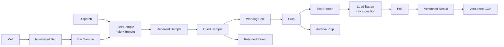

# 03 — Traceability, identity, and audit

## Material graph

## Derivation edge contract

Every transformation is a `Derivation` edge rather than an update to the parent. Required fields: `parent_id(s)`, `child_id(s)`, operation type, material/method configuration version, mass in, mass out, unit, loss/reject reason, operator, timestamp, equipment/instrument, location/position, source record ID/version, and status.

The model permits multiple parents for composites and bulk metallurgical samples. It therefore supports both splits and merges and makes material balance calculable.

## Identity model

- Identifier schemes are tenant configuration with prefix, site code, year, sequence, and check digit.
- Field and lab IDs are linked, never substituted; provisional receipt has its own temporary identity and a later reconciliation link.
- Before fusion, bags/packets can use durable barcode labels. During fusion through prill, `tray_id + position_number` is the identity because crucible labels do not survive the furnace.
- Recommended labels: resin thermal-transfer on synthetic stock; Code 128 for bags/pulp and QR for dispatch manifests.

## Append-only audit and signatures

An audit event records actor, role, timestamp/time zone, action, entity/version, before/after values, terminal, reason where required, and previous-event hash. Hash chaining makes tampering detectable.

Approval is an electronic signature: re-authenticate the user, capture signature meaning, bind it to exact record/result/configuration versions, and retain it after later corrections. Corrections and re-assays produce successors (`supersedes`), never in-place edits.

## Integrity rule

The system can always answer: **which physical material, controls, equipment, raw measurements, configuration, people, and approvals produced this reported value?** If an upstream record is incomplete, voided, held, or unapproved, it must block the reportable path.
