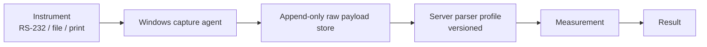

# 05 — Instrument, field, and integration flows

## Instrument capture

The capture agent sends raw bytes, source, instrument ID, and capture timestamp. It does not parse or interpret values. The server applies a versioned parser profile, stores the result as a measurement, and preserves the raw payload forever so a corrected profile can regenerate measurements.

Supported capture modes: serial/USB-serial listener for balances; watched folders for AAS/LECO CSV, TXT, or XML; print-stream capture; and manual double-key entry as universal fallback.

### Reading-to-sample binding

- **Worklist-driven:** operator scans/selects subject, confirms expected subject, then commits live reading.
- **Sequence-driven:** system advances through configured positions, with a confirmation before every commit.

Nothing binds simply because a reading arrived. The operator must see expected subject and live value together, then confirm.

## Field connectivity and receipt reconciliation

The dispatch—not the individual sample—is the sync unit. Primary path: mobile field app with local database syncs over lab LAN when it arrives. Fallback: printed QR manifest. Final fallback: receipt creates provisional samples; arrival of the later dispatch triggers a discrepancy report.

| Reconciliation outcome | System action |
| --- | --- |
| Matched physical and dispatch sample | Link receipt to FieldSample and complete intake. |
| Dispatch missing physical sample | Flag missing; do not invent receipt. |
| Unexpected physical sample | Keep provisional/received record and investigate. |
| Identifier/interval mismatch | Put receipt on hold with evidence and resolution trail. |

## Integration boundary and migration

acQuire owns ground/hole/source sample data; this LIMS owns laboratory execution. Expected samples/dispatches may enter from acQuire, while current approved results leave through a confirmed import layout. Product/version and workflow configuration are discovery items; V1 supplies file export while formal two-way exchange is a V2 spike.

Historical Excel/CSV migration uses reusable column mapping, validation, dry-run, and reconciliation reporting. Imported records are marked `legacy`, retain source-file provenance, are read-only, and are never presented as instrument-captured records.
