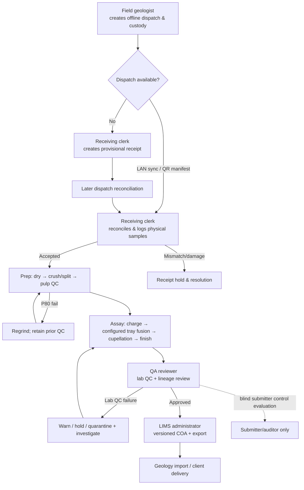

# 08 — Activity flow and ownership

## Ownership matrix

| Activity | Performs | Reviews/approves | System safeguard |
| --- | --- | --- | --- |
| Dispatch/control visibility | Field geologist | Submitter policy owner | Lab cannot change blind/retained status. |
| Receipt/reconciliation | Receiving clerk | Supervisor for holds | Samples can proceed provisionally; reconciliation remains auditable. |
| Material transformation | Prep/assay technician | QA when flagged | Parent/child graph, masses, locations, configuration versions. |
| Instrument capture | Agent + technician confirmation | Technical reviewer | Immutable raw payload, expected-subject confirmation. |
| QC | System evaluates; QA reviews lab stream | Senior chemist / manager | Position-aware template; versioned rules and lot certificates. |
| Result approval | QA reviewer | QA reviewer | Producer ≠ approver; electronic signature. |
| Report issue | LIMS administrator | Release authority where defined | Only current approved result versions are selectable. |

## Whole-flow data rule

Operational forms are the authoritative source for event metadata. The lineage graph derives operator, timestamp, equipment, mass, position, location, and status from each form/event automatically; no user rekeys those properties into a separate traceability screen.
