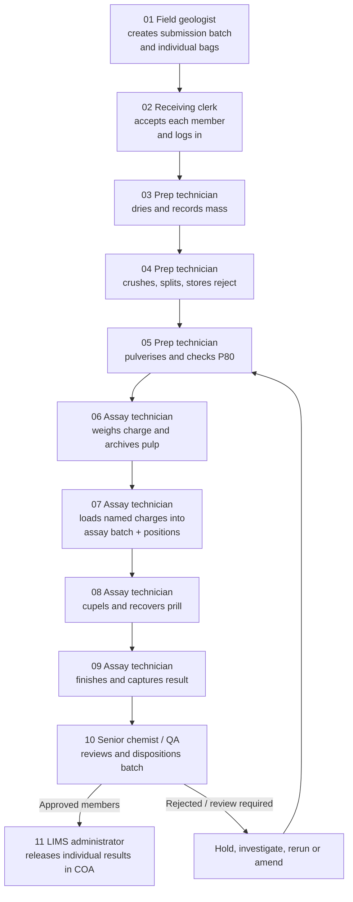

# End-to-end activity flow

## Happy path

## User activities by phase

| Phase | User action | LIMS behaviour | Evidence created |
| --- | --- | --- | --- |
| Collection | Establishes the physical sample identity and custody transfer. | Creates the field sample and custody event. | Signed submission / COC. |
| Intake and preparation | Verifies identity, measures material, transforms it into sub-samples. | Generates lab IDs/barcodes and parent-child material links. | Intake, drying, crush/split, and grind-QC records. |
| Assay | Consumes a measured aliquot, batches it with controls, and turns it into an analyte measurement. | Locks batch composition, instruments, runs, and calculation inputs. | Charge, furnace, cupellation, and finish records. |
| Quality review | Tests validity of controls and process flags, then records a disposition. | Holds results from reporting until approval. | QA checklist, control-chart references, investigation links. |
| Release | Publishes only approved results against original hole and interval. | Versions and timestamps the released COA. | Immutable COA and release event. |

## Batch-member behaviour through the flow

| Group created | How members are handled | How the group is closed |
| --- | --- | --- |
| Submission batch | Each bag is a separately scannable manifest line. Receiving records accepted, held or rejected status per line. | Every line is accepted, held, rejected or transferred; no unaccounted member is permitted. |
| Prep run | Each sample has an equipment position, source material and output/exception record. | Each member is complete, held or transferred to a later run. |
| Assay batch | Each charge or control has a unique tray/crucible position that flows to button, prill and result. | QA disposition names the affected members; controls and samples are evaluated separately. |
| COA release set | Each selected approved result remains a distinct COA line with interval and result version. | Release is immutable; a correction creates a new version/set. |

## Required exception handling

| Trigger | Immediate state | Owner | Required resolution |
| --- | --- | --- | --- |
| Bag/tag differs from submission | Intake hold | Receiving clerk | Photograph/describe discrepancy; field owner confirms identity or sample is rejected. |
| Wet mass, dry mass, or split yield is implausible | Preparation hold | Prep technician | Check scale, records and material loss; senior review before continuation. |
| P80 outside specification | Regrind required | Prep technician | Re-pulverise and record a new sieve test linked to the same pulp. |
| Charge outside tolerance | Assay hold | Assay technician | Void/re-weigh before fusion; retain void reason. |
| Standard, blank, or duplicate fails | QA hold | Senior chemist / QA | Investigate, rerun affected work as needed, and document final disposition. |
| Result amended after approval | Controlled amendment | QA + LIMS administrator | Supersede, never overwrite, the prior result/COA; record reason and approver. |

## Minimum audit trail for every activity

Each saved record must retain: record ID and version, actor identity, action timestamp with time zone, instrument or equipment ID where applicable, source material IDs, resulting material IDs, status/disposition, and electronic signature or approval when required.
