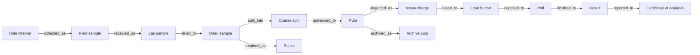

# Lineage graph model

## Nodes

| Node type | Examples | Stable identifier |
| --- | --- | --- |
| Field interval | Hole ID + from/to depth | `interval_id` |
| Physical sample | Field bag, lab sample, dried sample, coarse split, reject, pulp, charge, lead button, prill, archive pulp | `sample_id` / `material_id` |
| Process event | Drying cycle, crusher run, sieve test, furnace batch, instrument read | `event_id` |
| Control material | Certified reference material, blank, duplicate | `control_id` |
| Result | Gravimetric/ICP/AAS result and calculated grade | `result_id` |
| Report | COA and later amendment | `report_id`, `version` |

## Relationships

## Edge properties: derived directly from source records

Every material-transforming edge stores the following, populated from the named form/log rather than re-entered:

| Property | Meaning | Source record |
| --- | --- | --- |
| `operator_id` | Person who performed or attested the activity | Stage form/log |
| `performed_at` | Date/time of the activity | Stage form/log |
| `instrument_id` | Oven, crusher, mill, balance, furnace, microbalance, ICP/AAS as applicable | Stage form/log |
| `record_id` / `record_version` | Immutable evidence pointer | Stage form/log |
| `quantity` / `unit` | Measured mass, count, or volume where applicable | Stage form/log |
| `location` | Shelf, tray, oven, furnace, or archive position | Stage form/log |
| `status` | Completed, voided, hold, approved, rejected | Stage form/log |

## Data integrity rules

- Preserve parent IDs when creating child materials; never replace the original sample identity.
- Do not permit result release unless every upstream edge is complete and the QA batch is approved.
- Void records are retained with a reason and are excluded from active calculations.
- A correction creates a new version and a `supersedes` relation; the original stays readable.
- Controls link to the exact furnace batch and analytical sequence they validate.
