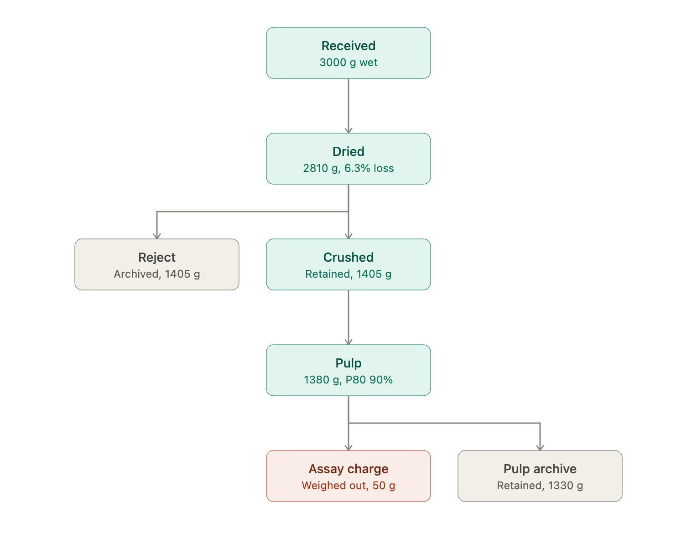
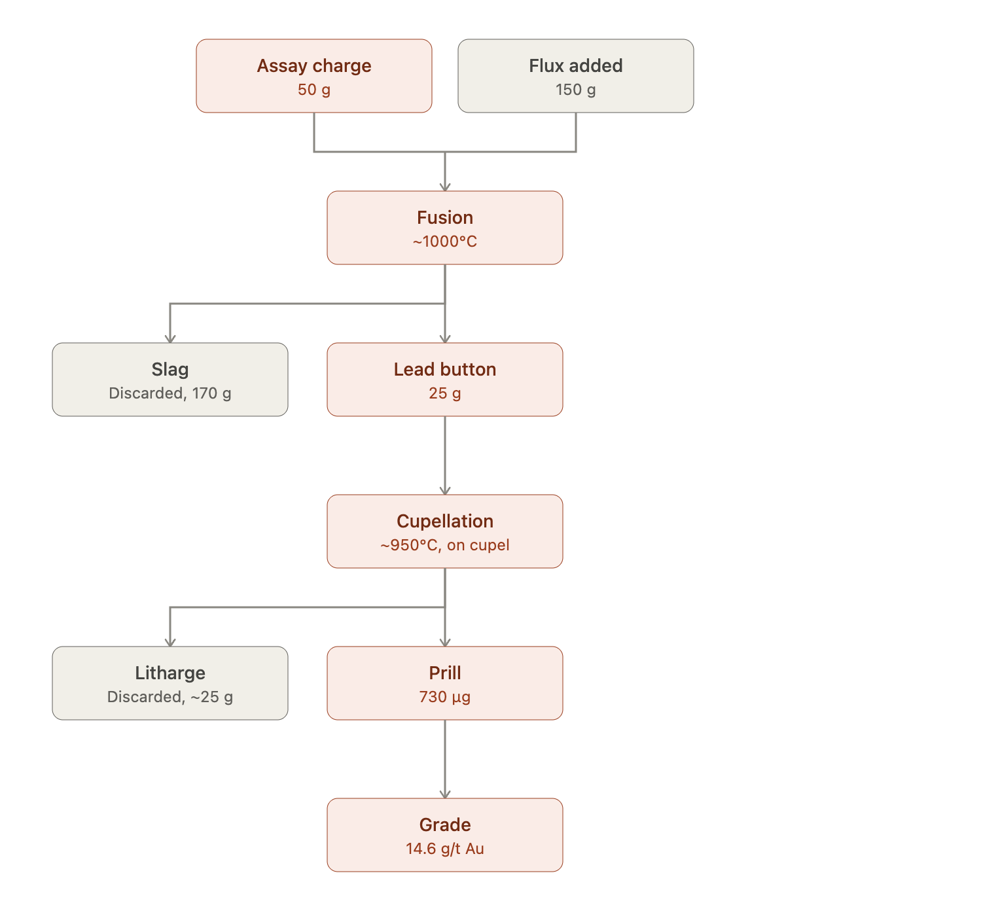

# The prep-to-grade pipeline

Each stage below is a real physical transformation with its own mass loss, and each one is exactly the kind of thing that has to become an **edge**, not a column, if you want to answer "where did this number come from?" six months later.

## Sample preparation

**Field sample** — Drill core or chip sample cut/collected in the field, tagged with `hole_id` and a `from–to` depth interval. This is the graph's root node — no incoming transformation, only provenance metadata (hole, interval, sampler, date).

**Received** — Logged in at the lab, gross (wet) mass recorded, custody transferred from field to lab. The edge here isn't chemically interesting, but it's the point where legal chain-of-custody starts, so it still needs operator and timestamp.

**Dried** — Oven-dried to drive off moisture before crushing (wet material won't crush or split reproducibly). `mass_in` = gross mass, `mass_out` = dry mass, and `moisture_pct` is derived, not stored redundantly — it's a property of the edge, computed from the two masses it already carries.

**Crushed & split** — Dried sample is crushed (jaw crusher) to reduce particle size, then split (riffle or rotary splitter) into a working portion and a **reject**. Critically, the reject is *kept*, not discarded — it's a second output node of the same edge. This is where a flat "parent_id" table breaks: one input mass produces two surviving children, both traceable, both potentially re-sampled later.

**Pulverised** — The working split is ground to powder in a ring mill. A P80 check (percentage passing a target mesh, e.g. 85% < 75 µm) confirms the grind is fine enough for representative sub-sampling — store the P80 value on the edge, it's a QC gate, not a sample property.

**Pulp** — The homogeneous fine powder. This is the archived, re-samplable material — the node other future edges (reruns, umpire checks, additional elements) will hang off of.

**Assay charge** — A small charge (commonly 30–50 g) weighed out of the pulp for fire assay. The pulp is *not* consumed — this is a split where one output (the charge) is tiny and goes forward, the other (remaining pulp) is retained and dominant in mass. Modeling this as anything other than a split loses the fact that the pulp still exists and can be re-charged.

## Fire assay

**Test portion / tray position** — The weighed charge goes into a numbered crucible at a known position in a furnace batch. Tray position matters because standards, blanks, and duplicates are inserted at known positions for QC — the position is really an attribute of the *batch context* of the transformation, not of the sample itself.

**Fusion** — Charge + flux (litharge, soda ash, borax, silica, reducing agent) is fused at ~1000 °C. `mass_in` = charge + flux additions, `mass_out` splits into a lead button (collects Au/Ag/PGEs) and slag (discarded, but logged for mass balance). This is a fusion (merge) followed immediately by a split — flux joins the graph as a second parent, then the melt separates into two children.

**Lead button** — Separated from slag, cleaned, hammered into a cube — carries essentially all the precious metal from the charge.

**Cupellation** — The button is heated on a bone-ash cupel; lead oxidizes and is absorbed into the cupel, leaving a tiny doré bead — the **prill**. `mass_in` = lead button, `mass_out` = prill (milligrams) + litharge absorbed (discarded). This step has the most dramatic mass loss ratio in the whole chain and is exactly why mass balance checking matters most here — a badly-run cupellation loses prill into the cupel, and only an edge with real mass_in/mass_out lets you catch that.

**Prill weight** — Weighed on a microbalance, in micrograms. Effectively a measurement edge (`mass_in` = `mass_out`, high-precision reading).

**Finish** — Either gravimetric (parting with nitric acid to separate Au from Ag) or instrumental (dissolve, read on AAS/ICP). Grade in g/t is computed from prill mass and assay charge mass — this is a **computed edge**, not a physical transformation, but it belongs in the same graph so the final number carries its full lineage back to `hole_id` / `from–to`.

## The graph model

**Nodes** — one per physical state of matter: `FieldSample`, `Received`, `Dried`, `CrushedSplit`, `Reject`, `Pulp`, `AssayCharge`, `LeadButton`, `Prill`. Common properties: `sample_id`, `mass_g`, `timestamp`, `status` (active/archived/consumed).

**Edges** — one per transformation: `operation` (DRY, CRUSH_SPLIT, PULVERISE, WEIGH_OUT, FUSE, CUPEL, FINISH), `mass_in_g`, `mass_out_g` (can be a list, for splits/merges), `operator_id`, `instrument_id`, `qc_flag`.

**Splits**: one edge, multiple output nodes (crush reject, weigh-out remainder).
**Merges**: one edge, multiple input nodes (flux + charge at fusion; composite metallurgical samples combining several pulps).
**Mass balance check**: `sum(outputs) + logged_loss ≈ input`, flagged automatically if it drifts outside tolerance — this is the mechanical audit the flat table can't give you.

Here's a worked instance, end to end, plus a composite/merge case:Here's the full derivation chain as a graph — one path follows the sample's continuing mass (teal/coral), branches peel off to archived rejects and discards (gray):



That 50-gram charge now enters the fire assay, where the graph shows a merge (flux joining the charge) followed by two more splits (slag discarded, litharge absorbed) before the tiny prill is weighed:





## Reading the graph as data

Every arrow above is one edge record:

```
(Received)-[DRIED {mass_in:3000, mass_out:2810, operator:"J.Kofi", timestamp:...}]->(Dried)
(Dried)-[CRUSH_SPLIT {mass_in:2810, outputs:[{node:"Reject",mass:1405},{node:"Crushed",mass:1405}]}]->(Crushed),(Reject)
(Crushed)-[PULVERISE {mass_in:1405, mass_out:1380, p80_um:75, p80_pct:90}]->(Pulp)
(Pulp)-[WEIGH_OUT {mass_in:1380, outputs:[{node:"AssayCharge",mass:50},{node:"PulpArchive",mass:1330}]}]->(AssayCharge),(PulpArchive)
(AssayCharge),(Flux)-[FUSE {mass_in:200, outputs:[{node:"LeadButton",mass:25},{node:"Slag",mass:170}]}]->(LeadButton),(Slag)
(LeadButton)-[CUPEL {mass_in:25, outputs:[{node:"Prill",mass:0.00073},{node:"Litharge",mass:24.99927}]}]->(Prill),(Litharge)
(Prill)-[FINISH {method:"ICP-AES", charge_mass:50}]->(Grade{value:14.6, unit:"g/t Au"})
```

Two things fall out of this for free that a flat table can't give you:

**Mass balance as an automatic QC check.** At every node, `sum(outgoing edge outputs) + logged_loss ≈ incoming edge mass`. At `Fusion`, 200 g in should reconcile to 25 g button + 170 g slag + ~5 g volatilised — if a lab enters 25 g button + 170 g slag from a 210 g charge+flux, the graph flags a 15 g gap nobody explained. That check is structurally impossible on a table where "sample 4471" is one row with a single mass column.

**Full backward traceability from the number people actually care about.** Walk `Grade` back through `FINISH → Prill → Cupellation → LeadButton → Fusion → AssayCharge → WeighOut → Pulp → Pulverise → Crushed → CrushSplit → Dried → Dried → Received`, and you land on `hole_id` / `from–to` with every operator, instrument, and mass loss along the way intact — including the fact that a reject and an archived pulp still physically exist and can be re-queried.

For composites (the case D2 calls out explicitly — bulk metallurgical samples), the same model handles it without a schema change: a `MERGE` edge simply takes multiple `Pulp` nodes as inputs into one `Composite` node, carrying each parent's contributed mass. A parent-id column can express "child of," but it can't express "sum of," which is exactly what a composite is.
