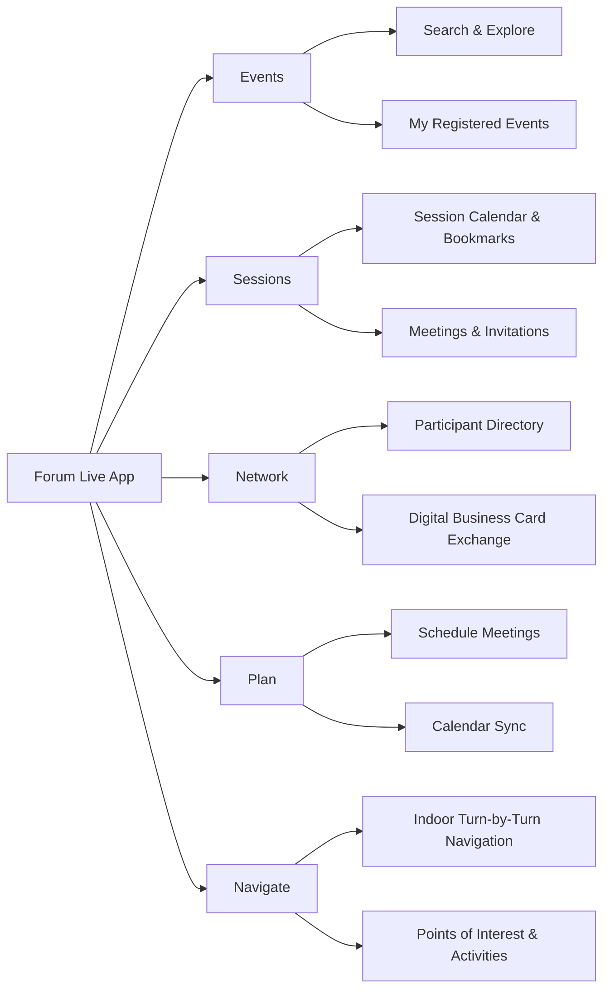

Based on the search results, the app with the ID `com.weforum.forumevents` is the **Forum Live** app, the official mobile application for World Economic Forum events 【turn1search2】【turn1search5】. Below is a detailed site map and feature breakdown for this app.

## 📍 App Site Map

The app is structured around five core modules designed to guide attendees through their event experience 【turn1search5】.

| **Primary Section** | **Sub-Features/Content** | **Purpose** |
| :--- | :--- | :--- |
| **🎉 Events** | • Search & Explore Events • My Registered Events | Discover and access forums, summits, and meetings. |
| **📅 Sessions** | • Session Calendar & Bookmarks • Meetings & Invitations | Plan your personal agenda and manage schedule commitments. |
| **👥 Network** | • Participant Directory • Digital Business Card Exchange | Connect with other attendees and exchange contact information. |
| **🗓️ Plan** | • Schedule Meetings • Calendar Sync | Coordinate logistics and integrate with personal calendars. |
| **🧭 Navigate** | • Indoor Turn-by-Turn Navigation • Points of Interest & Activities | Find your way around the venue and discover nearby activities. |

---

## ✨ Detailed App Features

### 1. Events
This module is the gateway to all World Economic Forum events.
*   **Search & Explore**: Easily search and explore events that match your interests 【turn1search5】.
*   **My Registered Events**: Your registered events are organized for quicker access, providing a personalized view 【turn1search5】.

### 2. Sessions
This module helps you manage your time and agenda during an event.
*   **Session Calendar & Bookmarks**: Bookmark sessions you want to attend in a dedicated calendar view 【turn1search5】.
*   **Centralized Schedule**: Your sessions, meetings, and invitations are neatly presented in one convenient place 【turn1search5】.

### 3. Network
This module is designed for professional connection and networking.
*   **Participant Directory**: Browse the list of participants, and filter by industry, expertise, country, and more to find relevant connections 【turn1search5】.
*   **Digital Business Card Exchange**:
    *   Exchange digital business cards by simply scanning an event badge 【turn1search5】.
    *   Save the business card details directly to your device's contacts 【turn1search5】.

### 4. Plan
This module focuses on logistical coordination and planning.
*   **Schedule Meetings**: Set up a meeting with other participants directly within the app 【turn1search5】.
*   **Calendar Sync**: Sync your personal calendar with the app so you can see all your commitments in one place 【turn1search5】.

### 5. Navigate
This module assists with on-site orientation and discovery.
*   **Indoor Navigation**: Easily navigate the event venue using turn-by-turn indoor navigation 【turn1search5】.
*   **Explore Nearby**: Find points of interest and explore activities near you 【turn1search5】.

📊 **App Ratings & Version History**

The app has received positive feedback, with an overall rating of **4.8 out of 5** based on 115 ratings on the Apple App Store 【turn1search5】. Recent version updates have focused on bug fixes and improvements, indicating active maintenance. For example, version 2.1.6 was released just 5 days ago, and version 2.1.5 was released on May 6, 2026 【turn1search5】.

🔒 **App Privacy Practices**

The developer, the World Economic Forum, indicates that the app's privacy practices may include handling of data not linked to your identity for analytics and app functionality purposes 【turn1search5】. This includes:
*   **Analytics Data**: Identifiers (like User ID) and Usage Data (Product Interaction) 【turn1search5】.
*   **App Functionality Data**: Identifiers (Device ID) and Diagnostics (Crash Data) 【turn1search5】.
For more details, users are directed to the developer's privacy policy 【turn1search5】.

> 💡 **Note**: The initial Google Play Store link (`com.weforum.forumevents`) returned a "not found" error in the search results 【turn0fetch0】. The detailed features above are primarily sourced from the app's listing on the Apple App Store under the bundle ID `com.weforum.forum-events` 【turn1search5】, which is the confirmed official app for World Economic Forum events 【turn1search2】. The feature set for the Android version would be expected to be very similar or identical.