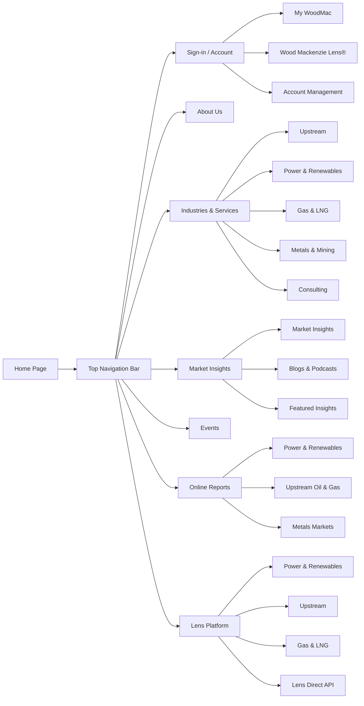

Based on the provided webpage content from Wood Mackenzie, here is an analysis of the main software UI menus and typical page flows for a user navigating their platform.

### 🗺️ Main Navigation Menu Structure
The site uses a multi-level mega-menu navigation system. The primary menu items and their key sub-sections are summarized below:

### 📱 Detailed Page Flows & UI Components
The website is structured to guide users from high-level exploration to specific data access or insights.

#### 1. **Primary User Flows**
*   **Accessing Research & Data:** The primary flow for customers is to log in to one of the specialized platforms (e.g., Wood Mackenzie Lens®) from the top-right menu 【turn0fetch0】. These platforms are the core "software" products where detailed analytics and reports are accessed.
*   **Exploring Insights & Content:** A non-logged-in user would typically browse under **"Market Insights"** for blogs, podcasts, and newsletters, or **"Online Reports"** to browse and purchase specific research 【turn0fetch0】.
*   **Learning About Services:** The **"Industries & Services"** menu serves as the main catalog for their offerings, ranging from sector-specific data (Upstream, Metals) to consulting services 【turn0fetch0】.

#### 2. **Key UI Elements & Menus**
*   **Persistent Top Navigation:** Contains the main mega-menu, search functionality, and the "Sign in" button for customers 【turn0fetch0】.
*   **Footer Navigation:** Provides secondary links organized under headings like **"DISCOVER"** (Products), **"RESOURCES"** (News & Support), and **"ABOUT WOODMAC"** (Company info) 【turn0fetch0】.
*   **Contextual Calls-to-Action (CTAs):** Throughout the page, CTAs like "Discover Products," "Explore Consulting," and "Log-in to access Lens" guide users toward key conversion points 【turn0fetch0】.
*   **Cookie Consent Banner:** A critical UI overlay that manages user privacy preferences, featuring "Accept All Cookies," "Reject All," and "Manage Cookies" options, as detailed in the **"Privacy Preference Center"** 【turn0fetch0】.

#### 3. **"Lens Platform" Specific Flow**
This appears to be their flagship analytics software suite. The flow is:
1.  **Log-in:** Click "Log-in to access Lens" from the homepage or platform menu 【turn0fetch0】.
2.  **Select Module:** Choose a specific module like "Power & Renewables," "Upstream," or "Metals & Mining" 【turn0fetch0】.
3.  **Access Features:** Each module provides integrated data, insights, and analytics specific to that sector. The "Lens Direct - API" option suggests a flow for technical integration 【turn0fetch0】.

📖 Deep Dive: Detailed Sub-Menu Structure

The main menu sections contain extensive sub-menus. Here is a breakdown of the key ones:

*   **About Us:**
    *   Our Story, Our People, Our Values, Our Customers, Our Locations 【turn0fetch0】.
*   **Industries & Services:**
    *   Upstream, Emissions & Carbon Management, Energy Transition Scenarios & Technologies, Power & Renewables, Gas & LNG, Metals & Mining, Oils & Chemicals, Commodity Trading Analytics, Supply Chain Analytics, Consulting 【turn0fetch0】.
*   **Market Insights:**
    *   **Content Types:** Market Insights, Horizons, Blogs, Podcasts, The Inside Track, Book - Connected 【turn0fetch0】.
    *   **Featured Topics:** Energy Transition, Middle East conflict, CCUS, Electric vehicles, US trade policies and tariffs, Venezuela 【turn0fetch0】.
*   **Online Reports:**
    *   Categories: Power and renewables, Upstream oil and gas, Macroeconomics, Oil and gas markets, LNG, Metals markets, Chemicals, Wallmaps 【turn0fetch0】.
*   **Lens Platform:**
    *   **Modules:** Power & Renewables, Hydrogen, Upstream, Subsurface, Gas & LNG, Metals & Mining, Carbon, Emissions, Energy Transition, Lens Direct - API 【turn0fetch0】.

### 💡 Conclusion
The Wood Mackenzie website is structured as a comprehensive portal for energy and natural resource intelligence. Its UI flows from broad discovery (**About Us, Market Insights**) to specific service exploration (**Industries & Services**) and finally to secure access for specialized data and analytics (**Lens Platform**). The navigation is deep, multi-layered, and designed to serve both casual industry readers and logged-in enterprise customers accessing their core software products.