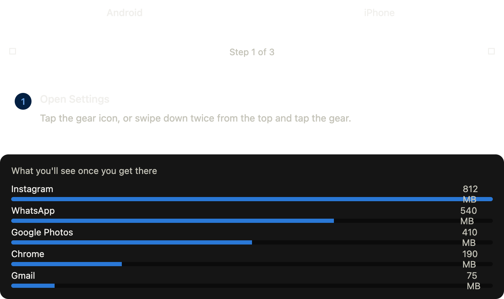
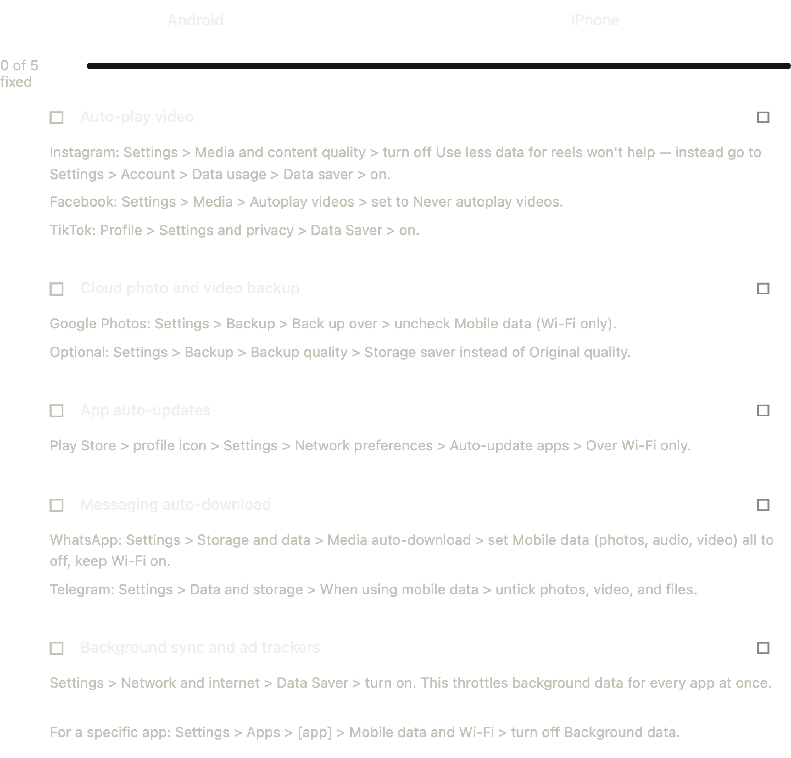

This is solid segment territory — "data disappearing without explanation" is one of the most common and least understood complaints mobile users have, and there's real technical substance behind it. Let me give you the background, then build something you can actually use on-air or hand to your production team.

## The technical reality: where the data actually goes

**1. Background App Refresh / Sync**
Apps don't need to be open to use data. iOS and Android both run background processes that:
- Poll servers for new content (Instagram checking for new posts, Gmail checking for new mail)
- Sync photos/videos to cloud backups (Google Photos, iCloud) — this is often the single biggest hidden drain, especially after someone takes video
- Refresh location data for weather, maps, and "nearby" features

**2. Push Notification Infrastructure**
Every notification-enabled app maintains a persistent low-level connection (via Apple's APNs or Google's FCM). This is small per-ping but adds up across 40+ apps checking in constantly.

**3. Auto-Play Video (the biggest single offender)**
Facebook, Instagram, TikTok, X/Twitter, and news sites are engineered to auto-play video the moment it scrolls into view — sound off, but full data pulled. A user can "just scroll" for 20 minutes and unknowingly stream the data-equivalent of several YouTube videos.

**4. Ad SDKs and Trackers**
Free apps embed ad networks (Meta Audience Network, AdMob, etc.) that load rich media ads, run analytics pings, and fetch tracking pixels — independent of whether the user interacts with the ad at all.

**5. OS and App Auto-Updates**
Play Store and App Store default to auto-updating apps over any available connection unless explicitly restricted to Wi-Fi. A single OS update can be 1–3GB.

**6. Pre-caching / Predictive Loading**
Some apps (YouTube, news apps, even browsers) pre-load content they predict you'll want next — a "smoother experience" that costs data you never asked to spend.

## Answering your five questions with the technical grounding

- **Morning-to-lunchtime disappearance** — almost always background sync + auto-play + an auto-update that landed overnight or over a cellular fallback when Wi-Fi dropped.
- **Deliberate design vs. neglect** — it's genuinely both: engagement-optimized auto-play is deliberate (more watch time = more ad revenue for the platform); default-on auto-updates and sync are more "convenience-first" design that externalizes cost onto the user's bundle.
- **Worst offenders** — ranked roughly: video-heavy social apps (auto-play) > cloud photo/video backup > messaging apps with auto-media-download (WhatsApp is notorious) > system/app updates > everything else.
- **Regulatory transparency** — several regulators (including in the EU and parts of Africa) have pushed telecoms toward per-app data breakdowns; the underlying tech (OS-level data usage tracking) already exists on every phone, so the ask is really about *visibility at point of sale/top-up*, not new infrastructure.

Now — for the live, interactive part, here's a toolkit built for exactly this segment: a diagnostic your viewers can follow along with in real time, an offender ranking they can react to, and the actual settings paths for both Android and iPhone so you can walk through the "3 switches" on air without guessing menu locations.Tap between the two tabs — the ranking gives you the actual on-screen breakdown to talk through, and the switches tab has real menu paths for Android and iPhone side by side so you (or a producer) can walk it live without fumbling through settings on air.

A few production notes to round out the segment:

- **For audience interactivity**: consider a quick poll ("Did your data disappear before noon today — yes/no") right before you reveal the offender ranking. It primes the "aha" moment when auto-play video comes out on top.
- **On the regulation question**, frame it as a real, live debate rather than settled fact — telecoms could expose this data (the OS already tracks it per-app), but there are counterarguments about compliance burden and whether it's really the telecom's job versus the app maker's. Good spot to throw to a caller or guest.
- **One live demo moment that plays well on camera**: pull up Settings > Mobile Data (or Cellular) on a phone in-studio and scroll the actual per-app data list — most viewers have never looked at this screen, and seeing "Facebook: 1.2GB this week" next to their own name is the visceral hook the whole segment is selling.

/////////////////////////////////

# "The Data Tax" — On-Air Notes

**Goal:** Explain in plain language why data disappears, name names, and give viewers 3 things they can do the moment the segment ends.

---

## Opening hook (30 seconds)

> "You buy a data bundle at 8am. By 1pm it's gone. You haven't watched a single video. So where did it go? Your phone has been spending your money while you weren't looking — and today I'm going to show you exactly how, and how to stop it."

Optional: ask the host or a caller live — "Show of hands, has this happened to you this week?" — before revealing anything. Gets buy-in before the technical part.

---

## The plain-language explanation (keep this simple on air)

Think of your phone as having two kinds of data use:

1. **Data you can see** — opening apps, watching videos, browsing.
2. **Data you can't see** — the phone doing things *for* you in the background, without asking each time.

Almost all the "disappearing" data is #2. Five things are responsible for nearly all of it:

| Offender | Roughly how much | Why it happens |
|---|---|---|
| Auto-play video in feeds | ~35% | Instagram, TikTok, Facebook, X are built to play video the second it scrolls into view — sound off, data on. |
| Cloud photo/video backup | ~25% | Google Photos / iCloud upload every new video the moment you take it, full quality, no prompt. |
| App auto-updates | ~15% | Play Store / App Store update apps in the background unless told to only do it on Wi-Fi. |
| Messaging auto-download | ~12% | WhatsApp/Telegram download every photo, voice note, video sent to you — even in group chats you don't check. |
| Background sync & ad trackers | ~13% | Mail, weather, and ad networks "check in" constantly, even when the app is closed. |

**Line you can use on air:** *"Nobody is stealing your data. Your phone is just doing what it's designed to do — stay 'fresh' and 'connected' at all times. The problem is nobody asked you if you wanted that trade-off."*

---

## Answering the five questions

**1. "Has this happened to you?"**
Yes — frame it as universal, not a personal failing. This isn't about people misusing their phones; it's about defaults nobody chose.

**2. Deliberate design or consumer neglect?**
Be even-handed here — it's genuinely both, and it's a good "debate" beat for the show:
- *Deliberate*: auto-play video is explicitly designed to maximize watch time, because more watch time = more ad revenue for the platform. That's a business incentive, not an accident.
- *Not malicious, but negligent-by-default*: things like auto-backup and auto-update aren't trying to profit off your data — they're just designed for convenience-first, cost-later, and nobody bothered to make the cost visible to the user.

**3. Worst offenders**
Rank them live using the numbers above. Say plainly: *"If you only fix one thing today, turn off auto-play video in your social apps. That alone is the biggest single lever."*

**4. The 3 settings to switch off live**
Pick ONE platform to demo on air (whichever phone you have in studio) but mention both exist. Say the menu path slowly and clearly — viewers are following along on their own phones in real time.

**Android:**
1. Settings → Apps → [pick a social app] → Mobile data & Wi-Fi → turn off **Background data**.
2. Play Store → Settings → Network preferences → Auto-update apps → **Over Wi-Fi only**.
3. WhatsApp → Settings → Storage and data → Media auto-download → set all three (photos, audio, video) to **Wi-Fi only**.

**iPhone:**
1. Settings → General → **Background App Refresh** → turn off entirely, or per app for social/news.
2. Settings → Cellular → scroll down, turn off cellular data for social, video, and cloud-backup apps.
3. Settings → Cellular → **Wi-Fi Assist** → turn off. Also Settings → Safari → turn off **Auto-Play** for videos.

**On-air tip:** hold up a phone and actually tap through step 1 live — even 10 seconds of "look, I'm just tapping here" makes it feel achievable rather than technical.

**5. Should regulators require transparency?**
Present both sides, don't take a hard personal stance on air:
- *For*: the data already exists — every phone already tracks usage per app in Settings. The ask isn't new technology, it's making that breakdown visible *before* someone buys a bundle, e.g., at point of sale or top-up.
- *Against/complication*: telecoms only see total data used, not which app used it — that breakdown lives on the *device*, not the network. So this is really a question for phone makers and app stores, not telecom operators, which complicates who regulators would even target.
- Good line: *"The real question isn't whether regulators should act — it's who they'd actually be regulating: the telco selling you the bundle, or the app that's spending it."*

---

## Extra practical tips to have in your back pocket (for follow-up questions or a caller)

- **Check what's actually eating your data**: Settings → Network & internet → Data usage (Android) or Settings → Cellular → scroll down (iPhone) shows a per-app breakdown going back a full billing cycle. This is the single most useful screen most people have never opened.
- **Turn off auto-play at the app level, not just the OS level**: Instagram, Facebook, and X each have their own "auto-play videos" setting inside the app itself (usually under Settings → Media/Data usage). Turning it off there is often more effective than relying on OS-level restrictions.
- **Downgrade backup quality**: Google Photos and iCloud both let you choose "space saving" / lower-resolution backup instead of full quality — cuts backup data significantly with barely visible quality loss.
- **Low Data Mode exists on both platforms**: iPhone has a system-wide "Low Data Mode" toggle (Settings → Cellular → [carrier] → Low Data Mode) and Android has "Data Saver" (Settings → Network & internet → Data Saver) — both throttle background activity across every app at once, one switch instead of twenty.
- **Wi-Fi doesn't always mean "safe"**: some phones are set to keep using cellular data even near Wi-Fi if the Wi-Fi signal is weak (this is what iPhone's "Wi-Fi Assist" does) — worth mentioning as a sneaky one viewers won't expect.

---

## Closing line options

> "Your data isn't disappearing by accident — it's being spent on your behalf, by default settings you never chose. The good news: every fix I showed you today takes under a minute."

or, if you want a call-to-action close:

> "Tonight, before you go to bed, do the one thing: check your data usage screen. I promise you'll be surprised by what's at the top."

/////////////////////////////////

Toggle to your platform and step through it — three taps and you're at the exact screen that names the culprit.

Once you're there, a couple of things worth knowing so you can read it correctly on air:

- **Foreground vs. background** matters more than the total — an app with high background use but low foreground use is the one silently syncing or auto-downloading, even when you never opened it.
- **The billing cycle reset date** affects what you're seeing — Android lets you set the cycle date to match your actual data purchase, iPhone just shows "since last reset," so if numbers look low, check when it last reset (Settings > Cellular > Reset Statistics on iPhone).
- **Tapping into any single app** on both platforms breaks down its usage further and, on Android, lets you jump straight to that app's background-data toggle — so the "find it" screen and the "fix it" screen are one tap apart.

////////////////////////////////

Pick your platform and tap each row to check it off as you go — every fix is inside that specific app's own settings, not just the OS level, since that's usually where the auto-play and auto-download toggles actually live.

Two things worth knowing before you go through the list:

- **Order matters if you're short on time**: do auto-play video and cloud backup first — together they're roughly 60% of the hidden usage, so those two alone will fix most of the "vanishing by lunchtime" problem.
- **The two OS-level catch-alls** — Data Saver on Android and Low Data Mode on iPhone — are worth turning on regardless of whether you do the per-app fixes, since they throttle background activity across everything at once as a safety net.

////////////////////////////////

Here is your comprehensive, unified note. I’ve consolidated the overlapping sections, organized the flow from technical prep to on-air execution, and integrated the scattered production tips into a single, cohesive document.

---

# "The Data Tax" — Comprehensive On-Air & Production Notes

**Goal:** Explain in plain language why mobile data disappears, name names, and give viewers 3 things they can do the moment the segment ends.

---

## PART 1: HOST PREP — The Technical Reality
*This is background context for you. Almost all "disappearing" data is invisible to the user. Here is where it actually goes:*

1. **Auto-Play Video (The Biggest Offender):** Facebook, Instagram, TikTok, X/Twitter are engineered to play video the second it scrolls into view. A user can "just scroll" for 20 minutes and unknowingly stream the data-equivalent of several YouTube videos.
2. **Cloud Photo/Video Backup:** Google Photos/iCloud upload every new video the moment it's taken, full quality, no prompt. Often the single biggest hidden drain after a weekend of taking videos.
3. **Background App Refresh / Sync:** Apps don't need to be open to use data. They poll servers for new content, sync locations for weather/maps, and refresh feeds.
4. **Messaging Auto-Download:** WhatsApp and Telegram download every photo, voice note, and video sent to you—even in group chats you never open.
5. **OS and App Auto-Updates:** Play Store/App Store default to updating apps over any available connection. A single OS update can be 1–3GB.
6. **Ad SDKs, Trackers & Pre-caching:** Free apps run analytics pings and fetch tracking pixels. Some apps (YouTube, browsers) pre-load content they predict you'll want next. 
7. **Push Notification Infrastructure:** Every notification-enabled app maintains a persistent low-level connection. Small per-ping, but adds up across 40+ apps.

---

## PART 2: ON-AIR FLOW & SCRIPT

### 1. Opening Hook (30 seconds)
> "You buy a data bundle at 8am. By 1pm it's gone. You haven't watched a single video. So where did it go? Your phone has been spending your money while you weren't looking — and today I'm going to show you exactly how, and how to stop it."

**Production Note:** Right before revealing the offender ranking, run a quick live poll: *"Show of hands / poll: Did your data disappear before noon today — yes/no?"* This primes the "aha" moment when auto-play video comes out on top.

### 2. The Plain-Language Explanation
Think of your phone as having two kinds of data use: **Data you can see** (opening apps, watching videos) and **Data you can't see** (the phone doing things *for* you in the background). Almost all the "disappearing" data is the second kind. 

| Offender | Roughly how much | Why it happens |
|---|---|---|
| Auto-play video in feeds | ~35% | Social apps are built to play video the second it scrolls into view — sound off, data on. |
| Cloud photo/video backup | ~25% | Google Photos / iCloud upload every new video the moment you take it, full quality. |
| App auto-updates | ~15% | Play Store / App Store update apps in the background unless told only to use Wi-Fi. |
| Messaging auto-download | ~12% | WhatsApp/Telegram download every media file sent to you — even in unopened group chats. |
| Background sync & ad trackers | ~13% | Mail, weather, and ad networks "check in" constantly, even when the app is closed. |

**Line you can use on air:** *"Nobody is stealing your data. Your phone is just doing what it's designed to do — stay 'fresh' and 'connected' at all times. The problem is nobody asked you if you wanted that trade-off."*

### 3. Answering the Five Key Questions

**Q1: "Has this happened to you? / Why morning-to-lunchtime?"**
Frame it as universal, not a personal failing. This isn't about misusing phones; it's about defaults nobody chose. Morning-to-lunchtime disappearance is almost always background sync + auto-play + an auto-update that landed overnight or over a cellular fallback when Wi-Fi dropped.

**Q2: Deliberate design or consumer neglect?**
Be even-handed — it's genuinely both, and it's a great "debate" beat for the show:
*   *Deliberate:* Auto-play video is explicitly designed to maximize watch time, because more watch time = more ad revenue. That's a business incentive, not an accident.
*   *Negligent-by-default:* Auto-backup and auto-update aren't trying to profit off your data — they're just designed "convenience-first, cost-later," and nobody bothered to make the cost visible.

**Q3: Worst offenders?**
Rank themC them live using the table above. Say plainly: *"If you- only fix one thing;C turn off auto<auto>-play video in your social apps. That alone is the biggest single lever."*

**Q4: Should regulators require transparency?**
Present both sides; don't take a hard personal stance on air:
*   *For:* The data already exists —(every phone tracks usage per app. The ask is making that breakdown visible *before* someone buys a bundle (at point"point of sale/top-up).
*   *Against/Complication:* Telecoms only see total data#total data used"used, not which app used it — that breakdown:breakdown livesD%lives on the>the *device*, not the network. This is really a question for phone9phone makers and app stores, not telecom operators0.1operators* 
*   **Good line:** *"The real question isn't whether regulators should act — it's who they'd"they %'d actuallyGAactually be regulating*regulating: the telco selling you the bundle, or the app that's spending it4.1it=*it."*

---

##;##+## PART 3: THE<3: THE LIVED:5L>5 THE LIVE INTERACTIVE TOOL>TOOLKITD0>0>0>0

### Step ;###:1:F;1F Step 1: The Diagnostic (Find the Culprit)
**Live Demo(9*(9*(9 Demo1Demo Demo Demo Demo/;G;G Demo moment%G%G%90A:0A:0A: Pull up1;1;1;1;1;1 up up up up up up up up up up up up up up up up up up up up up up up up up up up up up up up up up*9*9*9*9*9*9*9*9*9*9*9*9*9*9*9*9*9*9*9*9*9*9*9*9*9*9*9*9*9*9*9*9*9*9*9*. Most viewers have never looked at this screen, and seeing "Facebook: 1.2GB this week" is the visceral hook the' the' the' the' the' the' the' the' the' the' the6 the6 the6 the6 the6 the6 the6 the6 the6 the6 the6 the6 the6 the6 the6 the6 the6 the6 the6 the6 the6 the6 the6 the6 the6 the6 the6 the6 the6 the6 the6 the6 the6 the6 the6 the6 the6 the6 the6 the6 the6 the6 the6 the6 the6 the6 the6 the6 the6= the= the= the= the= the= the= the= the= the= the= the= the= the= the= the= the= the= the= the= the= the= the= the= the= the= the= the= the= the= the= the= the= the= the= the= the= the= the= the= the= the= the= the= the= the= the= the= the= the= the= the= the= the= the= the= the= the= the= the= the= the= the= the= the= the= the= the= the= the= the= the= the= the= the= the= the= the= the= the= the= the= the= the= the= the= the= the= the= the= the= the= the= the=D theD the segment is selling. Tell viewers to find it on their own phones right now:

*   **Android:** `Settings → Network & internet → Data usage`
*   **iPhone:** `Settings → Cellular → scroll down`

**How to read it on air:**
*   **Foreground vs. Background matters more than the total:** An app with high background use but low foreground use is the one silently syncing, even when you never opened it.
*   **Check the billing cycle reset date:** Android lets you set the cycle date to match your actual data purchase. iPhone just shows "since last reset"—tell iOS users if numbers look low, check when it last reset (`Settings → Cellular → Reset Statistics`).
*   **Tap into a single app:** On both platforms, tapping an app breaks down its usage further. On Android, it lets you jump straight to that app's background-data toggle—so the "find it" screen and the "fix it" screen are one tap apart.

### Step 2: The 3 Settings to Switch Off (The Fix)
*Pick ONE platform to demo on air (whichever phone you have in studio) but mention both exist. Say the menu path slowly and clearly — viewers are following along on their own phones in real time. Note: Order matters. Do auto-play video and cloud backup first — together they're roughly 60% of the hidden usage.*

**Android:**
1.  **Kill Background Data for Social Apps:** `Settings → Apps → [pick a social app] → Mobile data & Wi-Fi → turn off Background data`.
2.  **Limit App Updates:** `Play Store → Settings → Network preferences → Auto-update apps → Over Wi-Fi only`.
3.  **Stop WhatsApp Auto-Download:** `WhatsApp → Settings → Storage and data → Media auto-download → set all three (photos, audio, video) to Wi-Fi only`.

**iPhone:**
1.  **Kill Background App Refresh:** `Settings → General → Background App Refresh → turn off entirely, or per app for social/news`.
2.  **Cut Cellular to Heavy Apps:** `Settings → Cellular → scroll down, turn off cellular data for social, video, and cloud-backup apps`.
3.  **Kill Safari Auto-Play & Wi-Fi Assist:** `Settings → Safari → turn off Auto-Play for videos`. Then `Settings → Cellular → Wi-Fi Assist → turn off` (this stops the phone from using cellular data to "boost" weak Wi-Fi).

**On-air tip:** Hold up a phone and actually tap through Step 1 live — even 10 seconds of "look, I'm just tapping here" makes it feel achievable rather than technical.

### Step 3: The OS-Level Catch-Alls (The Safety Net)
If viewers only do one thing after the show, mention these. They throttle background activity across *everything* at once, one switch instead of twenty:
*   **iPhone:** `Settings → Cellular → [carrier] → Low Data Mode`
*   **Android:** `Settings → Network & internet → Data Saver`

---

## PART 4: BACK-POCKET TIPS (For Callers / Follow-ups)

*   **Turn off auto-play at the app level, not just the OS level:** Instagram, Facebook, and X each have their own "auto-play videos" setting inside the app itself (usually under `Settings → Media/Data usage`). Turning it off there is often more effective than relying on OS-level restrictions.
*   **Downgrade backup quality:** Google Photos and iCloud both let you choose "space saving" / lower-resolution backup instead of full quality — cuts backup data significantly with barely visible quality loss.
*   **Wi-Fi isn't always "safe":** Some phones are set to keep using cellular data even near Wi-Fi if the Wi-Fi signal is weak (iPhone's "Wi-Fi Assist" does this) — worth mentioning as a sneaky one viewers won't expect.

---

## PART 5: CLOSING LINE OPTIONS

**Option 1 (The Empowerment Close):**
> "Your data isn't disappearing by accident — it's being spent on your behalf, by default settings you never chose. The good news: every fix I showed you today takes under a minute."

**Option 2 (The Call-to-Action Close):**
> "Tonight, before you go to bed, do the one thing: check your data usage screen. I promise you'll be surprised by what's at the top."

