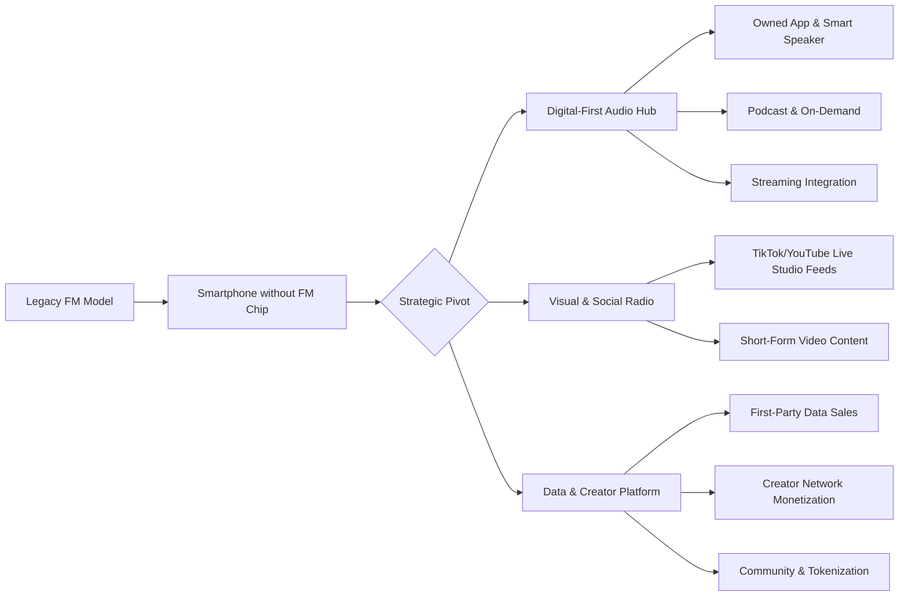

Based on your request for a comparable analysis of media companies across America, I have synthesized insights from the provided search results and industry knowledge. The American landscape is dominated by the **creator economy** and tech-driven media conglomerates, which operate on fundamentally different models than the African broadcast-centric stations previously discussed.

Here is a structured analysis of the American media landscape, its revenue models, and strategic recommendations.

### 🇺🇸 Comparable Media Companies Across America
Unlike the single-market focus of Pluzz FM and 3Music, American peers are often part of massive conglomerates or operate as digital-first entities with global reach.

| Entity Type | Examples | Primary Demographic | Key Difference from African Model |
| :--- | :--- | :--- | :--- |
| **Music TV Networks** | MTV (Paramount), REVOLT (Media) | Gen Z & Millennials | **Digital-First Pivot:** MTV is winding down linear channels to focus on digital and social content 【turn0search10】. REVOLT is built as a multi-platform network from the start. |
| **Radio Conglomerates** | iHeartMedia, Audacy (formerly CBS Radio) | Broad (targeted via formats) | **Scale & Data:** Own hundreds of stations, leveraging massive listener data for targeted digital advertising. iHeart is the largest podcast publisher globally. |
| **Digital-First Audio** | Spotify, Apple Music, SiriusXM | All ages, segmented | **Platform, Not Station:** They are global distribution platforms with algorithm-driven curation, not geo-bound broadcasters. |
| **Creator-Led Networks** | Night Inc., Studio71, Collab | Gen Z & Alpha | **Talent as Brand:** Built around individual creators, not the station's brand. The "station" is a network of influencers. |

### 💰 Revenue Models: How American Media Monetizes
The revenue streams are vastly more diversified and heavily reliant on data and digital platforms.

1.  **Advanced Digital Advertising:** Using listener/view data to sell hyper-targeted ads across digital audio (podcasts, streams), social, and display. This commands premium CPMs (Cost Per Mille) compared to traditional radio spots.
2.  **Podcast & On-Demand Audio:** A major revenue pillar. iHeartMedia and others sell ads against podcast content, and platforms like Spotify share subscription revenue with creators 【turn0search20】【turn0search24】.
3.  **Creator Economy Partnerships:** Brands pay for integrations not just on a show, but across a creator's entire social ecosystem (TikTok, Instagram, YouTube) 【turn0search0】. The "station" facilitates these deals.
4.  **Subscription & Premium Tiers:** Platforms like Spotify and Apple Music rely on subscription revenue. SiriusXM is a subscription-based satellite radio service.
5.  **Syndication & Licensing:** Licensing popular shows or segments to other platforms, international markets, or even traditional radio stations.
6.  **Live Events & Experiences:** While present, they are often larger-scale (e.g., iHeartRadio Music Festival) and integrated with digital broadcasts and social media amplification.

### 🚀 What American Companies Are Doing That African Stations Are Not
The gap is primarily in **data utilization, platform integration, and creator-centric business models.**

1.  **Data-Driven Monetization:** They don't just sell "airtime"; they sell **access to specific audience segments** based on rich, first-party data from apps, smart speakers, and online listening. This allows for programmatic ad buying and higher yields.
2.  **Owning the Platform Ecosystem:** iHeartMedia owns a radio network, a podcast network, and a significant digital ad tech stack. They capture value at multiple points, not just as a content distributor. African stations are largely tenants on others' platforms (FM, YouTube).
3.  **Creator as the Core Product:** In the American model, the **creator's brand** is often more valuable than the station's. Networks like Night Inc. exist to monetize the creator's audience through diverse channels (merch, tours, TV production, licensing), with the "station" acting as an incubator and amplifier. African stations still primarily monetize the **station's brand**.
4.  **Strategic Pivot from Linear to Digital:** MTV is a stark example—shutting down linear channels to invest in digital content where the audience lives 【turn0search10】. This is a proactive, controlled decline of legacy business to fund growth in new ones. The pivot is often more reactive in African markets.
5.  **Integration with Global Streaming Services:** There is deep, structural integration. Spotify has "Spotify Stations" and promotes radio-like features, while also being a key revenue source for podcasters. The line between "radio," "streaming," and "podcast" is intentionally blurred to capture all listening occasions.

### 💡 Recommended Revenue Streams for US & Global Media Companies
To stay ahead, companies should explore these emerging models highlighted in the creator economy research:

1.  **Web3 & Tokenized Communities:** Launch branded tokens or NFTs that grant holders voting rights on playlists, exclusive access to events, or a share of revenue. This builds a moat of super-fans and creates a new asset class 【turn0search0】.
2.  **Micro-Creator & Niche Network Incubation:** Instead of only chasing mega-influencers, build networks of **micro-creators** (10k-100k followers) who have high engagement 【turn0search0】. Aggregate their audiences for targeted brand campaigns, which are more authentic and cost-effective.
3.  **AI-Powered Personalization & Creation:** Use AI to generate personalized radio streams, create dynamic ad insertions, or even assist in content creation. This improves listener experience and operational efficiency 【turn0search0】.
4.  **Direct Fan Commerce & Tipping:** Integrate seamless in-app purchasing for merch, concert tickets, or direct "tips" to hosts/creators during live streams. This captures the direct-to-fan commerce trend 【turn0search0】.
5.  **B2B Content & Data Licensing:** License not just shows, but the **data and insights** from audience interactions to record labels, brands, and market researchers. This is a high-margin, invisible revenue stream.

### 📻 Navigating the "No FM on iPhone" Era: American Strategies
The decline of the FM chip is a symptom, not the cause. The real shift is the move from **scheduled, linear consumption to on-demand, algorithmic consumption.**

**1. Digital-First Audio Hub:** The station's app is the new dial. It must be a **lifestyle app** for the brand, featuring live streams, podcasts, on-demand shows, news, and community features. Integration with **CarPlay and Android Auto** is non-negotiable to capture the commute.

**2. Visual & Social Radio ("Radio with Pictures"):** The studio must become a **content studio**. Live-streaming on TikTok, YouTube, and Twitch is mandatory. The chat and interactions are the new request lines. This content is then repurposed for short-form video, podcast clips, and social posts.

**3. The Shift from "Station" to "Platform":** The endgame is not to be a better radio station, but to be the **central platform** that connects a community of creators and fans. The revenue comes from facilitating interactions, data, and commerce across this ecosystem, not just from selling ads against a linear stream.

### 🔄 Business Shifts & Strategic Recommendations

| Shift | Recommendation for US/Global Media |
| :--- | :--- |
| **From Broadcaster to Platform** | Stop thinking of yourself as a "station" with a digital extension. **Re-architect as a digital platform** that has a broadcast channel. Invest in tech, data infrastructure, and creator tools. |
| **From Audience to Community** | Move from measuring passive listeners to **cultivating active communities**. Use Discord, Reddit, and your app to build spaces where fans interact 24/7, not just during a show. Monetize the community, not just the broadcast. |
| **From Content to IP & Creators** | Double down on **ownable Intellectual Property** (formats, shows, characters) and **creator partnerships**. The value is in what can be owned and monetized across multiple windows and territories, not just a local live show. |
| **From Ad-Supported to Mixed Model** | Aggressively diversify revenue. Build **subscription tiers** for superfans, launch **commerce initiatives**, and explore **Web3 community tokens**. Reduce reliance on the volatile ad market. |
| **From Local to Global Niche** | Use digital distribution to find your **global niche**. A station focused on Afrobeats or Amapiano isn't just for Ghana or Nigeria—it's for a global diaspora and fanbase. Market and monetize accordingly. |

In conclusion, the American media landscape demonstrates that survival requires **proactive, strategic reinvention**, not just adaptation. The most successful companies are those that have fully embraced the creator economy model, leveraging data, community, and diverse digital revenue streams to build resilient businesses less dependent on the declining FM radio paradigm.